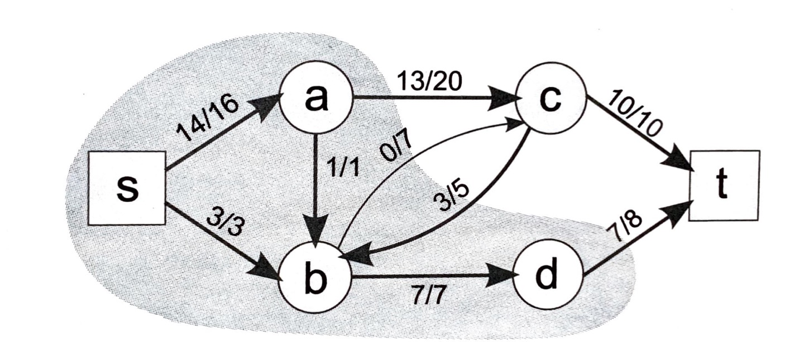

# 유량 네트워크

- 각 간선에 용량(capacity)라는 추가 속성이 존재하는 방향 그래프
- 각 간선은 유량을 흘려보낼 수 있는 파이프 역할을 함
- 정점 u에서 v로 가는 간선의 용량을 c(u,v), 실제 흐르는 유량을 f(u,v)라고 하면, 네트워크의 유량은 항상 다음 세 가지 속성을 만족해야함
  1. 용량 제한 속성
     - f(u,v) <= c(u,v)
     - 각 간선의 유량은 해당 간선의 용량을 초과할 수 없다.
  2. 유량의 대칭성
     - f(u,v) = -f(v,u)
     - u에서 v로 유량이 흘러올 경우, v의 입장에서는 u로 음수의 유량을 보내는 것이라고 생각할 수 있다.
  3. 유량의 보존
     - 각 정점에 들어오는 유량과 나가는 유량의 양은 정확히 같아야 한다.
     - 유량의 대칭성에 의해 정점에 들어오는 유량은 모두 음수로 표현되므로, 나가는 양과 상쇄되기 때문
- 유량 네트워크에는 유량이 시작되는 정점인 소스(source)와 유량이 도착하는 정점인 싱크(sink)가 존재한다.
  - 이 두 정점에서는 유량의 보존 속성이 성립하지 않지만, 소스에서 나온 모든 유량은 결국 싱크로 들어간다.


## 포드-폴커슨(Ford-Fulkerson) 알고리즘

- 최초로 고안된 네트워크 유량 알고리즘으로 그 개념과 구현이 비교적 간단
- 이보다 빠른 알고리즘도 존재하지만, 대부분의 문제는 풀 수 있음
- 유량 네트워크의 모든 간선의 유량을 0으로 두고 시작해, 소스에서 싱크로 유량을 더 보낼 수 있는 경로(증가 경로)를 찾아 유량을 보내는 것을 더 이상 증가 경로가 없을 때 까지 반복
- 잔여 용량(residual capacity)
  - 간선의 용량과 유량의 차이
  - r(u,v) = c(u,v) - f(u,v)
- 잔여 용량이 0보다 클 때만, 유량이 흐를 수 있음
- 증가 경로를 통해 흘려보낼 수 있는 유량의 최대량은, 그 경로에 포함된 간선의 잔여 용량 중 최솟값

### 구현

1. 잔여 용량이 남은 간선들만을 사용하는 너비 우선 탐색을 통해 증가 경로 찾기

2. 유량 보내기

3. 증가 경로가 없을 때 까지 1, 2 반복

   [BOJ 6086](https://www.acmicpc.net/problem/6086)

   ```python
   from collections import deque
   N = int(input())
   
   def ctoi(c):
       if ord(c) <= 90:
           return ord(c)-65
       else:
           return ord(c)-71
   
   # 증가 경로 찾는 bfs
   def bfs(source, sink, parent):
       q = deque([source])
       parent[source] = source
   
       while q:
           curr = q.popleft()
           for node in adj[curr]:
               # 잔여 용량이 0보다 큰 경우만 탐색에 이용
               if capacity[curr][node] - flow[curr][node] > 0 and parent[node] == -1:
                   q.append(node)
                   parent[node] = curr
                   if node == sink:
                       return True
       return False
   
   def Ford_Fullkerson(source, sink):
       total_flow = 0
       while True:
           parent = [-1]*52
           if bfs(source, sink, parent):
               curr = sink
               min_flow = 1000
               # 해당 증가 경로를 통해 흘려보낼 수 있는 유량의 최댓값은
               # 그 경로에 포함된 간선의 잔여 용량의 최솟값
               while curr != source:
                   min_flow = min(min_flow, capacity[parent[curr]][curr] - flow[parent[curr]][curr])
                   curr = parent[curr]
               
               curr = sink
               # 유량 흘려 보내기
               # 음의 유량 반드시 포함
               while curr != source:
                   flow[parent[curr]][curr] += min_flow
                   flow[curr][parent[curr]] -= min_flow
                   curr = parent[curr]
               
               total_flow += min_flow
           else:
               break
       return total_flow
   ```


## 정당성의 증명과 최소 컷 최대 유량 정리

- 포드-폴커슨 알고리즘의 동작 방식은 이해하기 쉽지만, 정당성이 직관적으로 와닿지 않음

  - 증가 경로가 여러 개인 경우 그 중 아무 것이나 택해도 괜찮을까?
  - 증가 경로를 잘못 택할 경우, 최대 유량을 찾기 전에 막혀서 증가 경로를 찾이 못하게 되진 않을까?

- 위와 같은 경우가 없음을 ''최소 컷 최대 유량 정리(Min-cut Max-flow Theorem) ''로 증명 가능

  

  출처: 구종만, 프로그래밍 대회에서 배우는 알고리즘 문제 해결 전략, 998쪽

- 컷(cut)

  - 유량 네트워크의 컷이란, 소스와 싱크가 각각 다른 집합에 속하도록 그래프의 정점들을 두 개의 집합으로 나눈 것
  - 소스가 속한 집합을 S, 싱크가 속한 집합을 T
  - S에서 T로 가는 간선들의 용량 합을 컷 S, T의 용량이라고 정의
  - S에서 T로 실제로 보내는 총 유량을 컷S, T의 유량이라고 정의

- 위 그림에서 컷 S, T의 용량은 20 + 7 + 8 = 35
- 위 그림에서 컷 S, T의 유량은 13 + 0 - 3 + 7 = 17
  - c-b의 유량이 음수로 계산됨을 유의
- 유량 네트워크의 모든 컷의 유량과 용량에는 다음 두 속성이 항상 성립한다.
  1. 컷의 유량은 소스에서 싱크로 가능 총 유량과 같다. 네트워크의 모든 유량은 S에 포함된 소스에서 흘러나와 T에 포함된 싱크로 흘러들어가기 때문. T에서 S로 흘러오는 유량은 음수로 계산되므로 유량의 일부가 S와 T를 여러 번 오가는 경우에도 컷의 유량에는 한 번만 포함
  2. 컷의 유량은 용량과 같거나 더 작음. 모든 간선에 대해 유량은 용량 이하의 값이기 때문
- 간단하게 말하자면, 모든 컷의 유량은 같고, 어떤 컷에서라도 용량은 유량 이상의 값을 가짐
- 이 때, 네트워크에서 용량이 가장 작은 컷을 찾아내는 문제를 ''최소 컷(min cut) 문제''라고 함
- 최소 컷 문제는 최대 유량과 밀접하게 관련이 있음
  - 만약 네트워크에 용량과 유량이 같은 컷 S', T'가 존재한다고 가정
  - 이 때, S', T'는 항상 최소 컷이며, 현재 소스에서 싱크로 보내는 유량은 네트워크의 최대 유량임
  - 만약, S', T' 보다 용량이 작은 컷이 존재한다면, 해당 컷에 대해 유량이 용량보다 크므로 모순
    - 모든 컷의 유량은 같다.
  - 만약, 컷 S', T'의 유량 보다 많은 유량을 보내는 방법이 있을 경우, S', T'에 대해 유량이 용량보다 커지므로 모순
- 최소 컷 최대 유량 정리는 증가 경로가 존재하지 않는 유량 네트워크에서 용량과 유량이 같은 컷을 찾아내는 방법을 보여줌
  - 소스에서 잔여 용량이 있는 간선을 통해 갈 수 있는 정점들의 집합 S와, 그럴 수 없는 정점들의 집합 T로 정점의 집합을 나누면 됨
  - 소스는 항상 S에 속하고, 싱크는 항상 T에 속함
  - S에 속한 정점에서 T에 속한 정점으로 가는 모든 간선의 잔여 용량은 0임
    - 잔여 용량이 1이라도 있다면, 반대쪽 정점 또한 S에 포함되어야하기 때문
  - 즉, S에 속한 정점에서 T에 속한 정점으로 가는 모든 간선에 대해 용량과 유량이 같음 
  - 포드-폴커슨 알고리즘은 유량 네트워크에 증가 경로가 더 이상 존재하지 않을 때 종료하므로, 위 과정에서 찾아낸 유량이 네트워크의 최대 유량이 됨

