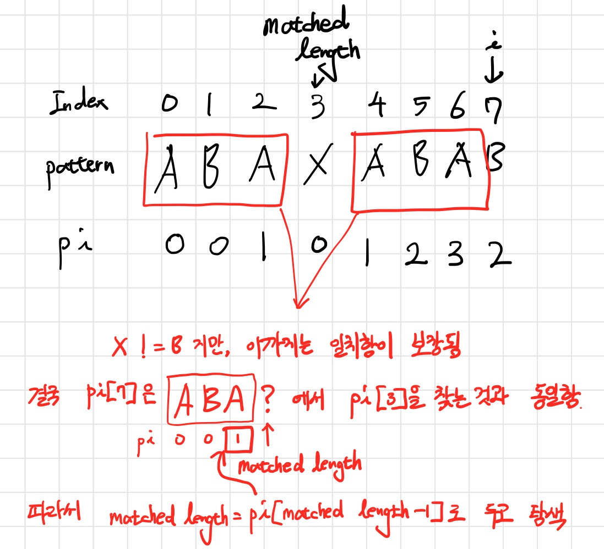
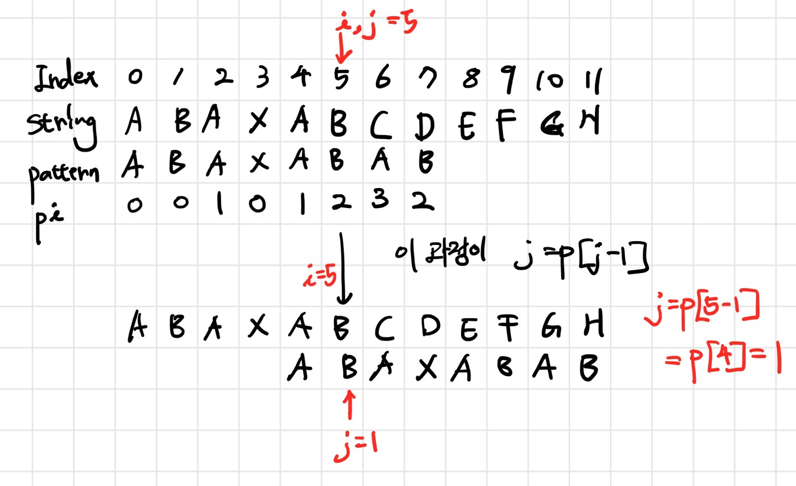

# KMP 알고리즘

- 특정 문자열 내에서 원하는 패턴을 찾는 알고리즘
- 문자열의 길이를 N, 패턴의 길이를 M이라 했을 때, 단순 반복문으로 패턴을 찾게되면 시간복잡도가 O(NM)이므로 매우 비효율적
- 이를 선형시간 O(N+M) 내에 처리할 수 있게 해주는 KMP 알고리즘이 훨씬 효율적
- KMP 알고리즘에서는 한 번의 탐색에서 얻은 정보를 활용한다.
  - 어디까지 일치하는 지를 체크하고, 불필요한 반복을 줄임


## 구현

- 우선, 일치하는 접두사와 접미사의 최대길이를 저장하는 배열 pi를 만든다.

  ```python
  def makePi(pattern):
      pattern_length = len(pattern)
      pi = [0] * pattern_length
      # 현재까지 접미사와 일치하는 접두사의 길이
      matched_length = 0
      # pi[0]은 항상 0이므로, 1부터 시작
      i = 1
  	
      # 패턴 길이만큼 반복
      while i < pattern_length:
          # 현재 인덱스의 패턴 문자와 접두사의 마지막 문자가 같다면
          if pattern[i] == pattern[matched_length]:
              # 접두사 길이 + 1
              matched_length += 1
              # 갱신한 접두사 길이를 pi[i]에 넣어줌
              pi[i] = matched_length
              i += 1
          # 현재 인덱스의 패턴 문자와 접두사의 마지막 문자가 다르다면
          else:
              # 만약 접두사 길이가 0이 아니라면
              if matched_length != 0:
                  # 겹치는 부분만큼 뛰어 넘어서 탐색
                  matched_length = pi[matched_length-1]
              else:
                  pi[i] = 0
                  i += 1
      return pi
  ```

- 예시

  |  Index  |  0   |  1   |  2   |  3   |  4   |  5   |  6   |  7   |
  | :-----: | :--: | :--: | :--: | :--: | :--: | :--: | :--: | :--: |
  | pattern |  A   |  B   |  A   |  X   |  A   |  B   |  A   |  B   |
  |   pi    |  0   |  0   |  1   |  0   |  1   |  2   |  3   |  2   |

​		

- 이후 패턴과 문자열을 대조해간다.

  ```python
  def KMP(S, P):
      pi = makePi(P)
      i, j = 0, 0
      # 일치 개수
      cnt = 0
      # 일치하는 부분의 시작 인덱스
      idx = []
      while i < len(S):
          if S[i] == P[j]:
              i += 1
              j += 1
          else:
              if j != 0:
                  j = pi[j-1]
              else:
                  i += 1
          
          if j == len(P):
              cnt += 1
              idx.append(i-j)
              j = pi[j-1]
      return cnt
  ```

  

 - j를 matched_length라고 생각
 - p[j-1] 값이 다시 matched_length가 됨!!