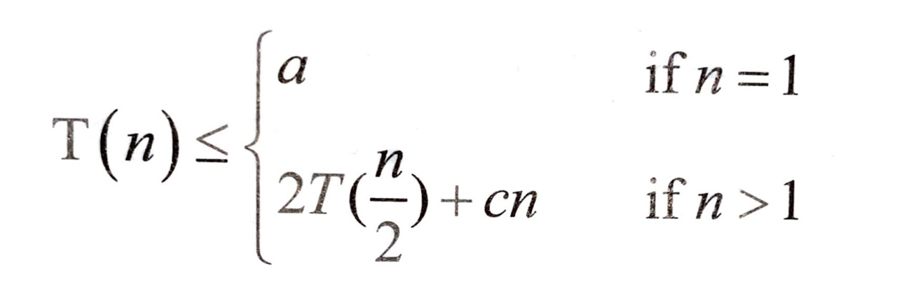
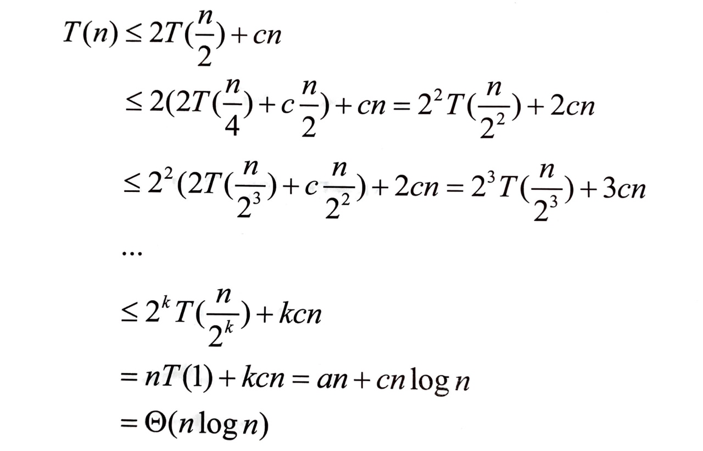

# 정렬

- A[1], ... , A[n]을 줄여서 A[1...n]으로 표기

## 기본적인 정렬 알고리즘

### 1. 선택 정렬

- 배열 A[1...n]에서 가장 큰 원소를 찾아 이 원소와 배열의 끝자리에 있는 A[n]의 자리를 바꿈

- 이후 그 원소를 제외한 나머지 n-1개의 원소에 대해 같은 작업을 반복함

  ```python
  def selectionSort(A):
      for i in range(len(A)-1, 0, -1):
          tmpMax = -float('inf')
          tmpidx = 0
          for j in range(i+1):
              if tmpMax < A[j]:
                  tmpMax = A[j]
                  tmpidx = j
          A[i], A[tmpidx] = A[tmpidx], A[i]
      return A
  ```

- 시간 복잡도는 $$n-1 + n-2 + \cdots + 1 = \frac{n(n-1)}{2} = O(n^2)$$

- 두 원소의 교환은 최소 0번, 최대 n-1번 일어날 수 있음


### 2. 버블 정렬

- 선택 정렬과 유사하게 제일 큰 원소를 맨 오른쪽으로 보내고 정렬할 배열의 크기를 하나씩 줄임

  ```python
  def bubbleSort(A):
      for i in range(len(A)-1, 0, -1):
          for j in range(1, i+1):
              if A[j-1] > A[j]:
                  A[j-1], A[j] = A[j], A[j-1]
      return A
  ```

- 위의 알고리즘은 알고리즘이 수행을 시작할 때나 중간에 정렬이 완료되더라도 끝까지 무의미한 순환을 반복함

- 이를 개선하여 아래와 같이 한 가지 장치를 추가할 수 있음

  ```python
  def bubbleSort(A):
      for i in range(len(A)-1, 0, -1):
          sorted = True
          for j in range(1, i+1):
              if A[j-1] > A[j]:
                  A[j-1], A[j] = A[j], A[j-1]
                  sorted = False
          if sorted = True:
              return A
      return A
  ```

- 위의 경우 배열이 정렬된 상태로 입력될 경우 $$O(n)$$의 시간 복잡도를 가짐
- 두 원소의 교환은 최소 0번, 최대 $$\frac{n(n-1)}{2}$$번 일어날 수 있음


### 3. 삽입 정렬

- 이미 정렬되어 있는 i개 짜리 배열에 하나의 원소를 더 더하여 정렬된 i+1개 짜리 배열을 만드는 과정을 반복

- 선택 정렬과 버블 정렬이 n개 짜리 배열에서 시작하여 그 크기를 하나씩 줄이는 데 반해, 삽입 정렬은 한 개 짜리 배열에서 시작하여 그 크기를 하나씩 늘림

  ```python
  def insertSort(A):
      tmpArray = [A[0]]
      for i in range(1, len(A)):
          tmpArray.append(A[i])
          for j in range(i, 0, -1):
              if tmpArray[j] < tmpArray[j-1]:
                  tmpArray[j], tmpArray[j-1] = tmpArray[j-1], tmpArray[j]
              else:
                  break
      return tmpArray
  ```

- 기본적으로 시간 복잡도는 $$O(n^2)$$
- 그러나 배열이 거의 정렬된 상태로 입력된다면 가장 매력적인 알고리즘
  - 이 경우, 두 번째 `for`문이 거의 돌지 않으므로 $$O(n)$$에 가까운 시간 복잡도를 가짐


## 고급 정렬 알고리즘

### 1. 병합 정렬

- 입력을 반으로 나누고, 전반부와 후반부를 독립적으로 정렬한 뒤 병합한다.

  ```python
  def mergeSort(A):
      if len(A) == 1: return A
      mid = len(A)//2
      front = mergeSort(A[:mid])
      back = mergeSort(A[mid:])
      return merge(front, back)
  
  
  def merge(front, back):
      tmp = []
      idxFront = 0
      idxBack = 0
  
      while idxFront < len(front) and idxBack < len(back):
          if front[idxFront] <= back[idxBack]:
              tmp.append(front[idxFront])
              idxFront += 1
          else:
              tmp.append(back[idxBack])
              idxBack += 1
      
      while idxFront < len(front):
          tmp.append(front[idxFront])
          idxFront += 1
      
      while idxBack < len(back):
          tmp.append(back[idxBack])
          idxBack += 1
      
      return tmp
  ```

- 시간 복잡도는 O(nlog~2~ n)

  - T(n)은 n개의 원소를 병합정렬하는데 걸리는 시간
  - T(n)은 전반부와 후반부를 정렬하는데 필요한 2T(n/2)과, 병합하는 시간 cn의 합과 같음

  




### 2. 퀵 정렬

- 평균적으로 가장 좋은 성능을 가져 가장 많이 쓰는 정렬 알고리즘

- 기준 원소를 고른 뒤, 이를 중심으로 더 작거나 같은 수는 왼쪽으로, 큰 수는 오른쪽으로 재배치함

- 분할된 왼쪽과 오른쪽 부분에 대해 재귀적으로 정렬을 수행함

  ```python
  def quickSort(A):
      if not A: return []
      criterion = A[-1]
      left = []
      right = []
      for idx, item in enumerate(A):
          if idx == len(A)-1: break
          if item <= criterion: left.append(item)
          else: right.append(item)
      left = quickSort(left)
      right = quickSort(right)
      return left + [criterion] + right
  
  ```

- 시간 복잡도는 O(nlog~2~ n)


### 

​                                          


