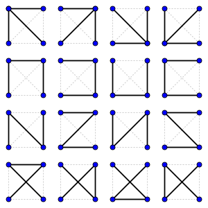

# 신장 트리(Spanning Tree)

- 모든 정점이 연결되어 있는 동시에 사이클이 존재하지 않아 트리의 속성을 만족하는 그래프
- 간선의 개수 E는 정점의 개수 V에서 1을 뺀 것과 같아야 함

​	


# 최소 신장 트리(MST: Minimum Spanning Tree)

- 가능한 신장 트리 중, 간선의 가중치 합이 최소인 경우

## 크루스칼 알고리즘(Kruscal Algorithm)

1. 모든 간선들을 거리(비용)을 기준으로 오름차순 정렬

2. 정렬된 순서에 맞게 그래프에 포함시켜 나감

3. Union-Find 알고리즘을 통해 사이클을 형성하는 경우 간선 제외

   [백준 1197번](https://www.acmicpc.net/problem/1197)

   ```python
   import sys
   input = sys.stdin.readline
   V, E = map(int, input().split())
   graph = []
   parent = [x for x in range(V+1)]
   
   def find(x):
       if x != parent[x]:
           parent[x] = find(parent[x])
       return parent[x]
   
   def union(x, y):
       x = find(x)
       y = find(y)
       if x <= y:
           parent[y] = x
       else:
           parent[x] = y
   
   for _ in range(E):
       A, B, cost = map(int, input().split())
       graph.append((A, B, cost))
   
   graph.sort(key=lambda x: x[2])
   
   ans = 0
   for item in graph:
       if find(item[0]) == find(item[1]):
           continue
       else:
           union(item[0], item[1])
           ans += item[2]
   print(ans)
   ```


## 프림 알고리즘(Prim's Algorithm)

1. 그래프에서 임의의 정점 선택하고 새 집합에 추가

2. 그 정점으로 부터 비용이 최소인 정점을 집합에 추가

3. 집합에 존재하는 정점들과, 그렇지 못한 정점들 사이에 최소 비용을 가지는 간선을 찾고 해당하는 정점을 집합에 추가

4. n-1번 반복

   [백준 4386번](https://www.acmicpc.net/problem/4386)

   ```python
   # 이 문제 같은 경우는, 정점 사이의 비용을 직접 구해야해서 좀 특이함
   def dist(first, second):
       return ((first[0]-second[0])**2 + (first[1]-second[1])**2)**(1/2)
   
   n = int(input())
   stars = []
   idx = 0
   for _ in range(n):
       x, y = map(float, input().split())
       stars.append((x, y, idx))
       idx += 1
   
   
   T = [stars[0]]
   ans = 0
   while len(T) != n:
       tmpMin = 1e9
       tmpStar = (0,0,0)
       for selectedStar in T:
           for star in stars:
               if star not in T:
                   if tmpMin > dist(star, selectedStar):
                       tmpMin = dist(star, selectedStar)
                       tmpStar = star
       ans += tmpMin
       T.append(tmpStar)
   print(ans)
   ```

   

