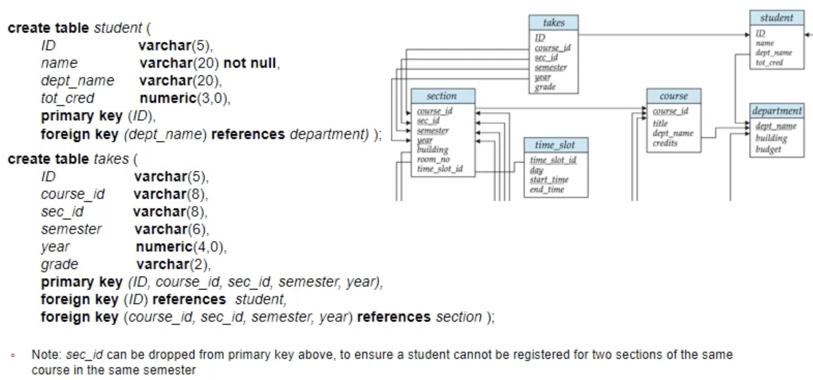
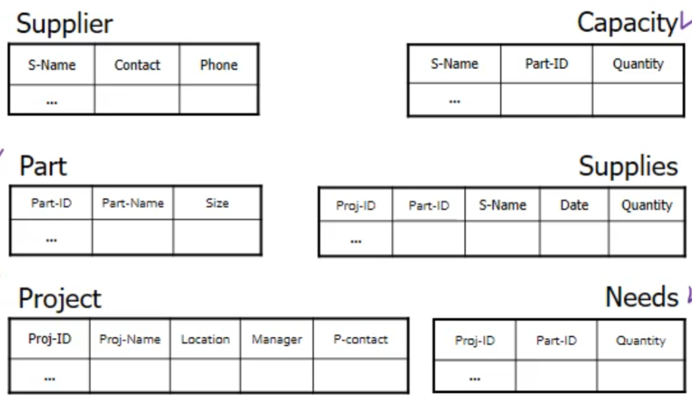

# Relational Model

- Data Model

  - The framework/formalism for representing data and their relationships

- Relation

  - Binary relation R on a set A is a collection of ordered pairs of elements of A

    

  - 릴레이션 R은 A를 자기 자신과 cartesian product한 집합의 subset

    

  - 도메인 D의 cartesian product

  

  

- Attribute Types

  - Each attribute of a relation has a name

  - The set of allowed values for each attribute is called the domain of the attribute

  - Attribute values are normally required to be atomic, that is, indivisible
    - 예를 들어, 전화번호 1435(ex101)은 composed
    
    - 학번 2016-15135는 atomic
    
    - 데이터를 가장 작은 단위로 저장
    
    - 절대적인 것은 아님
    
      

- Relation Schema

  - 테이블의 구조를 schema라고 함

  - 어떤 attribute들로 구성되는지

    

    

- Relation Instance

  - The current values (relation instance) of a relation are specified by a table

  - An element t of r is a tuple, represented by a row in a table

    

  - tuple의 순서는 관계 없음
  - 중복도 의미 없음

​	

- Relational Database

  - A database consists of multiple relations

  - For example, information about an enterprise is broken up into parts, with each relation storing one part of the information

    

  - Storing all information as a single relation is not a good idea
    - 데이터 베이스 구조면에서 매우 비효율적

- Keys

  

  

   - Schema Diagram for a banking enterprise

     

- Query Languages
  - Query
    - 데이터 베이스에 데이터를 요청하는 것
  
  - Language in which user requests information from the database
    - DDL, DML
    - procedural
      - specify what data are needed and how to get those data
      - 데이터를 가져오는 절차가 있음
        - 서울에 사는 사람들 -> 성이 김씨인 사람 -> 계좌
      - Relational Algebra
    - nonprocedural
      - declarative
      - specify only what data are needed
      - 데이터의 조건을 명시
      - SQL
  

- Pure languages
  - 데이터 베이스를 다루고 정보를 뽑아내는 데에 필요한 기능들을 이론적으로 완전하게 명시한 언어들
    - Relational Algebra
    - Tuple Relational Calculus
    - Domain Relational Calculus
  - Pure languages form underlying basis of query languages that people use
  - 상용적으로 사용하지는 않음

- Relation Algebra

  - Algebra

    - operators and operands

  - operands

    - relations

  - operators

    - basic operators (+ additional operations)

    - take two or more relations as inputs and give a new relation as a result

      - Select

        - 레코드 단위의 필터

        

      - Project

        - 컬럼 단위의 필터

        

      - Union

        - Union Compatible
          - relations must have the same arity (same number of attributes)
          - The attribute domains must be compatible

        

      - Set Difference

        - Union과 마찬가지로 compatible
          - relations must have the same arity (same number of attributes)
          - The attribute domains must be compatible
          - 릴레이션의 스키마가 달라 compatible하지 않더라도 결과가 릴레이션으로 나올 수 있지만, 이는 잘못된 의미일 것으로 가정
  
        
  
      - Set-Intersection
  
        
  
      - Joining two relations: Cartesian-Product
  
        - r과 s의 schema가 합쳐짐
  
        
  
    - Joining two relations: Natural-Join
  
      - 공유하는 attribute에서 같은 값을 가지는 경우만 뽑아냄
  
      
  
    
  
  - Composition Operation
  
    - can build expressions using multiple operations
  
    - 연산의 결과는 다시 operand가 될 수 있음
  
      
  
  - Rename Operation
  
    - allow us to name, and therefore to refer to, the results of relational-algebra expressions
  
      

- Basic Expression
   - consists of either one of the following
     - A relation in the database
     - A constant relation

   - Let E~1~ , E~2~ be relational algebra expressions

     - the following are all relational-algebra expressions

     - 아래 여섯가지 표현으로 다른 모든 관계를 표현할 수 있음

       

       - Set-Intersection

         

       - Natural-Join

         

         - properties

           

       - Assignment Operation

         

         

# SQL

- Structured Query Language

- based on set and relational operations with certain modifications and enhancements

- 70년대 초에 IBM에서 만듦

- DDL

  - schema를 다룸

  - Create Table Construct

    

    - Domain Types in SQL

      

    - Integrity Constraints in create table

      - 데이터를 삽입할 때 지켜야하는 제약 조건

      - primary key는 not null과 unique한 속성을 가짐

        

        

        - takes 테이블의 primary key에서 sec_id를 제거하면, 학생은 한 학기에 sec_id가 다른 똑같은 수업을 듣지 못하게 된다.
        - primary key는 유니크 해야하고 이 때문에 CS 001 강좌와 CS 002 강좌를 구분할 수 없기 때문에 둘 중 하나만 테이블에 넣을 수 있다.

  - Drop Table

    

- DML

  - 데이터를 조작

  - SELECT
  
    
  
    
  
    
  
  - WHERE
  
    
  
  - FROM
  
    
  
  - JOINS
  
    
  
  - Rename operation
  
    
  
  - String Operation
  
    
  
  - Ordering
  
    
  
  - Set Operation
  
    
  
  - Null Values
  
    
  
    - Null Values and Three Valued Logic
  
      
  
    - Aggregate Functions
  
      
  
      
  
      
  
  - Null Values and Aggregates
  
    
  
  - Nested Subqueries
  
    - A subquery is a select-from-where expression that is nested within another query
    - perform tests for set membership, set comparisons, and set cardinality
  
    
  
    
  
    
  
    
  
    
  
  - DELETE
  
    
  
    
  
  - INSERT
  
    
  
    
  
  - UPDATE
  
    
  
  - Join 
  
    
  
    - Inner Join
  
      
  
    - Natural Join
  
      
  
      
  
    - Outer Join
  
      
  
  - Integrity Constraints
  
    - 무결성 규칙(제약)
  
    - 데이터 베이스의 데이터들이 지켜야할 조건
  
    - Not Null Constraint
  
      
  
       - The Unique & Primary Key Constraints
  
         
  
    - The Check Clause
  
      
  
  - Referential Integrity (Foreign Key Constraints)
  
    - 참조 무결성 
  
      
  
    - Foreign Key가 참조하는 테이블에서 해당 키가 없어질 때
  
      
  
  - Authorization Specification in SQL
  
    
  
    
  
  - Revoking Authorization in SQL
  
    
  
  - Authorization-Grant Graph
  
    
  
    - u1이 revoke되면, u4도 DBA까지의 path가 끊어지므로 revoke됨
  
  - Roles
  
    
  
    

# DATABASE DESIGN & THE E-R MODEL

- Creating a Database

  - Consider your needs
    - Report you will need
    - Inquiries you will want to make
  - Sketch the table structure
    - what kind of data is needed in each column
  - Determine characteristics of field
    - Field name: Each field must have a unique field name
    - Field type & length
      - Character, numeric, date, ...
  - Create the table
    - Define each field in the table
    - Define primary key

- 반드시 중복을 피해야함

  - 저장 공간의 낭비

  - 중복은 inconsistency를 일으킴

    - 아래 테이블에서 Sammi의 전화번호가 바뀌면 수백개의 레코드를 바꿔야할 수 있음

      

- ER Diagram (Entity-Relation Diagram)

  - 시각적으로 데이터 베이스의 구조를 표현

    

  - 이를 토대로 테이블을 만듦

    

- Database Design
  - Decide on the DB schema that
    - is able to hold all information in consideration,
    - with minimal (or no) redundancy, and allows for effective & efficient data operations
  - Critical in reducing operations and maintenance costs of SW systems
- Phase of Database Design
  - Conceptual design
    - Construction of an ER schema
    - to provide an optimal description of the user requirements
  - Logical design
    - map onto the implementation data model of the DBMS (such as RDB)
  - Physical design
    - specify physical features of the database (issues pertaining to performance rather than information contexts)
      - index, sequence order, ...

- Entity-Relation Model

  - proposed by P. Chen in 1976

  - A very powerful tool in the design of adatabases

    - simple model
    - effective means of communication between user, designer, and implementer

  - E-R model is not an implementation model

    - there is no DBMS whose internal structures are based on the E-R model

  - Data Modeling

    - A database can be modeled as

      - a collection of entities
      - relationships among entities

    - Entity

      - an object that exists and is distinguishable from other objects
      - entity instance
        - specific person, company, event, plant, ...

    - Attributes

      - entities have attributes
        - people have names and addresses
      - Types of Attributes
        - Simple attribute
          - values cannot be divided into subparts
            - firstname, lastname, phone#
        - Composite attribute
          - composed of multiple parts
            - name = (lastname, firstname)
            - phone# = (number, extension)
          - Relational Model의 attribute는 atomic, 즉 simple attribute여야 하는데, compsite attribute가 나온 이유
            - Conceptual Design 단계에서는 이후 단계는 고려하지 않고 requirements를 E-R Diagram을 이용하여 가장 정확하게 표현해야하기 때문
        - Null
          - null value: a special value meaning 'missing' or 'unknown'
          - some attributes are not allowed to have ull values
        - Single-valued attribute
          - each attribute has a single value for an entity
          - id, name, dept
        - Multivalued attribute
          - an attribute may have more than one value for an instance
          - children = {john, tom}, phone#={5567, 5568}
        - Deribed attributes
          - value can be derived from the values of other related attributes or entities
          - duration, count, sum, ...

    - Entity set

      - a set of entities of the same type that share the same properties
        - set of all persons, companies, trees, holidays, ...

      - database를 설계하는 것은 결국 entity set을 정의하는 것

  - Relationships

    - relationships are defined between entities

    - Relationship set

      

    - Degree of a Relationship Set

      

    - Mapping Constraints

      - Relationship cardinality

        - Number of entities to which another entity can be associated via a relationship set

      - Generic types

        - 1 : 1 (One to one)

        - 1 : m (One to many)

        - m : 1 (Many to one)

        - m : n (Many to Many)

          

        - 화살표의 끝이 1을 의미

      - Participation of an Entity Set in a Relationship Set

        ​	

        - Total participation (double line)
          - every entity in the entity set participates in at least one relationship in the relationship set
            - all student must participate in the relationship set
        - Partial participation (single line)
          - some entities may not participate in any relationship in the relationship set
            - participation of instructor in advisor is partial

    - Relationships can have attributes

      

  - E-R Diagrams

    - 같은 Entity set에서 relationship을 가질 수 있음

    

    - Rectangles represent entity sets
    - Diamonds represent relationship sets
    - Attributes listed inside entity rectangle
    - Underline indicates primary key attributes

  - Keys

    - Key for an Entity (Set)
      - Same as keys in relational models: super key, candidate key, primary key
      - Set of attributes whose values can distinguish entities from each other
    - Key for a Relationship (Set)
      - combination of primary keys of the participating entity set forms a super key
      - Must consider the mapping cardinality of the relationship set when deciding what are the candidate keys (and primary key)

  - Redundant Attributes

    

    - dept_name in instructor is redundant
      - since there is an explicit relationship which relates instructors to departments
      - The attribute replicates information present inthe relationship and should be removed from instructor
      - BUT: wasn't this a foreign key (which is important in schema diagrams)?!
        - Relation Model에서는 relationship을 explicit하게 표현할 수 없기 때문에 반드시 foreign key가 필요했다.
        - 그러나 Entity-Relation Model에서는 relationship을 explicit하게 표현할 수 있기 때문에 foreign key를 없애도 상관 없음

  - Weak Entity Sets

    - An entity set that does not have sufficient attributes to form a primary key

      

      - section 내부에서 전산개론(001.2015.1)과 데이터베이스(001.2015.1)을 구분할 수 없음
      - 이는 sec_coure라는 relationship으로 구분
      - section은 course에 dependant함
      - entity가 course와 관계가 없으면 section 내부에 존재할 수 없음
        - One to many
      - The existence of a weak entity set depends on the existence of a identifying entity set
        - Identifying relationship depicted using a double diamond 
      - The discriminator (or partial key) of a weak entity set
        - set of attributes that distinguishes among all the weak entities related to the same strong entity
      - primary key(of weak entity set) = primary key(of identifying strong entity) + discriminator(of weak entity set)

      

      - 버스 좌석은 1번부터 n번까지 존재
      - 그러나 좌석 번호만가지고 어떤 버스의 좌석인지 알 수 없음
      - 따라서 버스와의 relationhip을 통해 구분
      - 좌석 번호가 discriminator

  - Entended E-R Features

    - Specialization

      

      - subgroupings within an entity set
      - Sub entities share common attributes
      - Each sub entity set may have its own specific attributes
      - 클래스의 상속을 닮음
      - 위에서부터 아래로 설계

    - Generalization

      - combine a number of entity sets that share the same features into a higher-level entity set
      - Opposite of specialization
        - depends on where you start
      - 아래에서 부터 위로 설계

    - Inheritance

      - The attributes and relationships of the higher-level entity sets are inherited by (applies to) the lower-level entity sets

    - Types of generalization (super-sub entities)

      

      - disjoint vs overlapping
        - wheter an entity can belong to more than two sub entity set
      - total vs partial
        - whether every higher level entity belong to a lower level entity set

      
