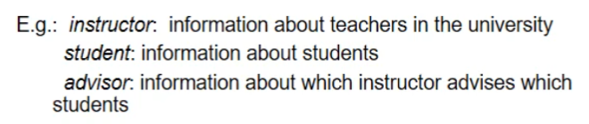

# Relational Model

- Data Model

  - The framework/formalism for representing data and their relationships

- Relation

  - Binary relation R on a set A is a collection of ordered pairs of elements of A

    

  - 릴레이션 R은 A를 자기 자신과 cartesian product한 집합의 subset

    

  - 도메인 D의 cartesian product

  

  

- Attribute Types

  - Each attribute of a relation has a name

  - The set of allowed values for each attribute is called the domain of the attribute

  - Attribute values are normally required to be atomic, that is, indivisible
    - 예를 들어, 전화번호 1435(ex101)은 composed
    
    - 학번 2016-15135는 atomic
    
    - 데이터를 가장 작은 단위로 저장
    
    - 절대적인 것은 아님
    
      

- Relation Schema

  - 테이블의 구조를 schema라고 함

  - 어떤 attribute들로 구성되는지

    

    

- Relation Instance

  - The current values (relation instance) of a relation are specified by a table

  - An element t of r is a tuple, represented by a row in a table

    

  - tuple의 순서는 관계 없음
  - 중복도 의미 없음

​	

- Relational Database

  - A database consists of multiple relations

  - For example, information about an enterprise is broken up into parts, with each relation storing one part of the information

    

  - Storing all information as a single relation is not a good idea
    - 데이터 베이스 구조면에서 매우 비효율적

- Keys

  

  

   - Schema Diagram for a banking enterprise

     

- Query Languages
  - Query
    - 데이터 베이스에 데이터를 요청하는 것
  
  - Language in which user requests information from the database
    - DDL, DML
    - procedural
      - specify what data are needed and how to get those data
      - 데이터를 가져오는 절차가 있음
        - 서울에 사는 사람들 -> 성이 김씨인 사람 -> 계좌
      - Relational Algebra
    - nonprocedural
      - declarative
      - specify only what data are needed
      - 데이터의 조건을 명시
      - SQL
  

- Pure languages
  - 데이터 베이스를 다루고 정보를 뽑아내는 데에 필요한 기능들을 이론적으로 완전하게 명시한 언어들
    - Relational Algebra
    - Tuple Relational Calculus
    - Domain Relational Calculus
  - Pure languages form underlying basis of query languages that people use
  - 상용적으로 사용하지는 않음

- Relation Algebra

  - Algebra

    - operators and operands

  - operands

    - relations

  - operators

    - basic operators (+ additional operations)

    - take two or more relations as inputs and give a new relation as a result

      - Select

        - 레코드 단위의 필터

        

      - Project

        - 컬럼 단위의 필터

        

      - Union

        - Union Compatible
          - relations must have the same arity (same number of attributes)
          - The attribute domains must be compatible

        

      - Set Difference

        - Union과 마찬가지로 compatible
          - relations must have the same arity (same number of attributes)
          - The attribute domains must be compatible
          - 릴레이션의 스키마가 달라 compatible하지 않더라도 결과가 릴레이션으로 나올 수 있지만, 이는 잘못된 의미일 것으로 가정
  
        
  
      - Set-Intersection
  
        
  
      - Joining two relations: Cartesian-Product
  
        - r과 s의 schema가 합쳐짐
  
        
  
    - Joining two relations: Natural-Join
  
      - 공유하는 attribute에서 같은 값을 가지는 경우만 뽑아냄
  
      
  
    
  
  - Composition Operation
  
    - can build expressions using multiple operations
  
    - 연산의 결과는 다시 operand가 될 수 있음
  
      
  
  - Rename Operation
  
    - allow us to name, and therefore to refer to, the results of relational-algebra expressions
  
      

- Basic Expression
   - consists of either one of the following
     - A relation in the database
     - A constant relation

   - Let E~1~ , E~2~ be relational algebra expressions

     - the following are all relational-algebra expressions

     - 아래 여섯가지 표현으로 다른 모든 관계를 표현할 수 있음

       

       - Set-Intersection

         

       - Natural-Join

         

         - properties

           

       - Assignment Operation

         

         

# SQL

- Structured Query Language

- 70년대 초에 IBM에서 만듦

- DDL

  - schema를 다룸

  - Create Table Construct

    

    - Domain Types in SQL

      

    - Integrity Constraints in create table

      - 데이터를 삽입할 때 지켜야하는 제약 조건

      - primary key는 not null과 unique한 속성을 가짐

        

        

        - takes 테이블의 primary key에서 sec_id를 제거하면, 학생은 한 학기에 sec_id가 다른 똑같은 수업을 듣지 못하게 된다.
        - primary key는 유니크 해야하고 이 때문에 CS 001 강좌와 CS 002 강좌를 구분할 수 없기 때문에 둘 중 하나만 테이블에 넣을 수 있다.

  - Drop Table

    

- DML

  - 데이터를 조작

  

