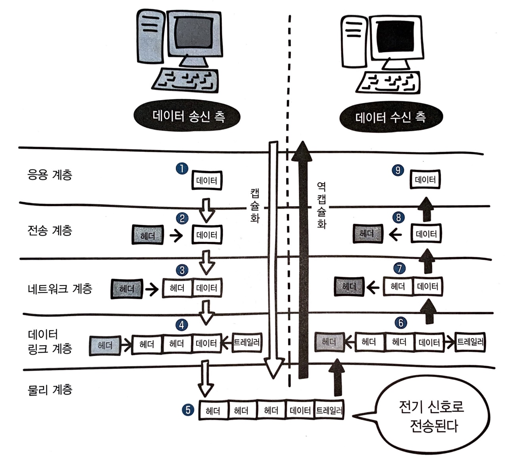

> 모두의 네트워크를 읽고 공부한 내용을 정리한 레파지토리입니다.

---

# 1장 기초지식

## 1. 네트워크의 구조

- **네트워크**란 두 대 이상의 컴퓨터를 연결하여 서로 데이터를 전송할 수 있게 하는 통신망
- **인터넷**은 전 세계의 큰 네트워크부터 작은 네트워크까지 연결하는 거대한 네트워크
  - TCP/IP 프로토콜을 사용하는 세계 최대 규모의 네트워크
- **패킷**이란 컴퓨터 간에 데이터를 주고받을 때 네트워크를 통해 전송되는 데이터의 작은 조각
  - 큰 데이터를 작게 나누어 전송
  - 이는 큰 데이터를 그대로 전송하면 그 데이터가 네트워크의 대역폭(네트워크에서 이용 가능한 최대 전송 속도, 정보를 전송할 수 있는 단위 시간당 전송량)을 너무 많이 점유해서 다른 패킷의 흐름을 막을 위험이 있기 때문
  - 목적지로 보낸 패킷은 전송한 순서대로 도착하지 않을 수 있음
  - 또는 패킷이 전송될 때 네트워크가 지연되어서 늦게 도착하거나 누락되기도 함
  - 즉, 패킷은 도착 순서를 보장할 수 없음
    - 사진 데이터를 패킷으로 나누어 보낼 때, 목적지에서는 패킷을 합쳐 사진 데이터를 복구할 수 있어야함
    - 따라서 패킷을 합쳐 데이터를 복구하기 위해서 송신 측에서 수신 측으로 패킷을 보낼 때, 각 패킷에 번호를 붙여 보냄  

## 2. 정보의 양을 나타내는 단위

- 0과 1의 정보를 나타내는 최소 단위를 **비트(bit)**라고 함
- **8비트(bit)**는 **1바이트(byte)**
- 컴퓨터는 기본적으로 바이트 단위로 데이터를 읽고 쓰는 작업을 수행
- 숫자를 문자로 치환하기 위해 문자 코드 사용
  - 대표적으로 ASCII(아스키) 코드
    - 알파벳, 기호, 숫자 등을 다룰 수 있는 기본적인 문자 코드
- 문자 데이터도 패킷으로 나누어서 보냄  

## 3. 랜과 왠

-  네트워크는 접속할 수 있는 범위에 따라 크게 두 가지 종류로 나눔

  1. **LAN**(Local Area Network)
     - 건물 안이나 특정 지역을 범위로 하는 네트워크
     - 가정이나 빌딩 안에 있는 사무실 같이 지리적으로 제한된 곳에서 컴퓨터와 프린터 등을 연결할 수 있는 네트워크
  2. **WAN**(Wide Area Network)
     - 지리적으로 넓은 범위에 구축된 네트워크
     - 인터넷 서비스 제공자(ISP)가 제공하는 서비스를 사용하여 구축된 네트워크
       - ISP: Internet Service Provider
         - 인터넷 상용 서비스 사업을 하고 있는 KT, U+, SK브로드밴드와 같은 사업자

  |      |           LAN            |         WAN          |
  | :--: | :----------------------: | :------------------: |
  | 범위 | 좁음(건물이나 특정 지역) | 넓음(랜과 랜을 연결) |
  | 속도 |           빠름           |         느림         |
  | 오류 |           적음           |         많음         |

  

## 4. 가정에서 하는 랜 구성

- 가정에서 인터넷을 개통할 때는 **인터넷 서비스 제공자**와 **인터넷 회선**을 결정해야 함
- 인터넷 서비스 제공자와 네트워크를 연결하기 위해서는 **공유기**가 필요  

## 5. 회사에서 하는 랜 구성

- 외부에 공개하기 위한 네트워크인 **DMZ**라는 네트워크 영역 존재
  - 일반적으로 인터넷인 외부 네트워크와, 내부 네트워크 사이에 위치한 중간 지대(서브넷)를 말함
  - 네트워크의 보안 영역으로 외부 공격자가 내부 네트워크에 침입하는 것을 막음
- 웹 사이트를 불특정 다수의 외부 사용자에게 공개하려면 **웹 서버**를 공개
- 외부 사용자와 메일을 주고받으려면 **메일 서버**를 공개
- 외부에서 도메인 이름을 사용하여 회사의 서버에 접속하려면 **DNS 서버**를 공개
- 사내 또는 데이터 센터에 서버를 두고 운영하는 것을 **온프레미스**(on-premise)라 함  

# 2장 네트워크의 기본 규칙

## 6. 네트워크의 규칙

- 컴퓨터 간에 정보를 주고받을 때, 통신 방법에 대한 규칙이나 표준을 **프로토콜**이라 함

## 7. OSI모델과 TCP/IP 모델

- 여러 회사에서 만든 컴퓨터들이 통신하기 위해서는 표준 규격이 필요함

- ISO(International Organization for Standardization)에서 **OSI 모델**이라는 표준 규격을 제정

  - 데이터를 송수신 할 때, 컴퓨터 내부에서 일어나는 일을 일곱 계층(레이어)로 나눈 모델

    | 계층  |       이름       |                             설명                             |
    | :---: | :--------------: | :----------------------------------------------------------: |
    | 7계층 |    응용 계층     | 이메일 & 파일 전송, 웹 사이트 조회 등 어플리케이션에 대한 서비스 제공 |
    | 6계층 |    표현 계층     |          문자 코드, 압축, 암호화 등의 데이터를 변환          |
    | 5계층 |    세션 계층     |                 세션 체결, 통신 방식을 결정                  |
    | 4계층 |    전송 계층     |                  신뢰할 수 있는 통신을 구현                  |
    | 3계층 |  네트워크 계층   | 다른 네트워크와 통신하기 위한 경로 설정 및 논리 주소를 결정  |
    | 2계층 | 데이터 링크 계층 |      네트워크 기기 간의 데이터 전송 및 물리 주소를 결정      |
    | 1계층 |    물리 계층     |     시스템 간의 물리적인 연결과 전기 신호를 변환 및 제어     |

  - 각 계층은 독립적이므로 데이터가 전달되는 동안 다른 계층의 영향을 받지 않음
  - 송신 측에서 7계층 -> 1계층으로 데이터를 보내면 수신 측에서 1계층 -> 7계층을 통해 데이터를 받음

- **TCP/IP** 모델은 OSI 모델의 7계층을 4계층으로 단순화 시킨 모델

  - OSI모델과 대응 시키면 다음과 같음
    - 응용 계층 - 응용 계층 + 표현 계층 + 세션 계층
    - 전송 계층 - 전송 계층
    - 인터넷 계층 - 네트워크 계층
    - 네트워크 접속 계층 - 데이터 링크 계층 + 물리 계층

## 8. 캡슐화와 역캡슐화

- 데이터의 송신을 위해서는 데이터의 앞부분에 전송하는 데 필요한 정보를 붙여 다음 계층으로 보내야하는데, 이를 **헤더**라고 함
  - 헤더는 데이터의 내용이나 성격을 식별 또는 제어하는 데 사용됨
- 송신 측에서 헤더를 붙여 나가는 것을 **캡슐화**, 수신 측에서 헤더를 제거하는 것을 **역캡슐화**라 함

​		

1. 송신 측 컴퓨터에서 웹 사이트에 접속하려 하면, 응용 계층에서 웹 사이트에 접속하기 위한 요청 데이터가 만들어짐
2. 해당 데이터는 전송 계층에 전달되어 전송 계층에서 신뢰할 수 있는 통신이 이루어지도록 헤더를 붙임
3. 다음으로 네트워크 계층에 전달되어 헤더를 붙임
4. 마지막으로 물리적인 통신 채널을 연결하기 위해 데이터 링크 계층에서 헤더와 트레일러를 붙임
5. 최종적으로 데이터는 전기신호로 변환돼어 수신 측에 도착
6. 수신 측에서는 위의 과정을 거꾸로 진행하며 헤더를 제거해나감

# 3장 물리 계층: 데이터를 전기 신호로 변환하기

## 9. 물리 계층의 역할과 랜 카드의 구조

- OSI 모델의 물리 계층에서 0과 1로 이루어진 비트열이 전기 신호로 변환됨
- 위 과정은 랜 카드가 담당함
  - 0과 1의 정보가 컴퓨터 내부의 랜 카드로 전송되면, 랜 카드는 이를 전기 신호로 바꿈

## 10. 케이블의 종류와 구조

- 전송 매체는 데이터가 흐르는 물리적인 선로
  - 유선
    - 트위스트 페어 케이블, 광케이블
  - 무선
    - 라디오파, 마이크로파, 적외선
- 트위스트 페어 케이블(랜 케이블 =**랜선**)
  - UTP 케이블
    - 구리 선 8개를 2개씩 꼬아 만든 네 쌍의 전선
    - 실드가 없어 외부에서 발생하는 노이즈의 영향이 큼
    - 저렴
    - 데이터 전송 품질에 따라 종류가 나뉨
  - STP 케이블
    - 실드가 있는 케이블
    - 비쌈
- 랜 케이블의 종류
  - 다이렉트 케이블
    - 구리 선 여덟 개를 같은 순서로 커넥터에 연결한 케이블
    - 1, 2, 3, 6번 사용
    - 컴퓨터와 스위치를 연결할 때 사용
  - 크로스 케이블
    - 구리 선 여덟 개 중 한쪽 커넥터의 1번과 2번에 연결되는 구리 선을 다른 쪽 커넥터의 3번과 6번에 연결
    - 컴퓨터 간에 직접 랜 케이블로 연결할 때 사용
    - 전선의 연결 순서를 다르게 하여 송신과 수신을 분리함으로써 데이터 충돌을 방지

## 11. 리피터와 허브의 구조

- **리피터**와 **허브**는 물리 계층에서 동작하는 네트워크 장비
  - **리피터**는 전기 신호를 정형(일그러진 전기 신호를 복원)하고 증폭하는 기능을 함
    - 멀리 있는 상대방과 통신할 수 있게 신호를 정상으로 만드는 기능
    - 요즘은 다른 네트워크 장비가 리피터의 기능을 지원하여 잘 사용하지 않음
  - **허브**는 리피터와 마찬가지로 전기 신호를 정형하고 증폭하는 기능을 함
    - 리피터는 일대일 통신만 가능하지만, 허브는 포트를 여러개 가지고 있어 여러 대의 컴퓨터와 통신 가능
    - 허브는 특정 포트로부터 데이터를 받는다면, 해당 포트를 제외한 나머지 모든 포트로 받은 데이터를 전송함
    - 컴퓨터1에서 컴퓨터2로 데이터를 전송하면 컴퓨터2만 데이터를 받는게 맞지만, 실제로 허브를 사용하면 컴퓨터3, 컴퓨터4에도 데이터가 전송됨
      - 이러한 비효율적인 특징 때문에 더미 허브(dummy hub)라고도 불림

# 4장 데이터 링크 계층: 랜에서 데이터 전송하기

## 12. 데이터 링크 계층의 역할와 이더넷

- **데이터 링크 계층**은 네트워크 장비 간에 신호를 주고받는 규칙을 정하는 계층
  - 랜에서 데이터를 정상적으로 주고받기 위해 필요한 계층
  - 일반적으로 **이더넷**이 가장 많이 사용되는 규칙
    - 허브를 통해 데이터를 송신할 때 목적지에 대한 정보를 추가하여 목적지 이외의 컴퓨터는 데이터를 받더라도 무시
    - 여러 컴퓨터가 동시에 데이터를 전송해도 충돌이 일어나지 않는 구조
      - 이를 위해 데이터를 보내는 시점을 늦추는 방법 **CSMA/CD**
        - CS
          - '데이터를 보내려고 하는 컴퓨터가 케이블에 신호가 흐르고 있는지 아닌지를 확인한다'는 규칙
        - MA
          - '케이블에 데이터가 흐르고 있지 않다면 데이터를 보내도 좋다'는 규칙
        - CD
          - '충돌이 발생하고 있는지를 확인한다'는 규칙
        - CSMA/CD는 효율이 좋지 않아 요즘에는 거의 사용하지 않고 대신 **스위치**라는 네트워크 장비를 이용하여 데이터의 충돌을 피함

## 13. MAC 주소의 구조

- 0과 1로 이루어진 비트열을 전기 신호로 변환하는 랜카드에는 **MAC 주소**라는 번호가 정해져 있음

  - Media Access Control Address
  - 제조할 때 새겨지므로 물리 주소라고도 하며 전 세계에서 유일한 번호로 할당됨
  - 중복되지 않는 48비트 숫자로 구성됨
    - 00-23-AE-D9-7A-9A
      - 앞쪽 24비트는 랜 카드를 만든 제조사 번호
      - 뒤쪽 24비트는 제조사가 랜 카드에 붙인 일련번호

  - OSI 모델에서는 데이터 링크 계층에서, TCP/IP 모델에서는 네트워크 계층에서 **이더넷 헤더**와 **트레일러**를 붙임
    - 이더넷 헤더는 목적지의 MAC 주소(6바이트=48비트), 출발지 MAC 주소(6바이트), 유형(2바이트) 이렇게 총 14바이트로 구성됨
      - 이더넷 유형(Ethernet type)은 이더넷으로 전송되는 상위 계층 프로토콜의 종류를 나타냄
    - 트레일러는 FCS(Frame Check Sequence)라고도 하며, 데이터 전송 도중에 오류가 발생하는지 확인하는 용도로 사용
    - 이더넷 헤더와 트레일러가 추가된 데이터를 **프레임**이라고 함
      - 데이터 링크 계층에서 이더넷 헤더와 트레일러를 추가하여 프레임을 만들고(캡슐화), 물리 계층에서 이 프레임 비트열을 전기 신호로 변환하여 네트워크를 통해 전송
      - 데이터를 받은 컴퓨터에서는 데이터의 목적지 MAC 주소와 자신의 MAC 주소가 다르면 데이터를 파기
      - MAC 주소가 같을 경우 물리 계층에서 전기 신호로 전송된 데이터를 비트열로 변환하고 데이터 링크 계층에서 이더넷 헤더와 트레일러를 분리(역캡슐화)

## 14. 스위치의 구조

- **스위치**는 데이터 링크 계층에서 동작하고 레이어 2 스위치 또는 스위칭 허브라고도 불림
- 스위치 내부에는 MAC 주소 테이블(MAC address table)이 존재
  - 스위치의 포트 번호와 해당 포트에 연결 되어 있는 컴퓨터의 MAC 주소가 등록되는 데이터 베이스
- 스위치는 MAC 주소 학습 기능을 가짐
  - 컴퓨터에서 목적지 MAC 주소가 추가된 프레임이 전송되면, MAC 주소 테이블을 확인하고, 출발지 MAC 주소가 등록되어 있지 않으면 MAC 주소를 포트와 함께 등록
  - 이 때, 목적지 MAC 주소가 MAC 주소 테이블에 등록되어 있지 않으면, 허브처럼 모든 포트에 프레임이 전송되며 이를 플러딩(flooding)이라고 함
  - 목적지 MAC 주소가 등록되어 있으면, 해당 목적지에만 프레임이 전송되며 이를 MAC 주소 필터링이라고 함
    - 이를 통해 불필요한 데이터를 네트워크에 전송하지 않게 됨

## 15. 데이터가 케이블에서 충돌하지 않는 구조

- 통신 방식은 2가지
  - **전이중 통신 방식**
    - 데이터의 송수신을 동시에 통신하는 방식
    - 데이터를 동시에 전송해도 충돌이 발생하지 않음
  - **반이중 통신 방식**
    - 회선 하나로 송신과 수신을 번갈아가면서 통신하는 방식
    - 데이터를 동시에 전송하면 충돌이 발생함
- 컴퓨터와 컴퓨터를 직접 랜케이블로 연결한다면 전이중 통신 방식이됨
  - 크로스 케이블을 이용하여 송수신이 분리되기 때문
- 그러나 허브의 경우 내부는 송수신이 나누어져 있지 않기 때문에 동시에 데이터를 보내면 충돌이 일어남
  - 네트워크 지연 발생
  - 이 때문에 허브는 회선 하나를 통해 송신과 수신을 번갈아가면서 일어나는 반이중 통신 방식을 사용
- 스위치의 경우 충돌이 일어나지 않는 구조로 되어 있어 전이중 통신 방식으로 데이터를 주고받을 수 있음
  - 전송과 동시에 수신이 가능하여 효율이 높음

- 네트워크에서 충돌이 발생할 때 그 영향이 미치는 범위를 충돌 도메인(collision domain)이라고 함
  - 충돌 도메인의 범위가 넓을수록 네트워크가 지연됨
  - 허브는 연결되어 있는 컴퓨터 전체가 하나의 충돌 도메인이 됨
    - 즉, 충돌의 영향이 모든 컴퓨터에 미침
  - 스위치는 데이터를 동시에 송수신할 수 있는 전이중 통신 방식이기 때문에 충돌이 일어나지 않고 충돌 도메인의 범위도 관련 있는 컴퓨터만 포함되어 좁음
- **ARP(Address Resolution Protocol)**
  - 목적지 컴퓨터의 IP 주소를 이용하여 MAC 주소를 찾기 위한 프로토콜
  - 출발지 컴퓨터가 목적지 주소를 모르면 목적지의 MAC 주소를 알아내기 위해 네트워크에 브로드캐스트를 하는데, 이를 ARP 요청이라 함
  - 이 요청에 대해 지정된 IP 주소를 가지고 있지 않은 컴퓨터는 응답하지 않지만, 지정된 IP 주소를 가진 컴퓨터는 MAC 주소를 응답으로 보내며, 이를 ARP 응답이라 함
  - 이를 통해 출발지 컴퓨터는 MAC 주소를 얻고 이더넷 프레임을 만들 수 있음
  - 출발지 컴퓨터에서는 MAC 주소를 얻은 후에 MAC 주소와 IP 주소의 매핑 정보를 메모리에 보관하며, 이를 ARP 테이블이라 함
  - 이후 데이터 통신은 자신의 컴퓨터에 보관된 ARP 테이블을 참고하여 전송
    - 그러나 IP 주소가 변경되면 해당 MAC 주소도 함께 변경되므로 제대로 통신할 수 없음
    - 그래서 ARP 테이블에서는 보존 기간을 ARP 캐시로 지정하고 일정 시간이 지나면 삭제하고 다시 ARP 요청을 함

## 16. 이더넷의 종류와 특징

- 이더넷은 케이블의 종류나 통신 속도에 따라 다양한 규격으로 분류됨
- 10-BASE-T
  - 10은 Mbps단위인 통신 속도로 10Mbps를 의미
  - BASE는 BASEBAND라는 전송 방식을 의미
  - T는 UTP 케이블을 의미
- 최근 컴퓨터의 랜 포트는 1000BASE-T가 일반적이며 10GBASE-T도 늘어나는 추세

# 5장 네트워크 계층: 목적지에 데이터 전달하기

## 17. 네트워크 계층의 역할

- 수많은 네트워크가 연결된 환경에서 데이터 링크 계층의 기능만으로는 다른 네트워크로 데이터를 전송할 수 없음
- 따라서 네트워크 간의 통신을 가능하게 하는 네트워크 계층이 필요함
  - **라우터**라는 네트워크 장비 필요
  - 라우터는 데이터의 목적지가 정해지면 해당 목적지까지 어떤 경로로 가는 것이 좋은지 알려주는 기능을 함
  - 목적지를 찾기 위해 **IP주소** 필요
  - 목적지 IP주소까지 어떤 경로로 데이터를 보낼지 결정하는 것을 **라우팅**이라고 함
- 네트워크 계층에는 **IP(Internet Protocol)**라는 프로토콜이 있음
  - 네트워크 계층에서는 데이터를 캡술화 할 때 IP 헤더를 붙임
    - IP 헤더는 버전, 헤더 길이, 서비스 유형, 전체 패킷 길이, ID, 조각 상태, 조각의 위치, TTL, 프로토콜, 헤더 체크섬, 출발지 IP 주소, 목적지 IP주소 순으로 구성됨
  - 이렇게 만들어진 것을 IP 패킷이라고 함

## 18. IP 주소의 구조

- IP 주소는 인터넷 서비스 제공자(ISP)에게 받을 수 있음
- IP 주소의 버젼
  - IPv4
  - 32비트로 되어 있어 약 43억 개의 주소를 만들 수 있음
  - IPv6
    - 128비트로 되어 있어 엄청나게 많은 주소를 만들 수 있음
      - 340조의 1조배의 1조배
    - IPv6의 등장으로 가정의 TV나 에어컨에도 인터넷을 연결하여 통신할 수 있게 됨
- IPv4 주소가 부족하여 공인 IP 주소와 사설 IP 주소를 나누어씀
  - 인터넷 서비스 공급자가 제공하는 공인 IP 주소는 라우터에만 할당
  - 랜 안에 있는 컴퓨터에는 랜의 네트워크 관리자가 자유롭게 사설 IP 주소를 할당 
  - 또는 라우터의 DHCP(IP 주소를 자동으로 할당하는 프로토콜) 기능을 사용하여 주소를 자동으로 할당
  - 이런 방식으로 하나의 공인 IP 주소만으로 랜 안에 있는 모든 컴퓨터를 인터넷에 연결할 수 있음
- MAC 주소는 48비트로 구분하기 쉽도록 16진수로 표시하고, IP 주소는 32비트로 구분하기 쉽도록 10진수로 표기
  - 사람이 읽기 쉽도록 8비트 단위(옥텟)으로 나눠서 표시
  - 11000000 10101000 00000001 00001010
  - 192.168.1.10

- IP 주소는 네트워크 ID와 호스트 ID로 나누어짐
  - 네트워크 ID는 '어떤 네트워크'인지 나타냄
  - 호스트 ID는 '해당 네트워크의 어떤 컴퓨터'인지 나타냄

## 19. IP 주소의 클래스 구조

- 네트워크의 크기는 **클래스**라는 개념으로 구분

  | 클래스 이름 |         내용          |
  | :---------: | :-------------------: |
  |  A 클래스   | 대규모 네트워크 주소  |
  |  B 클래스   |  중형 네트워크 주소   |
  |  C 클래스   |  소형 네트워크 주소   |
  |  D 클래스   |    멀티캐스트 주소    |
  |  E 클래스   | 연구 및 특수용도 주소 |

- 큰 네트워크일수록 호스트 범위가 큼
- 공인 IP 주소의 범위
  - 일반 네트워크에서는 A~C 클래스까지 사용 가능
    - A 클래스는 처음 8비트가 네트워크 ID고 다음 24비트가 호스트 ID
    - 네트워크 ID의 범위는 1옥텟 00000001~01111111 -> 1~127
    - 호스트 ID의 범위는 3옥텟 00000000~11111111 -> 0~255, 약 1677만 개
    - B 클래스는 처음 16비트가 네트워크 ID고 다음 16비트가 호스트 ID
    - 네트워크 ID의 범위는1옥텟 10000000~10111111 + 1옥텟 00000000~11111111
    - 호스트 ID의 범위는 2옥텟 00000000~11111111, 약 6만 5천 대
    - C 클래스는 처음 24비트가 네트워크 ID고 다음 8비트가 호스트 ID
      - 네트워크 ID의 범위는 1옥텟 11000000~11011111 + 2옥텟 00000000~11111111
      - 호스트 ID의 범위는 1옥텟 00000000~11111111, 254개
- 사설 IP 주소의 범위도 따로 지정되어 있고, 이를 절대로 공인 IP주소로 사용할 수 없음
  - 가정용은 일반적으로 192.168.X.X로 사용

## 20. 네트워크 주소와 브로드캐스트 주소의 구조

- IP 주소에는 네트워크 주소와 브로드캐스트 주소가 있으며, 이 두 주소는 컴퓨터나 라우터가 자신의 IP로 사용하면 안됨
  - 네트워크 주소
    - 호스트 ID가 10진수로 0이고, 2진수면 00000000인 주소
    - 전체 네트워크에서 작은 네트워크를 식별하는 데 사용
    - 그 네트워크 전체를 대표하는 주소
    - 192.168.1.1~192.168.1.6의 주소를 가진 컴퓨터는 192.168.1.0의 네트워크에 있다고 할 수 있음
  - 브로드캐스트 주소
    - 호스트 ID가 10진수로 255고, 2진수면 11111111인 주소
    - 네트워크에 있는 컴퓨터나 장비 모두에게 한 번에 데이터를 전송하는 데 사용되는 전용 IP 주소

## 21. 서브넷의 구조

- A 클래스의 대규모 네트워크를 작은 네트워크로 분할아혀 브로드캐스트로 전송되는 패킷의 범위를 좁힐 수 있음
  - 이렇게 하면 더 많은 네트워크를 만들 수 있어서 IP 주소를 더 효과적으로 활용 가능
- 이렇게 네트워크를 분할하는 것을 **서브넷팅**이라 하고, 분할된 네트워크를 **서브넷**이라 함
  - 기존에 네트워크 ID와 호스트 ID로 구성되어 있던 것이 네트워크 ID, 서브넷, ID, 호스트 ID로 나뉨
  - 호스트 ID의 일부를 빌려 서브넷 ID로 바꿈
  - 네트워크 성능 보장, 자원을 효율적으로 분배하기 위해 네트워크 영역과 호스트 영역을 쪼개는 작업
- IP 주소를 서브넷팅하면, 어디까지가 네트워크 ID이고, 어디부터가 호스트 ID인지 판단하기 어려울 수 있음
  - 이를 해결하기 위해 **서브넷 마스크**라는 값을 사용
  - 서브넷 마스크는 네트워크 ID와 호스트 ID를 식별하기 위한 값
  - 32비트의 값
    - A 클래스는 11111111 00000000 00000000 00000000 -> 255.0.0.0
      - 프리픽스 표기법으로 /8
    - B 클래스는 11111111 11111111 00000000 00000000 -> 255.255.0.0
      - 프리픽스 표기법으로 /16
    - C 클래스는 11111111 11111111 11111111 00000000 -> 255.255.255.0
      - 프리픽스 표기법으로 /24
  - 서브넷 마스크와 IP 주소를 AND 연산하여 서브넷의 주소를 구할 수 있음
  - 서브넷 마스크의 연속된 1이 네트워크 영역, 0이 호스트 영역 
    - 210.100.100.1/24
      - 1101 0010. 0110 0100. 0110 0100. 0000 0001 (C 클래스 IP 주소)
      - 1111 1111. 1111 1111. 1111 1111. 0000 0000 (C 클래스 기본 서브넷 마스크)
      - 1101 0010. 0110 0100. 0110 0100. 0000 0000 -> 210.100.100.0 (서브넷)
    - 150.150.100.1/24
      - 1001 0110. 1001 0110. 0110 0100. 0000 0001 (B 클래스 IP주소)
      - 1111 1111. 1111 1111. 1111 1111. 0000 0000 (C 클래스 기본 서브넷 마스크)
      - 1001 0110. 1001 0110. 0110 0100. 0000 0000 -> 150.150.100.0 (서브넷)
        - B 클래스에 C 클래스의 서브넷 마스크 사용
        - B 클래스를 마치 C 클래스 주소처럼 이용하겠다는 것으로, 4옥탯에만 호스트 IP를 배정할 수 있게함
        - 즉, 네트워크 영역을 늘리고 호스트 영역을 줄임
    - 가능한 서브넷과 호스트 개수
      - 11001001 11011110 00000101 00000000 = 201.222.5.0 (IP 주소)
      - 11111111 11111111 11111111 11111000 = 255.255.255.248 (서브넷 마스크)
      - 서브넷 마스크 4옥탯 자리의 1의 개수가 사용자가 지정한 네트워크 영역이며 가능한 서브넷의 개수
        - 즉 2**5 = 32개
      - 서브넷 마스크 4옥탯 자리의 0의 개수가 사용자가 지정한 호스트 영역이며 가능한 호스트의 개수
        - 즉 2**3에서 브로드캐스트 주소, 네트워크 주소를 뺀 6개가 호스트의 개수

## 22. 라우터의 구조

- **라우터**는 네트워크를 분할함
- A 네트워크에 속한 컴퓨터1이 B그룹에 속한 컴퓨터2에게 데이터를 전송하려면 라우터의 IP 주소를 설정해야함
  - 이는 네트워크의 출입구를 설정하는 것으로 **기본 게이트웨이**라고 함
  - 컴퓨터1은 다른 네트워크로 데이터를 보낼 때 어디로 전송해야하는지 알지 못함
  - 따라서 일단 네트워크의 출입구를 지정하고 라우터로 데이터를 전송함
  - 이후 라우터에서 **라우팅** 기능 작동
    - 경로 정보를 기반으로 현재의 네트워크에서 다른 네트워크로 최적의 경로를 통해 데이터를 전송
    - 라우팅 테이블 사용
    - 라우터 간에 라우팅 정보를 교환하기 위한 프로토콜을 라우팅 프로토콜이라 함
      - RIP, OSPF, BGP 등

# 6장 전송 계층: 신뢰할 수 있는 데이터 전송하기

## 23. 전송 계층의 역할

- 전송 계층은 목적지에 신뢰할 수 있는 데이터를 전달하는 역할
  - 오류가 발생하면 데이터를 재전송하도록 요청
  - 전송된 데이터의 목적지가 어떤 어플리케이션인지 식별함
    - 웹페이지에서 사용하는 데이터가 메일 프로그램으로 전송되면 안됨
- 전송 계층의 특징
  - 신뢰성/정확성
    - 데이터를 목적지에 문제없이 전달하는 것
    - 연결형 통신
      - 상대편과 확인해 가면서 통신하는 방식
      - TCP
  - 효율성
    - 데이터를 빠르고 효율적으로 전달하는 것
    - 비연결형 통신
      - 상대편을 확인하지 않고 일방적으로 데이터를 전송하는 방식
      - 동영상 스트리밍의 경우 빠른 전송이 필요하므로 비연결형 통신을 사용
      - UDP

## 24. TCP의 구조

- **TCP**는 신뢰성과 정확성을 우선으로 하는 연결형 통신 프로토콜

- TCP로 전송할 때ㅐ 붙이는 헤더를 **TCP 헤더**라고 하며, 이 헤더가 붙은 데이터를 **세그먼트**라고 함

- 데이터를 정송하기 위해 먼저 연결(connection)이라는 **가상의 독점 통신로**를 확보해야 함

  - TCP 헤더에서 연결의 제어 정보가 107~112번째 비트 자리의 코드 비트에 기록됨

    | URG  | ACK  | PSH  | RST  | SYN  | FIN  |
    | :--: | :--: | :--: | :--: | :--: | :--: |
    |  0   |  0   |  0   |  0   |  0   |  0   |

  - 코드 비트는 각 비트별로 역할 존재
    - 초기값은 0이고 비트가 활성화 되면 1이 됨
    - 연결을 확립하려면 SY(연결 요청)N과 ACK(확인 응답)가 필요
    
  - 신뢰할 수 있는 연결을 하려면 데이터를 전송하기 전에 패킷을 교환 함

    1. 컴퓨터1이 컴퓨터2에게 연결 확립 허가를 받기 위한 요청(SYN)을 보냄

       | URG  | ACK  | PSH  | RST  | SYN  | FIN  |
       | :--: | :--: | :--: | :--: | :--: | :--: |
       |  0   |  0   |  0   |  0   |  1   |  0   |

    2. 컴퓨터2는 컴퓨터1이 보낸 요청을 받은 후 허가한다는 응답을 회신하기 위해 연결 확립 응답(ACK)를 보냄. 동시에 컴퓨터2도 컴퓨터1에게 데이터 전송 허가를 받기 위해 연결 확립 요청(SYN)을 보냄

       | URG  | ACK  | PSH  | RST  | SYN  | FIN  |
       | :--: | :--: | :--: | :--: | :--: | :--: |
       |  0   |  1   |  0   |  0   |  1   |  0   |

    3. 컴퓨터2의 요청을 받은 컴퓨터1은 컴퓨터2로 허가한다는 응답으로 연결 확립 응답(ACK)를 보냄

       | URG  | ACK  | PSH  | RST  | SYN  | FIN  |
       | :--: | :--: | :--: | :--: | :--: | :--: |
       |  0   |  1   |  0   |  0   |  0   |  0   |

  - 이처럼 데이터를 보내기 전에 연결을 확립하기 위해 패킷 요청을 세 번 교환하는 것을 **3-way 핸드셰이크**라고 함

  - 데이터를 전송한 후에는 연결을 끊기 위한 요청을 교환해야 함

    - FIN(연결 종료)와 ACK 사용

    1. 컴퓨터1에서 컴퓨터2로 연결 종료 요청(FIN)을 보냄

       | URG  | ACK  | PSH  | RST  | SYN  | FIN  |
       | :--: | :--: | :--: | :--: | :--: | :--: |
       |  0   |  0   |  0   |  0   |  0   |  1   |

    2. 컴퓨터2에서 컴퓨터1로 연결 종료 응답(ACK)를 반환

       | URG  | ACK  | PSH  | RST  | SYN  | FIN  |
       | :--: | :--: | :--: | :--: | :--: | :--: |
       |  0   |  1   |  0   |  0   |  0   |  0   |

    3. 컴퓨터2에서 컴퓨토1로 연결 종료 요청(FIN)을 보냄

       | URG  | ACK  | PSH  | RST  | SYN  | FIN  |
       | :--: | :--: | :--: | :--: | :--: | :--: |
       |  0   |  0   |  0   |  0   |  0   |  1   |

    4. 컴퓨터1에서 컴퓨터2로 연결 종료 응답(ACK)를 반환

       | URG  | ACK  | PSH  | RST  | SYN  | FIN  |
       | :--: | :--: | :--: | :--: | :--: | :--: |
       |  0   |  1   |  0   |  0   |  0   |  0   |

## 25. 일련번호와 확인 응답 번호의 구조

- 3-way 핸드셰이크가 끝나고 실제 데이터를 보내거나 상대방이 받을 때는 TCP 헤더의 **일련번호**와 **확인 응답 번호**를 사용
- TCP는 데이터를 분할해서 보내는데, 일련번호는 송신 측에서 수신 측에 '이 데이터가 몇 번째 데이터 인지' 알려 주는 역할
- 확인 응답 번호는 수신 측이 몇 번째 데이터를 수신했는지 송신 측에 알려주는 역할
  - 다음 번호의 데이터를 요청하는데 사용
    - 10번 데이터를 수신하면 11번 데이터를 송신 측에 요청
    - 이를 확인 응답이라고 함
- 재전송 제어
  - 데이터가 항상 올바르게 전달되는 것은 아니므로 일련번호와 확인 응답 번호를 사용해서 데이터가 손상되거나 유실된 경우에 데이터를 재전송
- 위의 과정은 세그먼트를 하나 보낼 때마다 확인 응답을 한 번 반환해야하므로 효율이 낮음
- 매번 확인 응답을 기다리는 대신 세그먼먼트를 연속해서 보내고 난 다음에 확인 응답을 반환하면 효율이 높아짐
  - 수신측에는 받은 세그먼트를 일시적으로 보관하는 장소인 버퍼 존재
  - 버퍼 덕분에 세그먼트를 연속해서 보내도 수신 측은 대응할 수 있고, 확인 응답의 효율도 높아짐
  - 그러나 수신 측에 대량으로 데이터가 전송되면 보관하지 못하고 넘치게 되는데, 이를 오버플로우라고 함
    - 오버플로우가 발생하지 않도록 버퍼의 한계 크기를 알고 있어야함
      - 이 값이 TCP 헤더의 윈도우 크기 값
      - 얼마나 많은 용량의 데이터를 저장해 둘 수 있는지를 나타냄
      - 확인 응답을 일일이 하지 않고 연속해서 송수신할 수 있는 데이터의 크기
      - 윈도우 크기의 초기값은 3-way 핸드셰이크를 할 때 판단

## 26. 포트 번호의 구조

- 데이터를 올바른 어플리케이션에 전송할 수 있도록 TCP 헤더의 **출발지 포트 번호**와 **목적지 포트 번호**가 필요함
- 포트 번호를 통해 어플리케이션을 구분 가능
- 포트 번호는 0~65535번 사용 가능
  - well-known ports
    - 0~1023번 포트
    - 주요 프로토콜이 사용하도록 예약

  - random ports
    - 1025번 이상
    - 클라이언트 측의 송신 포트로 사용

- 웹 브라우저에 접속하면, 임의의 포트가 자동으로 할당
  - 서버 측에서는 포트 번호를 정해 둬야 하지만, 클라이언트 측은 정하지 않아도 됨

## 27. UDP의 구조

- UDP는 비연결형 통신이라서 데이터를 전송할 때, TCP처럼 시간이 걸리는 확인 작업을 일일이 하지 않음
- **UDP 헤더**가 붙은 데이터를 **UDP 데이터그램**이라고 함
  - UDP 헤더는 TCP 헤더에 비해 간결함
- 효율성과 빠른 속도가 중요해서 상대방을 확인하지 않고 연속해서 데이터를 보냄
- **브로드캐스트**
  - UDP를 이용하여 랜에 있는 컴퓨터나 네트워크 장비에 데이터를 일괄로 보냄
  - TCP는 3-way 핸드셰이크와 같이 데이터를 전송할 때도 확인 응답을 하나씩 보내야 하기 때문에 브로드캐스트와 같이 불특정 다수에게 보내는 통신에는 적합하지 않음

