# OS

Reference: [운영체제, 반효경(이화여대) ](http://www.kocw.or.kr/home/cview.do?mty=p&kemId=1046323)

---


# 1. Introduction to Operating System

## 운영 체제란?

- 컴퓨터 하드웨어 바로 위에 설치되어 사용자 및 다른 모든 소프트웨어와 하드웨어를 연결하는 소프트웨어 계층
- 좁은 의미의 운영 체제 (커널)
  - 운영 체제의 핵심 부분으로 메모리에 상주하는 부분
  - 일반적으로 OS를 의미
- 넓은 의미의 운영 체제
  - 커널 뿐 아니라 각종 주변 시스템 유틸리티를 포함한 개념
  - 메모리에 상주하지 않는 독립적인 프로그램들을 포함


## 운영 체제의 목적

- 컴퓨터 시스템의 자원을 효율적으로 관리
  - 프로세서, 기억장치, 입출력 장치 등의 리소스를 효율적으로 관리
    - 프로그램 간의 형평성 있는 자원 분배
    - 주어진 자원으로 최대한의 성능 발휘
- 컴퓨터 시스템을 편리하게 사용할 수 있는 환경 제공


## 운영 체제의 분류

### 동시 작업 가능 여부

- 단일 작업 (single tasking)
  - 한 번에 하나의 작업만 처리
  - MS-DOS 프롬프트 상에서는 한 명령의 수행을 끝내기 전에 다른 명령을 수행시킬 수 없음
- 다중 작업 (multi tasking)
  - 동시에 두 개 이상의 작업 처리
  - UNIX, MS Windows 등에서는 한 명령의 수행이 끝나기 전에 다른 명령이나 프로그램을 수행할 수 있음

### 사용자의 수

- 단일 사용자 (single user)
  - MS-DOS, MS Windows
- 다중 사용자 (multi user)
  - UNIX, NT server
  - 보안 기능 필요
  - 현재는 대부분의 운영 체제가 여기에 속함

### 처리 방식

- 일괄 처리 (batch processing)
  - 작업 요청을 일정량 모아서 한꺼번에 처리
  - 작업이 종료될 때까지 기다려야 함
  - 현대 운영 체제에서는 찾아보기 힘듦
- 시분할 (time sharing)
  - 여러 작업을 수행할 때 컴퓨터의 처리 능력을 일정한 시간 단위로 분할하여 사용
    - 짧은 시간동안 여러 프로그램에 리소스를 번갈아 할당
  - 일괄 처리 시스템에 비해 짧은 응답 시간을 가짐
  - interactive한 방식
  - 정확한 시간을 지켜주는 시스템은 아님
    - 사람의 사용성에 집중
  - 현대 운영 체제의 주된 방식
    - Linux, Windows, IOS, Android 등
- 실시간 (real time)
  - 정해진 시간 안에 어떠한 일이 반드시 종료됨이 보장되어야 하는 실시간 시스템을 위한 운영 체제
  - 원자로/공장/미사일/반도체 장비/로봇 제어 등 특수한 목적을 가짐
  - 실시간 시스템의 개념 확장
    - Hard realtime system
      - 데드라인을 못지키면 치명적 결과 초래
    - Soft realtime system
      - 데드라인을 못지키면 경미한 결과 초래


## 혼동하기 쉬운 용어들

- 컴퓨터에서 여러 작업을 동시에 수행하는 것
  - Multitasking
  - Multiprogramming
    - 여러 프로그램이 메모리에 올라가 있음을 강조
  - Time Sharing
    - CPU의 시간을 분할하여 나누어 쓴다는 점을 강조
  - Multiprocess

- Multiprocessor
  - 하나의 컴퓨터에 CPU (processor)가 여러개 붙어 있음을 의미


## 운영 체제의 예시

### UNIX

- 대형 컴퓨터를 위해 만들어진 운영 체제
- C언어로 작성
  - C언어는 UNIX를 위해 개발된 언어
    - 어셈블리어로 코딩하는 것이 어려웠기 때문에 개발됨
    - 사람하고 가까운 고급 언어이지만, 기계어하고도 가까움
- 높은 이식성
  - 다양한 컴퓨터에 설치할 수 있음
- 최소한의 커널 구조
  - 메모리에 상주하는 커널에는 핵심적인 요소만 들어가있음
- 복잡한 시스템에 맞게 확장 용이
- 초창기에 소스 코드 공개
  - 프로그램 개발에 용이
- 다양한 버전 존재
  - System V, FreeBSD, SunOS, Solaris
  - Linux
    - 오픈 소스
    - 개인용으로 쓰기에도 좋음

### Windows

- 개인용 컴퓨터를 위해 만들어진 다중 작업용 GUI 기반의 운영 체제
- DOS용 응용 프로그램과 호환성 제공
- 네트워크 환경 강화
- 풍부한 지원 소프트웨어


## 운영 체제의 전반적인 구조

- CPU
  - CPU 스케쥴링
- Memory
  - 메모리 관리
- Disk
  - 파일 관리
- I/O device
  - 입출력 관리
- 그 외
  - 프로세스 관리
  - 보호 시스템
  - 네트워킹
  - 명령어 해석기 (Command Line Interpreter)


<br>

<br>

# 2. System Structure & Program Execution

## 컴퓨터 시스템의 구조

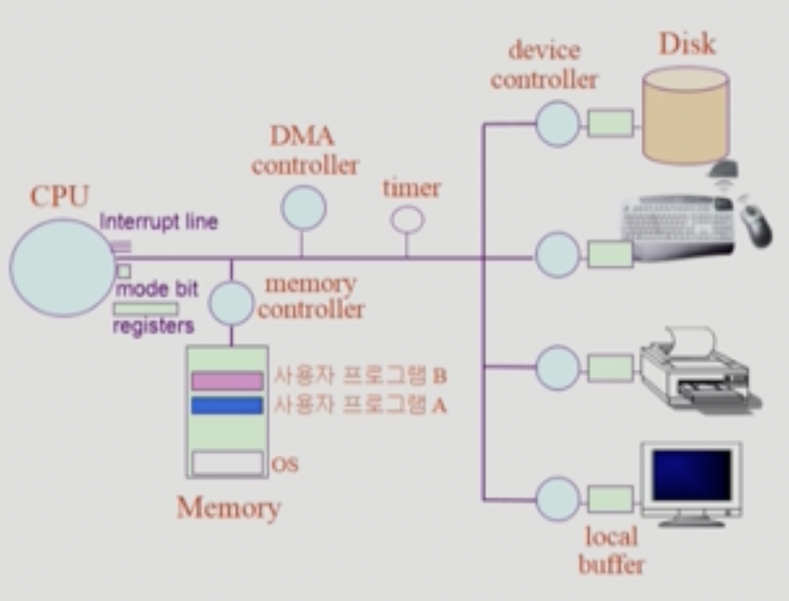

- Computer

  - CPU

    - 매 클락사이클 마다 메모리에서 기계어(instruction)를 읽어서 프로그램 실행
    - Register
      - 메모리보다 빠르면서 정보를 저장할 수 있는 작은 공간
      - Program counter register
        - CPU가 읽어야할 메모리의 위치를 가리킴
    - Mode bit
      - 사용자 프로그램의 잘못된 수행으로 다른 프로그램 및 운영 체제에 피해가 가지 않도록 하기 위한 보호 장치
      - CPU를 통해 실행되고있는 것이 OS인지, 프로그램인지 구분
      - 하드웨어적으로 두 가지 모드의 operation 지원
        - 사용자 모드->1
          - 사용자 프로그램 수행
        - 모니터 모드 (=커널 모드, 시스템 모드)->0
          - OS 코드 수행
      - 보안을 해칠 수 있는 중요한 명령어는 모니터 모드에서만 수행 가능한 특권명령으로 규정
        - I/O 관련
      - Interrupt나 Exception 발생 시 하드웨어가 mode bit을 0으로 설정
      - 사용자 프로그램에 CPU를 넘기기 전에 mode bit을 1로 설정
    - Interrupt line
      - CPU가 메모리 이외의 다른 하드웨어와 통신할 수 있는 경로
        - CPU가 I/O (키보드 입력, 화면 출력 등)와 관련한 신호를 받는 경로
        - Timer
      - CPU가 여러 프로그램을 번갈아가며 실행하는 도중 체크

  - Memory

    - memory controller 존재
      - CPU와 DMA controller가 동시에 memory에 접근하는 것을 방지

  - Timer

    - 특정 프로그램이 무한루프에 빠지게 되면 CPU를 독점하게됨
    - 이를 방지하기 위해 프로그램 별로 실행 시간을 할당하여 CPU를 독점하는 것을 방지
      - 정해둔 시간이 지나면, timer가 CPU에 interrupt를 걸게되고, 운영체제가 CPU의 제어권을 가져감
    - 매 클럭 틱 마다 1씩 감소
    - 타이머 값이 0이 되면 interrupt 발생
    - 현재 시간 계산에도 활용

  - DMA controller

    - DMA가 memory에 접근할 수 있도록 해줌
    - DMA는 I/O 장치에 의해 너무 많은 interrupt가 발생하여 CPU의 효율이 떨어지는 것을 방지
      - DMA가 CPU 대신 local buffer의 내용을 memory에 복사하고 CPU에 interrupt를 걸어 I/O가 끝났음을 알림
      - 이를 통해 CPU가 interrupt 당하는 빈도를 줄임

    

- I/O device

  - device controller
    - CPU에 비해 I/O device는 매우 느리므로, 각각의 device를 전담하는 일종의 작은 CPU
      - 예를들어, disk의 내부를 통제하는 것은 CPU가 아니고 disk controller의 역할
    - local buffer
      - device controller의 작업 공간
      - I/O는 실제 device와 local buffer 사이에서 일어남
    - device controller는 I/O가 끝났을 경우 interrupt를 통해 CPU에 그 사실을 알림
  - device driver
    - OS 코드 중 각 device에 접근하기 위한 software
  - Disk
    - Input/Output device의 역할 동시 수행
  - Mouse, Keyboard, ...


## 입출력 (I/O)의 수행

- 모든 입출력 명령은 모니터 모드에서만 수행가능한 특권 명령
- 시스템 콜 (System Call)
  - 사용자 프로그램이 운영 체제의 서비스를 받기 위해 커널 함수를 호출하는 것
  - 사용자 프로그램은 운영체제에게 I/O를 요청
    - 요청에 따라 사용자 모드에서 모니터 모드로 넘어감
      - Mode bit을 1에서 0으로 바꿈
    - Trap(소프트웨어적 interrupt)을 사용하여 interrupt 벡터의 특정 위치로 이동
    - 제어권이 interrupt 벡터가 가리키는 interrupt 서비스 루틴으로 이동
    - 올바른 I/O 요청인지 확인 후 I/O 수행
    - I/O 완료 시 제어권을 시스템 콜 다음 명령으로 옮김
    - I/O를 위해서는 두 가지 interrupt가 모두 걸림
      - I/O 요청 -> trap
      - I/O 완료 -> interrupt


## 인터럽트(Interrupt)

- 인터럽트 당한 시점의 레지스터와 program counter를 save한 후, CPU의 제어를 인터럽트 처리 루틴에 넘기게 됨
- Interrupt (하드웨어 interrupt)
  - 하드웨어(I/O device 등)가 발생시킨 인터럽트
- Trap (소프트웨어 interrupt)
  - Exception
    - 프로그램이 오류를 범한 경우
  - System call
    - 프로그램이 커널 함수를 호출하는 경우
- Interrupt 벡터
  - 해당 interrupt의 처리 루틴 주소를 가지고 있음
- Interrupt 처리 루틴 (Interrput Service Routine, Interrupt Handler)
  - 각각의 interrupt 마다 운영 체제가 해야하는 일이 다름
    - 키보드 컨트롤러가 interrupt를 걸면, local buffer의 내용을 memory에 복사하고, 키보드 I/O를 요청했던 프로세스에는 CPU를 얻을 수 있다고 알려야함
    - Timer가 interrupt를 걸면, CPU를 뺐어서 다른 프로레스에 넘겨야함
  - 각각의 interrupt를 처리하는 커널 함수
    - interrupt 마다 해야하는 일이 운영 체제의 코드에 미리 정의되어 있음
- 현대의 운영 체제는 interrupt에 의해 구동됨
  - 운영 체제는 평소에 CPU를 사용할 일이 없음
  - 항상 사용자 프로그램이 운영 체제 사용
  - interrupt가 걸릴 때만 CPU가 운영 체제로 넘어감


## 동기식 입출력과 비동기식 입출력

- 동기식 입출력 (synchronous I/O)
  - I/O 요청 후, 입출력 작업이 완료된 후에야 제어가 사용자 프로그램에 넘어감
  - 구현 방법1
    - I/O가 끝날 때까지 한 프로그램에서 CPU를 점유하여 낭비시킴
    - 매 시점 하나의 I/O만 일어날 수 있음
  - 구현 방법2
    - I/O가 완료될 때까지 해당 프로그램에게서 CPU를 뺐어 다른 프로그램에 넘김
    - I/O 처리를 기다리는 프로그램들을 줄세움
- 비동기식 입출력 (asynchronous I/O)
  - I/O가 시작된 후 입출력 작업이 끝나기를 기다리지 않고 제어가 사용자 프로그램에 즉시 넘어감
- 두 경우 모두 인터럽트를 통해 I/O가 끝났음을 알림


## DMA (Direct Memory Access)

- 입출력 장치를 메모리에 가까운 속도로 처리하기 위해 사용
  - 입출력 장치의 속도가 빠를수록 CPU에 인터럽트를 많이 걺
- CPU의 중재 없이 device controller가 buffer storage의 내용을 메모리에 block 단위로 직접 전송
  - 바이트 단위가 아닌, block 단위로 인터럽트를 발생시킴


## 서로 다른 입출력 명령어

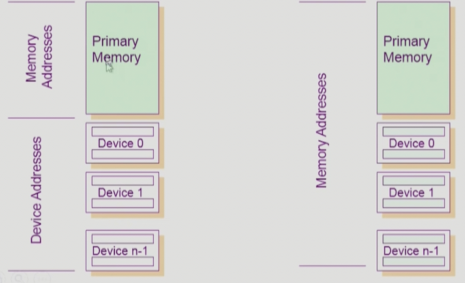

- 메모리에 접근하는 instruction과는 별개로 I/O device에 접근하는 special intruction 사용 (좌측)
- 메모리 주소를 연장하여 I/O device에 주소를 붙이고 메모리에 접근하는 instruction 그대로 사용 (우측)
  - Memory Mapped I/O


## 저장 장치 계층 구조

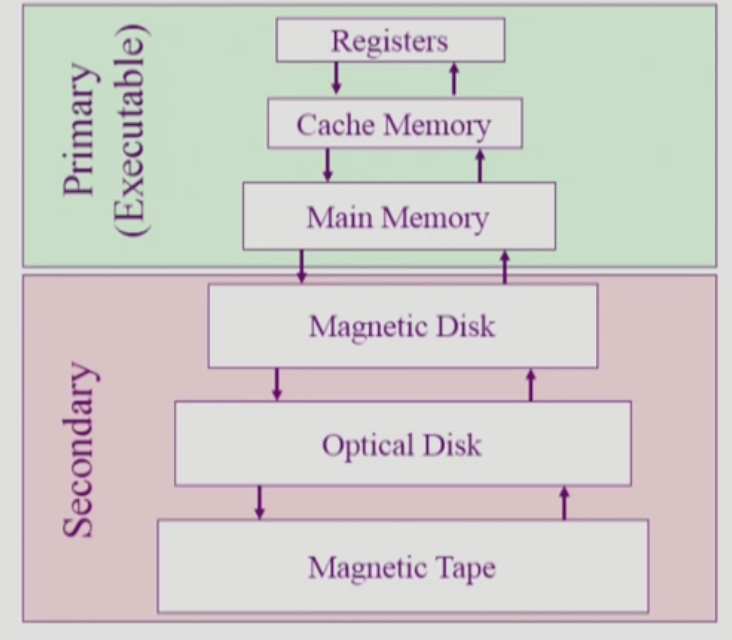

- 위로 갈수록 속도가 빠르지만 단위 공간당 비용이 비싸 용량이 적음
- 주기억 장치
  - 휘발성
  - byte 단위로 메모리 주소를 매기므로 CPU가 직접 접근해서 처리 가능
- 보조기억 장치
  - 비휘발성
  - byte 단위가 아닌 섹터 단위이므로 CPU가 직접 접근 불가
- 캐싱
  - 재사용을 목적으로 더 빠른 저장 매체에 정보를 저장해두는 것


## 프로그램의 실행 (메모리 load)

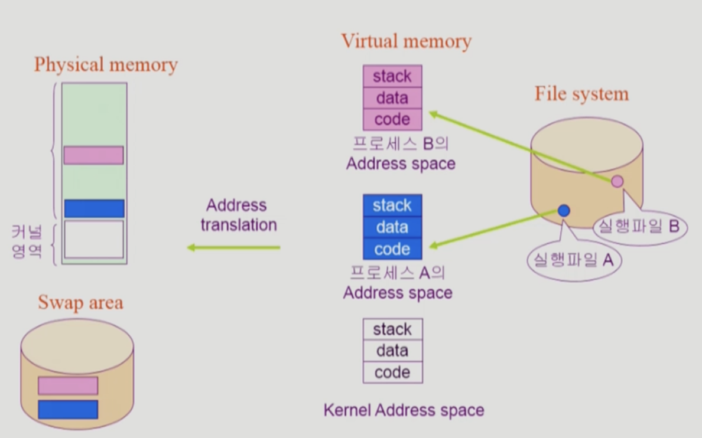

- File system에 저장되어있는 프로그램의 실행파일을 실행하면, 그 프로그램 만의 독자적인 주소 공간이 생김

  - 주소 공간은 아래의 영역으로 구성됨

    - code
      - CPU에서 실행할 기계어 저장

    - data
      - 프로그램이 사용할 변수 등의 자료구조 저장
    - stack
      - 함수를 호출하고 리턴할 때 데이터를 저장

  - 이 주소 공간 전체를 실제 메모리에 올리면 메모리가 낭비됨

    - 당장 필요한 부분만 메모리에 올림
      - 메모리에 올라간 코드가 필요없으면 버리거나, 하드디스크를 메인 메모리의 연장선으로 사용하는 swap area에 넘김
    - 이런 특성 때문에 Virtual memory라고 부름
    - 하드웨어의 도움을 받아 가상 메모리의 주소를 실제 메모리 주소로 변환해주는 계층 존재


## OS 커널 주소 공간의 내용

- code
  - 커널 코드
    - 시스템 콜, 인터럽트 처리 코드
    - 자원 관리를 위한 코드
    - 편리한 서비스 제공을 위한 코드
- data
  - 하드웨어를 관리하고 통제하기 위해 OS가 사용하는 자료구조
  - 각 프로그램을 관리하기 위한 자료 구조 (PCB)
- stack
  - 사용자 프로그램 마다 커널 스택을 별도로 둠


## 사용자 프로그램이 사용하는 함수

- 사용자 정의 함수
  - 자신의 프로그램에서 정의한 함수
  - 해당 프로그램의 virtual memory의 code 영억에 존재
- 라이브러리 함수
  - 자신의 프로그램에서 정의하지 않고 외부에서 가져다 쓴 함수
  - 해당 프로그램 실행 파일에 포함됨
  - 해당 프로그램의 virtual memory의 code 영억에 존재
- 커널 함수
  - 운영 체제 프로그램의 함수
  - OS 커널 주소 공간의 code 영역에 존재
  - 커널 함수의 호출 = 시스템 콜
    - 사용자 프로그램 virtual memory의 code 영역에서 OS 커널 주소 공간의 code 영역으로 직접 점프 불가
    - mode bit 제한도 있음


## 프로그램의 실행

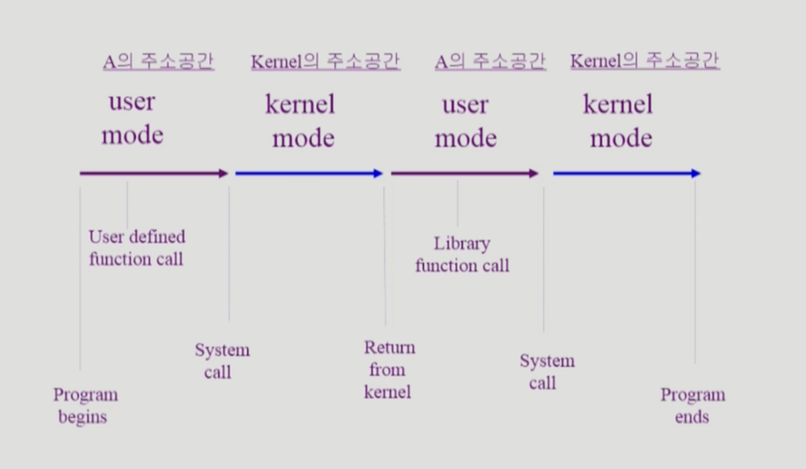

- 프로그램은 실행 후 종료될 때까지, user mode와 kernel mode를 왔다갔다하게 됨


# 3. Process

## 프로세스의 개념

- "Process is a program in execution"
- 프로세스의 문맥(context)
  - 프로세스의 정확한 상태를 규명하기 위해서 필요한 요소들
  - CPU 수행 상태를 나타내는 하드웨어 문맥
    - Program Counter
      - 프로세스 주소공간의 code를 가리킴
    - 각종 register에 들어있는 값
  - 프로세스의 주소 공간
    - code, data, stack
  - 프로세스 관련 커널 자료 구조
    - PCB (Process Control Block)
      - OS가 프로세스를 관리하기 위해 data 영역에 생성
    - Kernel stack
      - 프로세스의 시스템 콜에 의해 커널의 함수가 호출
  - multitasking을 할 때, 이전 프로세스의 문맥을 알고있어야 작업을 이어서 할 수 있음


## 프로세스의 상태 (Process State)

- 프로세스는 상태(state)가 변경되며 수행됨

  - Running

    - CPU를 잡고 instruction을 수행중인 상태

  - Ready

    - CPU를 기다리는 상태
      - 메모리 등 다른 조건을 모두 만족한 상태로 대기
    - Ready 상태에 있는 프로세스들이 번갈아가며 CPU를 잡게 됨

  - Blocked (wait, sleep)

    - CPU를 주어도 당장 instruction을 수행할 수 없는 상태
    - 프로세스 자신이 요청한 event(I/O 등)가 즉시 만족되지 않아 이를 기다리는 상태
      - 디스크에서 file을 읽어와야 하는 경우

  - New

    - 프로세스가 생성 중인 상태

  - Terminated

    - 수행(execution)이 끝난 상태
    - 정리할게 남아있는 상태

    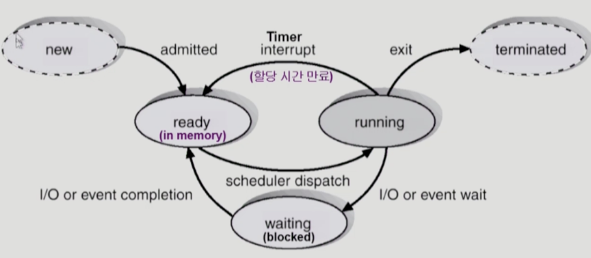

    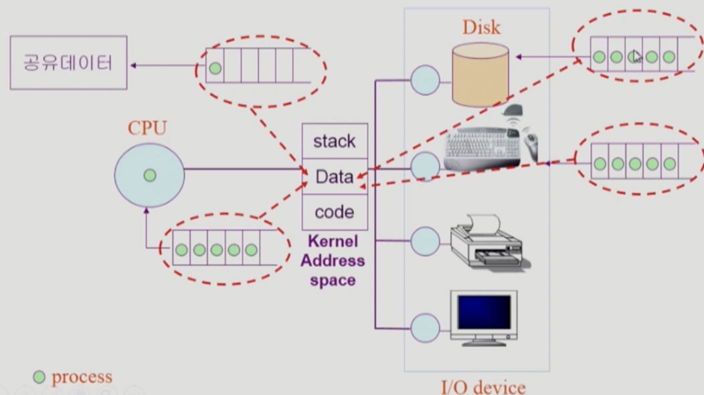

    - Ready queue에 줄 서있는 프로세스들이 CPU를 번갈아 가며 사용
    - 프로세스가 I/O를 필요로하면, 시스템 콜을 하고 blocked 상대가 되어 해당 장치의 I/O queue에 줄을 서게 됨
      - 해당 I/O 작업이 끝나면 device controller가 인터럽트를 걸어 I/O의 완료를 알리고, 프로세스는 다시 Ready queue에 들어감
    - queue는 커널의 주소 공간의 data 영역에 존재

- OS의 상태에 대해서는 이야기 하지 않음


## Process Control Block (PCB)

- OS가 각 프로세스를 관리하기 위해 프로세스 당 유지하는 정보
- 구성 요소
  - OS가 관리상 사용하는 정보
    - Process state, Process ID
    - scheduling information, priority
  - CPU 수행 관련 하드웨어 값
    - Program counter, registers
  - 메모리 관련
    - code, data, stack의 위치 정보
  - 파일 관련
    - open file descriptors ...
- queue에 프로세스를 줄 세울때, 사실은 PCB를 줄 세움


## 문맥 교환 (Context Switch)

- CPU를 한 프로세스에서 다른 프로세스로 넘겨주는 과정

  - CPU를 내어주는 프로세스의 상태를 그 프로세스의 PCB에 저장
    - register, program counter, memory map
  - CPU를 새롭게 얻는 프로레스의 상태를 PCB에서 읽어옴

- 시스템 콜이나 인터럽트 발생 시 반드시 문맥 교환이 일어나는 것이 아님

  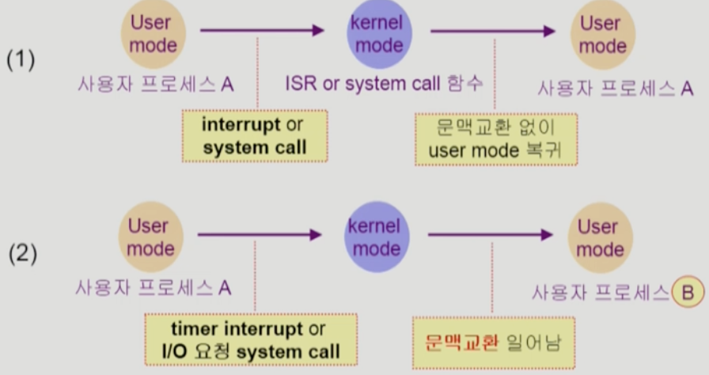

  - (1)의 경우에도 CPU 수행 정보 등 context의 일부를 PCB에 저장해야 하지만, 문맥 교환을 하는 (2)의 경우 그 부담이 훨씬 큼
    - (2)의 경우 cache memory flush가 필요하여 상당한 오버헤드 발생


## 프로세스를 스케줄링하기 위한 큐

- Job queue
  - 현재 시스템 내에 있는 모든 프로세스의 집합
  - 다른 queue에 있는 프로세스 포함
- Ready queue
  - 현재 메모리 내에 있으면서 CPU를 잡아서 실행되기를 기다리는 프로세스의 집합
- Device queue
  - I/O device의 처리를 기다리는 프로세스의 집합
- 프로세스들은 각 큐들을 오가며 수행됨


## 스케줄러 (Scheduler)

- Long-term scheduler (장기 스케줄러 or job scheduler)

  - 시작 프로세스 중 어떤 것들을 ready queue로 보낼지 결정
  - 프로세스에 메모리 및 각종 자원을 주는 문제
  - degree of Multiprogramming을 제어
    - 메모리에 프로그램을 몇개 올릴 것인지
  - time sharing system에는 보통 장기 스케줄러가 없음
    - 어떤 프로그램이 시작되면 곧바로 ready상태로 메모리에 올림

- Short-term scheduler (단기 스케줄러 or CPU scheduler)

  - 어떤 프로세스를 다음번에 running 시킬 지 결정
  - 프로세스에 CPU를 주는 문제
  - 충분히 빨라야 함
    - ms 단위

- Medium-Term scheduler (중기 스케줄러 or swapper)

  - 여유 공간 마련을 위해 프로세스를 통째로 메모리에서 디스크로 쫓아냄

  - 프로세스에서 메모리를 뺏는 문제

  - degree of Multiprogramming을 제어

  - 중기 스케줄러 덕분에 프로세스 상태에 suspended (stopped) 추가

    - 외부적인 이유로 프로세스의 수행이 정지된 상태

    - 프로세스는 통째로 디스크에 swap out 됨

      - 사용자가 프로그램을 일시 정지 시킨 경우
      - 메모리에 너무 많은 프로세스가 올라와 있을 때 시스템이 프로세스를 잠시 중단시킴

    - blocked의 경우 자신이 요청한 이벤트가 만족되면 ready로 돌아감

    - suspended의 경우 외부에서 resume해 주어야 active한 상태로 돌아갈 수 있음

      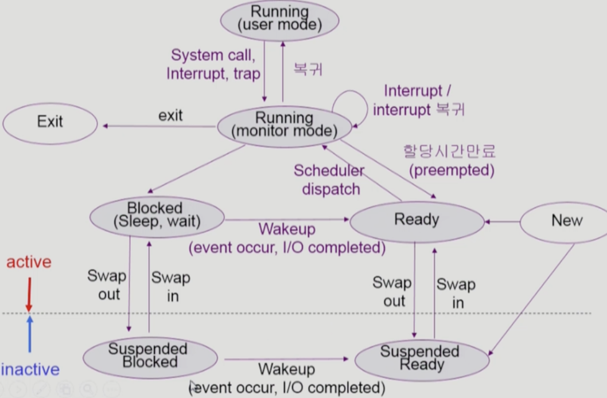


## Thread

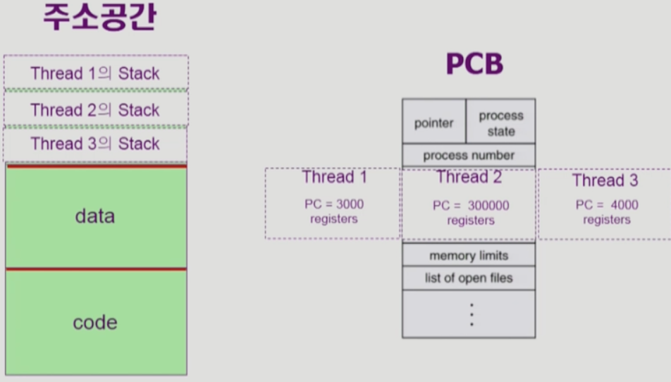

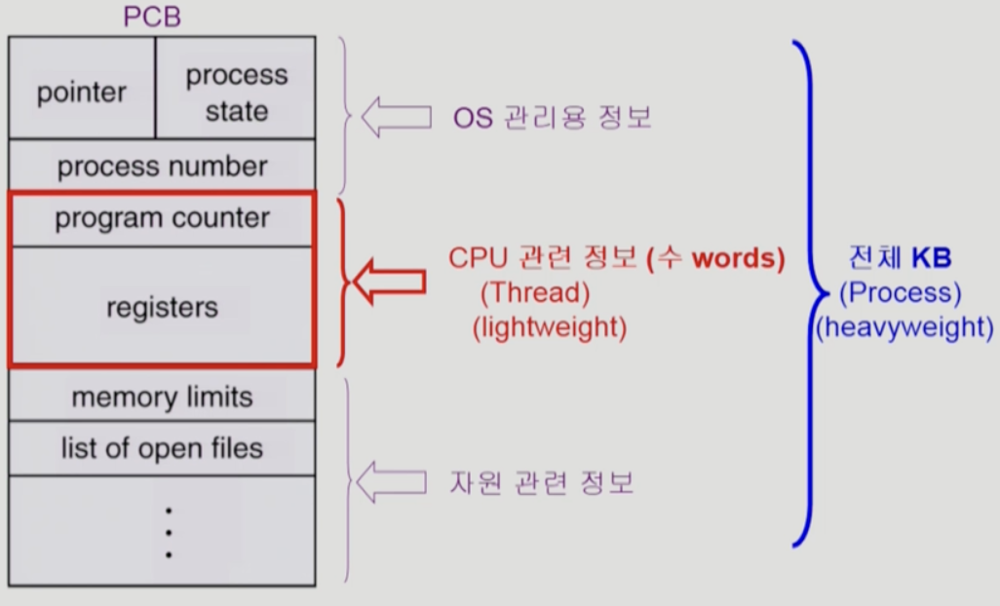

- 스레드는 프로세스 내부의 CPU 수행 단위 
  - 스레드를 lightweight process라고도 부름
    - 프로세스를 여러개 두는 것 보다, 한 프로세스에 스레드를 여러개 두는 것이 더 가볍기 때문
- 스레드의 구성 (CPU 수행과 관련있는 부분)
  - program counter
  - register set
  - stack space
- 프로세스 내부에서 스레드가 공유하는 부분 (task)
  - code section
  - data section
  - OS resources
- 다중 스레드로 구성된 태스크 구조에서는 하나의 서버 스레드가 blocked (waiting) 상태인 동안에도 동일한 태스크 내의 다른 스레드가 실행(running) 되어 빠른 처리를 할 수 있다.
  - 여러개의 스레드를 사용하는 웹 브라우저에서는 한 스레드에서 웹 페이지의 이미지를 읽어올 때, 다른 스레드가 이미 읽어온 텍스트를 화면에 띄울 수 있어서 사용자 입장에서 빠르게 느낌 -> 빠른 응답성
- 동일한 일을 수행하는 다중 스레드가 협력하여 높은 처리율 (throughput)과 성능 향상을 얻을 수 있음
  - 동일한 일을 수행하는 프로세스를 여러개 만들면, 각 프로세스 마다 독자적인 주소공간을 만들어야 해서 메모리가 낭비됨 -> 리소스 절약
- 스레드를 사용하면 병렬성을 높일 수 있음
  - CPU가 여러개 달린 컴퓨터에서 얻을 수 있는 이점


## Benefits of Threads

- Responsiveness
  - 웹브라우저에서 웹서버에 요청을하면 html을 받게 됨
  - 받은 html에서 다시 이미지들을 읽어와야됨(I/O)
  - 스레드가 여러개라면, 이미지를 읽어오는 스레드만 blocked되고, 다른 스레드가 html의 텍스트 등을 화면에 띄울 수 있음
    - I/O를 요청했음에도, 프로세스 자체가 blocked되지 않고 여전히 작동하므로 비동기식 입출력
- Resource Sharing
  - 동일한 일을 하는 경우, 프로세스를 여러개 만들면 메모리가 낭비되므로 스레드를 사용하여 리소스를 절약할 수 있음
- Economy
  - 프로세스를 생성하는 작업에 비해 스레드를 생성하는 작업은 오버헤드가 작음
  - 문맥 교환에서의 이점
- Utillization of MP Architectures
  - CPU가 여러개 있는 경우의 장점
  - 각각의 스레드가 서로다른 CPU에서 병렬적으로 작업 가능


## Implementation of Threads

- Kernel Threads
  - supported by kernel
  - OS 커널이 스레드의 존재를 아는 경우
  - 하나의 스레드에서 다른 스레드로 CPU가 넘어갈 때, 커널이 CPU 스케쥴링 하듯이 넘겨줌
- User Threads
  - supported by library
  - 프로세스 안에 여러 개의 스레드가 있다는 사실을 OS가 모름
  - 프로세스 자체적으로 내부에 CPU 수행 단위를 여러개 두면서 관리
    - 약간의 제약이 존재
- Real-time Threads


# 4. Process Management

## 프로세스 생성 (Process Creation)

- 부모 프로세스 (Parent process)가 자식 프로세스 (Children process) todtjd
- 프로세스의 트리 (계층 구조) 형성
- 프로세스는 자원을 필요로 함
  - OS로부터 받음
  - 부모 프로세스와 자원을 공유하는 경우도 있음
- 자원의 공유
  - 부모와 자식이 모든 자원을 공유하는 모델
  - 일부를 공유하는 모델
  - 전혀 공유하지 않는 모델
    - 일반적으로 부모와 자식은 서로 CPU와 메모리를 얻기 위해 경쟁
  - copy-on-write (COW)
    - 자식이 생성될 때 부모의 program counter register만 카피함
    - 자식의 data가 변화하면 그 부분은 부모와 더 이상 공유하지 않음
- 수행 (Execution)
  - 부모와 자식이 공존하며 수행되는 모델
  - 자식이 종료 (terminate)될 때 까지 부모가 기다리는(wait, blocked 상태) 모델
- 주소 공간 (Address space)
  - 프로세스의 생성은 두 단계를 거침
    - 자식은 부모의 주소 공간을 복사함
      - code, data, stack
      - binary and OS data (PCB)s
    - 자식은 그 공간에 새로운 프로그램을 올림(덮어 씌움)
  - 유닉스의 예
    - `fork()` 시스템 콜이 새로운 프로세스를 생성
      - 부모를 그대로 복사 (OS data except PID + binary)
      - 주소 공간 할당
    - `for()` 다음에 이어지는 `exec()` 시스템 콜을 통해 새로운 프로그램을 메모리에 올림


## 프로세스 종료 (Process Termination)

- 프로세스가 마지막 명령을 수행한 후 OS에게 이를 알려줌 (exit, 자발적)
  - 자식이 부모에게 output data를 보냄 (via wait 시스템 콜)
  - 프로세스의 각종 자원들이 OS에 반납됨
- 부모 프로세스가 자식의 수행을 종료시킴 (abort, 비자발적)
  - 자식이 할당 리소스의 한계치를 넘어설 때
  - 자식에게 할당된 태스크가 더 이상 필요하지 않을 때
  - 부모가 종료 (exit)하는 경우
    - OS는 부모 프로세스가 종료하는 경우 자식이 더 이상 수행되지 않도록 함
    - 손자->자식->부모 순의 단계적인 종료


## `fork()` 시스템 콜

```c
int main() {
  int pid;
  pid = fork();
  // A
  if (pid == 0) {
    	printf("\n Hello, I am child!\n");
  } else if {
    	printf("\n Hello, Iam parent!\n");
  }
}
```

- create a child (copy)
- `fork()`를 통해 자식을 만들면, 자식은 주석 A 밑의 코드부터 실행함
  - 부모 프로세스의 context를 복사했기 때문에 program counter가 가리키고 있는 부분 부터 실행됨
- 부모와 자식을 구분하기 위해 `fork()` 실행 후의 반환 값이 다름
  - 부모는 양수, 자식은 0을 가짐


## `exec()` 시스템 콜

```c
int main() {
  int pid;
  pid = fork();
  if (pid == 0) {
    	printf("\n Hello, I am child! Now I'll run data \n");
  		execlp("/bin/date", "/bin/date", (char *) 0);
  } else if (pid > 0) {
    	printf("\n Hello, I am parent!\n");
  }
}
```

- overlay new image

- 자식이 date라는 프로그램으로 덮어씌워짐

- 한 번 `exec()`을 하면 돌아올 수 없음

- 반드시 자식을 만들고 `exec()`할 필요는 없음

  ```c
  int main() {
      	printf("\n Hello, I am child! Now I'll run data \n");
    		execlp("/bin/date", "/bin/date", (char *) 0);
      	printf("\n Hello, I am parent!\n"); // 이 코드는 영원히 실행되지 않음
  }
  ```


## `wait()` 시스템 콜

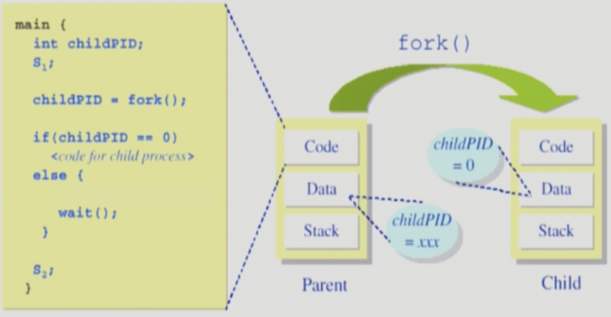

- sleep until child is done
- 프로세스 A가 `wait()` 시스템 콜을 호출하면
  - 커널은 자식 프로세스가 종료될 때 까지 프로세스 A를 sleep 시킴 (block 상태)
  - 자식 프로세스가 종료되면, 커널은 프로세스 A를 깨움 (ready 상태)
- 리눅스의 쉘이 프로세스 A
  - 커맨드에 다른 프로그램의 이름을 치면 자식 프로세스가 생성되고 `wait()` 시스템 콜
  - 자식 프로세스가 끝나면 다시 커서가 깜빡거리며 새로운 커맨드를 입력받을 수 있게 됨


## `exit()` 시스템 콜

- frees all the resources, notify parent
- 프로세스의 종료
  - 자발적 종료
    - 마지막 statement 수행 후 `exit()` 시스템 콜을 통해 종료
    - 프로그램에 명시적으로 적어주지 않아도 `main` 함수가 리턴되는 위치에 컴파일러가 자동으로 넣어줌
  - 비자발적 종료
    - 부모 프로세스가 자식 프로세스를 강제 종료 시킴
      - 자식 프로세스가 한계치를 넘어서는 리소스 요청
      - 자식에게 할당된 태스크가 더 이상 필요하지 않음
    - 키보드로 `kill, break` 등을 입력한 경우
    - 부모 프로세스가 종료되는 경우
      - 부모 프로세스가 종료되기 전에 자식 프로세스들이 먼저 종료됨


## 프로세스 간의 협력

- 독립적 프로세스 (Independent process)

  - 프로세스는 각자의 주소 공간을 가지고 수행되므로 원칙적으로 하나의 프로세스는 다른 프로세스의 수행에 영향을 미치지 못함

- 협력 프로세스 (Cooperating process)

  - 프로세스 협력 메커니즘을 통해 하나의 프로세스가 다른 프로세스의 수행에 영향을 미칠 수 있음

- 프로세스 간 협력 메커니즘 (IPC: Interprocess Communication)

  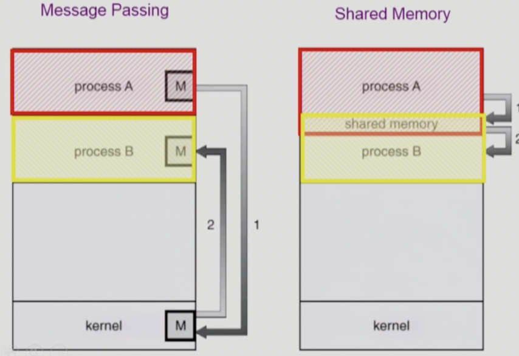

  - 메세지를 전달하는 방법 (message passing)
    - 커널을 통해 메세지 전달
  - 주소 공간을 공유하는 방법 (shared memory)
    - 서로 다른 프로세스 간에도 일부 주소 공간을 공유하게 하는 shared memory 메커니즘이 있음
    - thread의 경우 사실상 하나의 프로세스 내부에 존재하는 것이므로 프로세스 간 협력으로 보기는 어렵지만, 동일한 process를 구성하는 thread들 간에는 주소 공간을 공유하므로 협력이 가능


### Message Passing

- Message system
  - 프로세스 사이에 공유 변수 (shared variable)를 일체 사용하지 않고 통신하는 시스템
  - 메세지는 반드시 커널이 전달
- Direct Communication
  - 통신하려는 프로세스의 이름을 명시적으로 표시
- Indirect Communication
  - mailbox (또는 port)를 통해 메세지를 간접 전달


# 5. CPU scheduling

## CPU and I/O Bursts in Program Execution

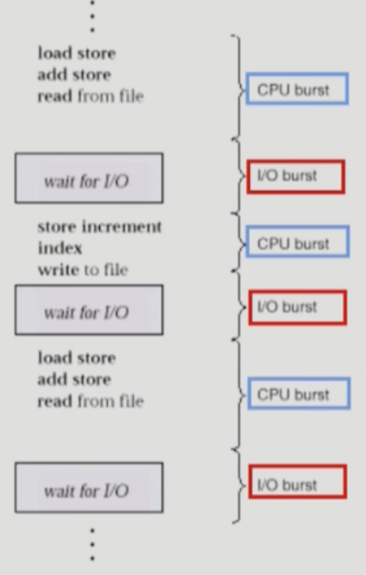

- 어떤 프로그램이든 실행되면, CPU burst와 I/O burst를 반복함
  - 빈도는 다름
    - 사람이 자주 개입하는 프로그램이면 I/O burst의 빈도가 높아짐


## CPU-burst Time의 분포

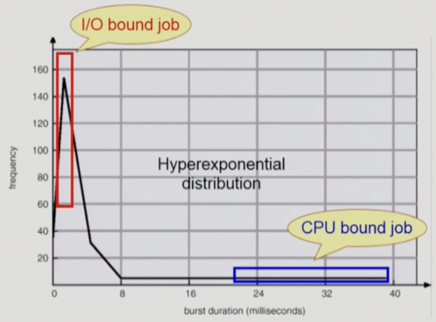

- I/O bound job
  - I/O burst가 많은 job
    - CPU를 잡고 계산하는 시간보다, I/O에 많은 시간이 필요한 job
  - many short CPU bursts
- CPU bound job
  - CPU만 길게 쓰는 프로그램
    - 계산 위주의 job
  - few very ong CPU bursts
- Interactive job에게 적절한 response 제공 요망
  - CPU bound job이 CPU를 너무 오래 사용하면, I/O가 많이 필요한 Interactive job의 대기 시간이 길어짐


## CPU Scheduler & Dispatcher

- CPU Scheduler
  - Ready 상태의 프로세스 중에서 이번에 CPU를 줄 프로세스를 고름
  - OS 내부의 CPU scheduling을 하는 코드
- Dispatcher
  - CPU의 제어권을 CPU scheduler에 의해 선택된 프로세스에게 넘기는 코드
  - 이 과정이 context switch (문맥 교환)

### CPU 스케줄링이 필요한 경우

1. Running -> Blocked
   - I/O를 요청하는 시스템 콜
2. Running -> Ready
   - 할당 시간 만료로 timer interrupt
3. Blocked -> Ready
   - I/O 완료 후 인터럽트
4. Terminate

- 1, 4에서의 스케줄링은 nonpreemptive (강제로 빼앗지 않고 자진 반납)
- 2, 3에서의 스케줄링은 preemptive (강제로 빼앗음)


## Scheduling Criteria

- CPU utilization (이용률)
  - keep the CPU as busy as possible
  - 전체 시간 중 CPU가 일한 시간의 비율
- Throughput (처리량)
  - number of processes that complete their execution per time unit
  - 몇 개의 일을 처리했는지
- Turnaround time (소요 시간)
  - amount of time to execute a particular process
  - CPU를 쓰러 들어와서 작업이 끝나고 나갈때까지 걸린 시간
- Waiting time (대기 시간)
  - amount of time a process has been waiting in the ready queue
  - ready queue에 줄 서서 기다리는 시간의 총합
- Response time (응답 시간)
  - amount of time it takes from when a request was submitted until the first response is produced, not ouput
  - 최초로 CPU를 얻기 까지 걸린 시간


## Scheduling Algorithm

### FCFS (First-Come First-Served)

- nonpreemtive
- 프로세스의 도착 순서대로 CPU 할당
- 긴 프로세스가 도착하면 짧은 프로세스들이 오래 기다려야 하므로 그리 효율적이지 않음
  - Convoy effect
- 24->3
  - average waiting time = 12
- 3->24
  - average waiting time = 1.5


### SJF (Shortest-Job-First)

- 각 프로세스와 다음번 CPU burst time을 가지고 스케쥴링에 활용
- CPU burst time이 가장 짧은 프로세스를 제일 먼저 스케쥴
- Nonpreemptive
  - 일단 CPU를 잡으면 이번 CPU burst가 완료될 때 까지 CPU를 선점 당하지 않음
- Preemptive
  - 현재 수행중인 프세스의 남은 burst time보다 더 짧은 CPU burst time을 가지는 새로운 프로세스가 도착하면 CPU를 빼앗김
  - 이 방법을 Shortest-Remainig-Time-First (SRTF)라고도 부름
    - SRTF는 주어진 프로세스들에 대해 minimum average waiting time을 보장
- Starvation
  - CPU 사용 시간이 긴 프로세스는 대기시간이 매우 길어질 수 있음
- 다음번 CPU burst time는 추정만이 가능함
  - 과거의 CPU burst time을 이용하여 추정
  - t': 추정값, t: 실제값
  - t'~n+1~ = αt~n~ + (1-α)t'~n~ (0<=α<=1)
  - -> t'~n+1~ = αt~n~ + (1-α)αt~n-1~ + ... + (1-α)^n+1^t'~0~
    - 최근 시간의 가중치가 더 큼


### Priority Scheduling

- 가장 높은 우선 순위(보통 정수값)를 가진 프로세스에게 CPU 할당
  - 우선 순위는 다양한 방법으로 정할 수 있음
- SJF도 Priority Scheduling의 일종
- Starvation
  - Solution
    - 대기 시간이 길어지면 우선 순위를 높여주는 Aging을 통해 Starvation을 방지
- Preemtive
- Nonpreemtive


### Round Robin (RR)

- 현대적인 CPU Scheduling
- 각 프로세스는 동일한 크기와 할당 시간 (time quantum)을 가짐
  - 일반적으로 10~100ms
- 할당 시간이 지나면 프로세스는 선점당하고 ready queue 제일 뒤에 가서 다시 줄을 섬
- n개의 프로세스가 ready queue에 있고, 할당 시간이 q time unit인 경우 각 프로세스는 최대 q time unit 단위로 CPU 시간의 1/n을 얻음
  - 어떤 프로세스도 (n-1) q time unit 이상 기다리지 않음
- 응답시간이 빠르다는 장점이 있음
- CPU 사용 시간이 길수록 대기 시간도 비례해서 커짐
- q가 커지면 FCFS와 유사해짐
- q가 작아지면 context switch 오버헤드가 커짐
- 프로세스의 CPU burst time이 비슷한 경우 average turnaround time이 길어짐


### Multilevel Queue

- Ready queue를 여러개로 분할

  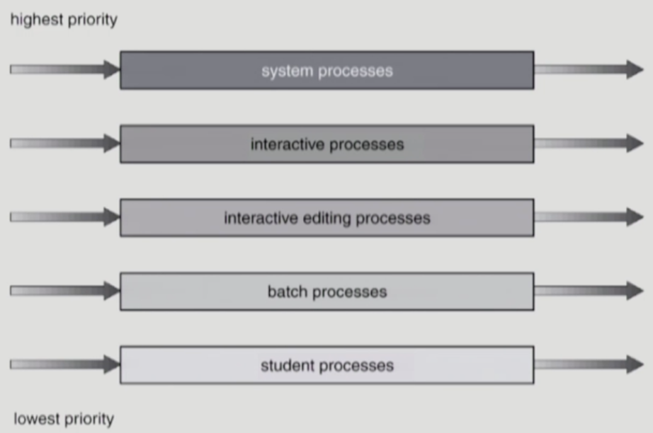

- 각 큐는 독립적인 스케줄링 알고리즘을 가짐
- 큐에 대한 스케줄링이 필요
  - Fixed priority scheduling
    - 무조건 우선순위가 높은 큐부터 처리
    - Starvation 문제 발생
  - Time slice
    - 각 큐에 CPU time을 적절한 비율로 할당
- 두 개의 queue로 분할하는 예시
  - foreground (interactive)
    - PR
  - background (batch - no human interaction)
    - FCFS


### Multilevel Feedback Queue

- 프로세스가 다른 큐로 이동 가능

  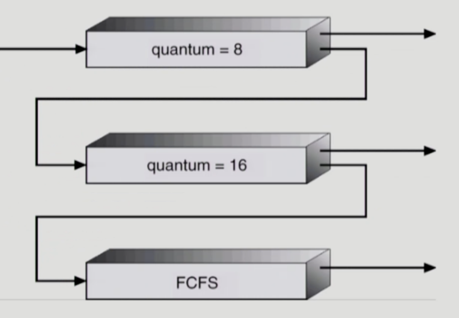

  - 프로세스는 처음에 맨 위의 큐에 들어감
  - 할당시간이 끝나면 아래 큐로 내려감
    - CPU 사용시간이 짧은 프로세스는 위쪽에서 빠져나감
    - CPU 사용시간이 긴 프로세스는 점점 아래로 내려감

- 정의해야하는 파라미터
  - Queue의 수
  - 각 큐의 scheduling algorithm
  - 프로세스를 상위/하위 큐로 보내는 기준
  - 프로세스가 CPU 서비스를 받으려 할 때 들어갈 큐를 결정하는 기준


### Multiple-Processor Scheduling

- CPU가 여러 개인 경우 스케줄링은 더 복잡해짐
- Homogeneous processor인 경우
  - Queue에 한 줄로 세워서 각 프로세서가 알아서 꺼내가도록 할 수 있음
  - 반드시 특정 프로세서에서 수행되어야 하는 프로세스가 있는 경우는 문제가 더 복잡해짐
- Load sharing
  - 일부 프로세서를 job이 몰리지 않도록 부하를 적절히 공유하는 메커니즘 필요
  - 별개의 큐를 두는 방법
  - 공동 큐를 사용하는 방법
- Symmetric Multiprocessing (SMP)
  - 각 프로세서가 각자 알아서 스케줄링 결정
- Asymmetric multiprocessing
  - 하나의 프로세서가 시스템 데이터의 접근과 공유를 책임지고 나머지 프로세서는 거기에 따름


### Real-Time Scheduling

- Hard real-time systems
  - 정해진 시간 안에 반드시 끝내도록 스케줄링해야 함
- Soft real-time computing
  - 일반 프로세스에 비해 높은 우선 순위를 갖도록 해야 함


### Thread Scheduling

- Local Scheduling
  - User level thread의 경우 OS가 thread의 존재를 모르므로 사용자 수준의 thread library에 의해 thread를 스케줄할지 결정
- Global Scheduling
  - Kernel level thread의 경우 일반 프로세스와 마찬가지로 커널의 단기 스케줄러가 어떤 thread를 스케줄할지 결정


## Algorithm Evaluation

- Queueing models
  - 확률 분포로 주어지는 arrival rate와 service rate 등을 통해 각종 performance index 값을 계산
- Implementation & Measurement
  - 실제 시스템에 알고리즘을 구현하여 실제 작업에 대하여 성능을 측정하고 비교
- Simulation
  - 알고리즘을 모의 프로그램으로 작성 후 실제 데이터인 trace를 입력으로 하여 결과 비교


# 6 . Process Synchronization

## 데이터의 접근

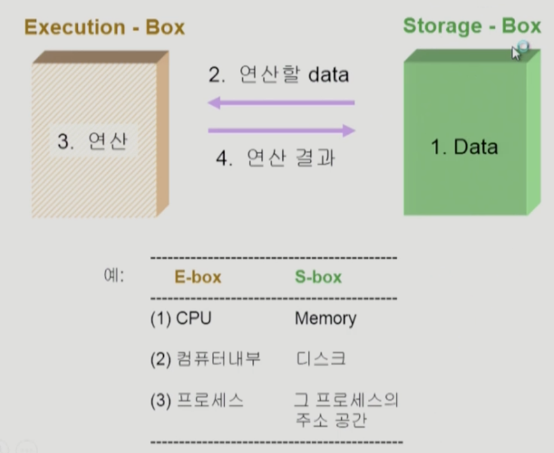


## Race Condition

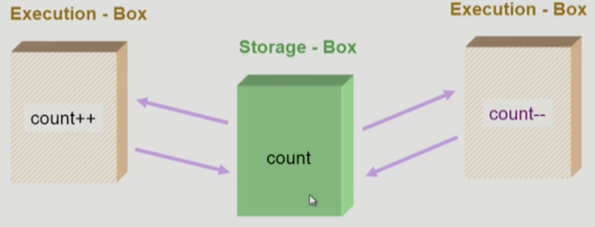

- 여러 주체가 하나의 데이터에 접근하면 Race condition의 가능성이 있음
- Multiprocessor system
  - 공유메모리를 사용하는 프로세스들
  - 커널 내부 데이터를 접근하는 루틴들


## OS에서의 Race Condition

### interrupt handler vs kernel

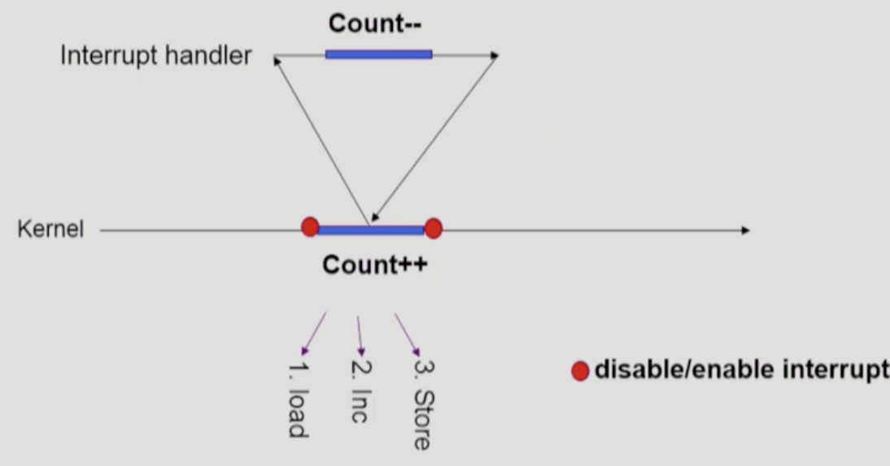

- 커널 모드 실행 중 인터럽트가 발생하여 인터럽트 처리 루틴이 수행
  - 양쪽 다 커널 코드이므로 kernel address space 공유
- 해결책
  - 커널 모드 실행 중 인터럽트 막기


### Preempt a process running in kernel

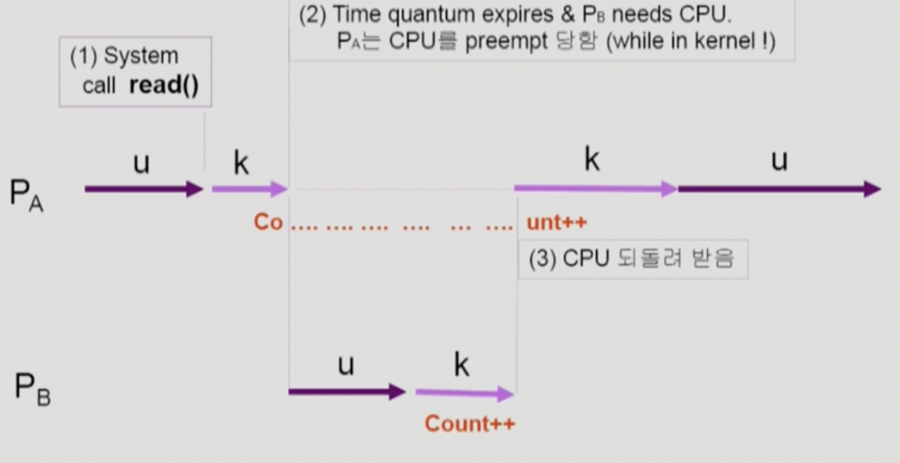

- 시스템 콜을 했는데, 해당 프로세스의 할당 시간이 끝남
- 해결책
  - 커널 모드에서 수행 중일 때는 CPU를 preempt하지 않음
  - 커널 모드에서 유저 모드로 돌아갈 때 preempt


### Multiprocessor

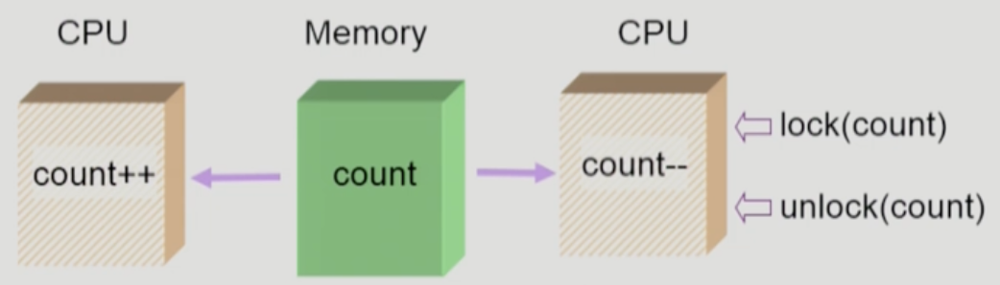

- 프로세서가 여러개인 경우, interrupt enable/disable로 race condition을 해결할 수 없음
- 해결책
  1. 한 번 하나의 CPU만이 커널에 접근할 수 있게 하는 방법
  2. 커널 내부에 있는 각 공유 데이터에 접근할 때 마다 그 데이터에 대해 lock/unlock하는 방법


## Process Synchronization 문제

- 공유 데이터의 동시 접근은 데이터의 불일치 문제를 발생시킬 수 있음
- 일관성 유지를 위해서는 협럭 프로세스 간의 실행 순서를 정해주는 매커니즘 필요
- Race condition
  - 여러 프로세스들이 동시에 공유 데이터를 접근하는 상황
  - 데이터의 최종 연산 결과는 마지막에 그 데이터를 다룬 프로세스에 따라 달라짐
  - Race condition을 막기 위해서는 concurrent process가 동기화되어야 함


## The Critical-Section Problem

- n개의 프로세스가 공유 데이터를 동시에 사용하기를 원하는 경우
- 각 프로세스의 code segment에는 공유 데이터를 접근하는 코드인 critical section이 존재
- 하나의 프로세스가 critical section에 있을  다른 모든 프로세스는 critical section에 들어갈 수 없어야 함
