# OS

Reference: [운영체제, 반효경(이화여대) ](http://www.kocw.or.kr/home/cview.do?mty=p&kemId=1046323)

---


# 1. Introduction to Operating System

## 운영 체제란?

- 컴퓨터 하드웨어 바로 위에 설치되어 사용자 및 다른 모든 소프트웨어와 하드웨어를 연결하는 소프트웨어 계층
- 좁은 의미의 운영 체제 (커널)
  - 운영 체제의 핵심 부분으로 메모리에 상주하는 부분
  - 일반적으로 OS를 의미
- 넓은 의미의 운영 체제
  - 커널 뿐 아니라 각종 주변 시스템 유틸리티를 포함한 개념
  - 메모리에 상주하지 않는 독립적인 프로그램들을 포함


## 운영 체제의 목적

- 컴퓨터 시스템의 자원을 효율적으로 관리
  - 프로세서, 기억장치, 입출력 장치 등의 리소스를 효율적으로 관리
    - 프로그램 간의 형평성 있는 자원 분배
    - 주어진 자원으로 최대한의 성능 발휘
- 컴퓨터 시스템을 편리하게 사용할 수 있는 환경 제공


## 운영 체제의 분류

### 동시 작업 가능 여부

- 단일 작업 (single tasking)
  - 한 번에 하나의 작업만 처리
  - MS-DOS 프롬프트 상에서는 한 명령의 수행을 끝내기 전에 다른 명령을 수행시킬 수 없음
- 다중 작업 (multi tasking)
  - 동시에 두 개 이상의 작업 처리
  - UNIX, MS Windows 등에서는 한 명령의 수행이 끝나기 전에 다른 명령이나 프로그램을 수행할 수 있음

### 사용자의 수

- 단일 사용자 (single user)
  - MS-DOS, MS Windows
- 다중 사용자 (multi user)
  - UNIX, NT server
  - 보안 기능 필요
  - 현재는 대부분의 운영 체제가 여기에 속함

### 처리 방식

- 일괄 처리 (batch processing)
  - 작업 요청을 일정량 모아서 한꺼번에 처리
  - 작업이 종료될 때까지 기다려야 함
  - 현대 운영 체제에서는 찾아보기 힘듦
- 시분할 (time sharing)
  - 여러 작업을 수행할 때 컴퓨터의 처리 능력을 일정한 시간 단위로 분할하여 사용
    - 짧은 시간동안 여러 프로그램에 리소스를 번갈아 할당
  - 일괄 처리 시스템에 비해 짧은 응답 시간을 가짐
  - interactive한 방식
  - 정확한 시간을 지켜주는 시스템은 아님
    - 사람의 사용성에 집중
  - 현대 운영 체제의 주된 방식
    - Linux, Windows, IOS, Android 등
- 실시간 (real time)
  - 정해진 시간 안에 어떠한 일이 반드시 종료됨이 보장되어야 하는 실시간 시스템을 위한 운영 체제
  - 원자로/공장/미사일/반도체 장비/로봇 제어 등 특수한 목적을 가짐
  - 실시간 시스템의 개념 확장
    - Hard realtime system
      - 데드라인을 못지키면 치명적 결과 초래
    - Soft realtime system
      - 데드라인을 못지키면 경미한 결과 초래


## 혼동하기 쉬운 용어들

- 컴퓨터에서 여러 작업을 동시에 수행하는 것
  - Multitasking
  - Multiprogramming
    - 여러 프로그램이 메모리에 올라가 있음을 강조
  - Time Sharing
    - CPU의 시간을 분할하여 나누어 쓴다는 점을 강조
  - Multiprocess

- Multiprocessor
  - 하나의 컴퓨터에 CPU (processor)가 여러개 붙어 있음을 의미


## 운영 체제의 예시

### UNIX

- 대형 컴퓨터를 위해 만들어진 운영 체제
- C언어로 작성
  - C언어는 UNIX를 위해 개발된 언어
    - 어셈블리어로 코딩하는 것이 어려웠기 때문에 개발됨
    - 사람하고 가까운 고급 언어이지만, 기계어하고도 가까움
- 높은 이식성
  - 다양한 컴퓨터에 설치할 수 있음
- 최소한의 커널 구조
  - 메모리에 상주하는 커널에는 핵심적인 요소만 들어가있음
- 복잡한 시스템에 맞게 확장 용이
- 초창기에 소스 코드 공개
  - 프로그램 개발에 용이
- 다양한 버전 존재
  - System V, FreeBSD, SunOS, Solaris
  - Linux
    - 오픈 소스
    - 개인용으로 쓰기에도 좋음

### Windows

- 개인용 컴퓨터를 위해 만들어진 다중 작업용 GUI 기반의 운영 체제
- DOS용 응용 프로그램과 호환성 제공
- 네트워크 환경 강화
- 풍부한 지원 소프트웨어


## 운영 체제의 전반적인 구조

- CPU
  - CPU 스케쥴링
- Memory
  - 메모리 관리
- Disk
  - 파일 관리
- I/O device
  - 입출력 관리
- 그 외
  - 프로세스 관리
  - 보호 시스템
  - 네트워킹
  - 명령어 해석기 (Command Line Interpreter)


<br>

<br>

# 2. System Structure & Program Execution

## 컴퓨터 시스템의 구조

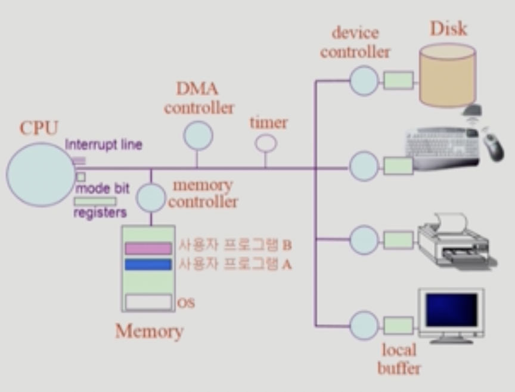

- Computer

  - CPU

    - 매 클락사이클 마다 메모리에서 기계어(instruction)를 읽어서 프로그램 실행
    - Register
      - 메모리보다 빠르면서 정보를 저장할 수 있는 작은 공간
      - Program counter register
        - CPU가 읽어야할 메모리의 위치를 가리킴
    - Mode bit
      - 사용자 프로그램의 잘못된 수행으로 다른 프로그램 및 운영 체제에 피해가 가지 않도록 하기 위한 보호 장치
      - CPU를 통해 실행되고있는 것이 OS인지, 프로그램인지 구분
      - 하드웨어적으로 두 가지 모드의 operation 지원
        - 사용자 모드->1
          - 사용자 프로그램 수행
        - 모니터 모드 (=커널 모드, 시스템 모드)->0
          - OS 코드 수행
      - 보안을 해칠 수 있는 중요한 명령어는 모니터 모드에서만 수행 가능한 특권명령으로 규정
        - I/O 관련
      - Interrupt나 Exception 발생 시 하드웨어가 mode bit을 0으로 설정
      - 사용자 프로그램에 CPU를 넘기기 전에 mode bit을 1로 설정
    - Interrupt line
      - CPU가 메모리 이외의 다른 하드웨어와 통신할 수 있는 경로
        - CPU가 I/O (키보드 입력, 화면 출력 등)와 관련한 신호를 받는 경로
        - Timer
      - CPU가 여러 프로그램을 번갈아가며 실행하는 도중 체크

  - Memory

    - memory controller 존재
      - CPU와 DMA controller가 동시에 memory에 접근하는 것을 방지

  - Timer

    - 특정 프로그램이 무한루프에 빠지게 되면 CPU를 독점하게됨
    - 이를 방지하기 위해 프로그램 별로 실행 시간을 할당하여 CPU를 독점하는 것을 방지
      - 정해둔 시간이 지나면, timer가 CPU에 interrupt를 걸게되고, 운영체제가 CPU의 제어권을 가져감
    - 매 클럭 틱 마다 1씩 감소
    - 타이머 값이 0이 되면 interrupt 발생
    - 현재 시간 계산에도 활용

  - DMA controller

    - DMA가 memory에 접근할 수 있도록 해줌
    - DMA는 I/O 장치에 의해 너무 많은 interrupt가 발생하여 CPU의 효율이 떨어지는 것을 방지
      - DMA가 CPU 대신 local buffer의 내용을 memory에 복사하고 CPU에 interrupt를 걸어 I/O가 끝났음을 알림
      - 이를 통해 CPU가 interrupt 당하는 빈도를 줄임

    

- I/O device

  - device controller
    - CPU에 비해 I/O device는 매우 느리므로, 각각의 device를 전담하는 일종의 작은 CPU
      - 예를들어, disk의 내부를 통제하는 것은 CPU가 아니고 disk controller의 역할
    - local buffer
      - device controller의 작업 공간
      - I/O는 실제 device와 local buffer 사이에서 일어남
    - device controller는 I/O가 끝났을 경우 interrupt를 통해 CPU에 그 사실을 알림
  - device driver
    - OS 코드 중 각 device에 접근하기 위한 software
  - Disk
    - Input/Output device의 역할 동시 수행
  - Mouse, Keyboard, ...


## 입출력 (I/O)의 수행

- 모든 입출력 명령은 모니터 모드에서만 수행가능한 특권 명령
- 시스템 콜 (System Call)
  - 사용자 프로그램이 운영 체제의 서비스를 받기 위해 커널 함수를 호출하는 것
  - 사용자 프로그램은 운영체제에게 I/O를 요청
    - 요청에 따라 사용자 모드에서 모니터 모드로 넘어감
      - Mode bit을 1에서 0으로 바꿈
    - Trap(소프트웨어적 interrupt)을 사용하여 interrupt 벡터의 특정 위치로 이동
    - 제어권이 interrupt 벡터가 가리키는 interrupt 서비스 루틴으로 이동
    - 올바른 I/O 요청인지 확인 후 I/O 수행
    - I/O 완료 시 제어권을 시스템 콜 다음 명령으로 옮김
    - I/O를 위해서는 두 가지 interrupt가 모두 걸림
      - I/O 요청 -> trap
      - I/O 완료 -> interrupt


## 인터럽트(Interrupt)

- 인터럽트 당한 시점의 레지스터와 program counter를 save한 후, CPU의 제어를 인터럽트 처리 루틴에 넘기게 됨
- Interrupt (하드웨어 interrupt)
  - 하드웨어(I/O device 등)가 발생시킨 인터럽트
- Trap (소프트웨어 interrupt)
  - Exception
    - 프로그램이 오류를 범한 경우
  - System call
    - 프로그램이 커널 함수를 호출하는 경우
- Interrupt 벡터
  - 해당 interrupt의 처리 루틴 주소를 가지고 있음
- Interrupt 처리 루틴 (Interrput Service Routine, Interrupt Handler)
  - 각각의 interrupt 마다 운영 체제가 해야하는 일이 다름
    - 키보드 컨트롤러가 interrupt를 걸면, local buffer의 내용을 memory에 복사하고, 키보드 I/O를 요청했던 프로세스에는 CPU를 얻을 수 있다고 알려야함
    - Timer가 interrupt를 걸면, CPU를 뺐어서 다른 프로레스에 넘겨야함
  - 각각의 interrupt를 처리하는 커널 함수
    - interrupt 마다 해야하는 일이 운영 체제의 코드에 미리 정의되어 있음
- 현대의 운영 체제는 interrupt에 의해 구동됨
  - 운영 체제는 평소에 CPU를 사용할 일이 없음
  - 항상 사용자 프로그램이 운영 체제 사용
  - interrupt가 걸릴 때만 CPU가 운영 체제로 넘어감


## 동기식 입출력과 비동기식 입출력

- 동기식 입출력 (synchronous I/O)
  - I/O 요청 후, 입출력 작업이 완료된 후에야 제어가 사용자 프로그램에 넘어감
  - 구현 방법1
    - I/O가 끝날 때까지 한 프로그램에서 CPU를 점유하여 낭비시킴
    - 매 시점 하나의 I/O만 일어날 수 있음
  - 구현 방법2
    - I/O가 완료될 때까지 해당 프로그램에게서 CPU를 뺐어 다른 프로그램에 넘김
    - I/O 처리를 기다리는 프로그램들을 줄세움
- 비동기식 입출력 (asynchronous I/O)
  - I/O가 시작된 후 입출력 작업이 끝나기를 기다리지 않고 제어가 사용자 프로그램에 즉시 넘어감
- 두 경우 모두 인터럽트를 통해 I/O가 끝났음을 알림


## DMA (Direct Memory Access)

- 입출력 장치를 메모리에 가까운 속도로 처리하기 위해 사용
  - 입출력 장치의 속도가 빠를수록 CPU에 인터럽트를 많이 걺
- CPU의 중재 없이 device controller가 buffer storage의 내용을 메모리에 block 단위로 직접 전송
  - 바이트 단위가 아닌, block 단위로 인터럽트를 발생시킴


## 서로 다른 입출력 명령어

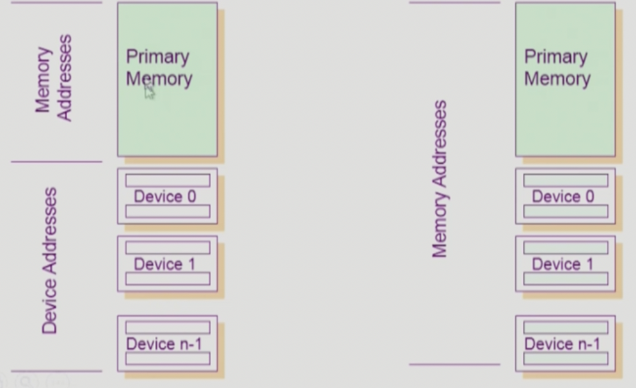

- 메모리에 접근하는 instruction과는 별개로 I/O device에 접근하는 special intruction 사용 (좌측)
- 메모리 주소를 연장하여 I/O device에 주소를 붙이고 메모리에 접근하는 instruction 그대로 사용 (우측)
  - Memory Mapped I/O


## 저장 장치 계층 구조

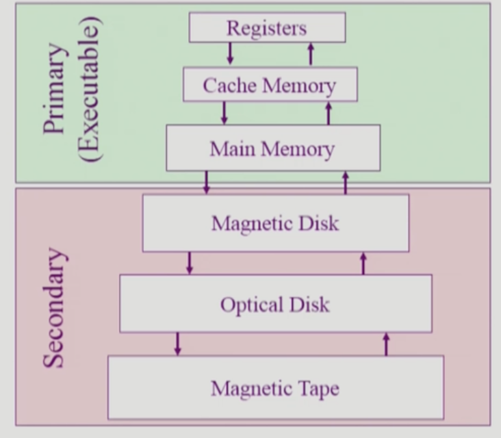

- 위로 갈수록 속도가 빠르지만 단위 공간당 비용이 비싸 용량이 적음
- 주기억 장치
  - 휘발성
  - byte 단위로 메모리 주소를 매기므로 CPU가 직접 접근해서 처리 가능
- 보조기억 장치
  - 비휘발성
  - byte 단위가 아닌 섹터 단위이므로 CPU가 직접 접근 불가
- 캐싱
  - 재사용을 목적으로 더 빠른 저장 매체에 정보를 저장해두는 것


## 프로그램의 실행 (메모리 load)


- File system에 저장되어있는 프로그램의 실행파일을 실행하면, 그 프로그램 만의 독자적인 주소 공간이 생김

  - 주소 공간은 아래의 영역으로 구성됨

    - code
      - CPU에서 실행할 기계어 저장

    - data
      - 프로그램이 사용할 변수 등의 자료구조 저장
    - stack
      - 함수를 호출하고 리턴할 때 데이터를 저장

  - 이 주소 공간 전체를 실제 메모리에 올리면 메모리가 낭비됨

    - 당장 필요한 부분만 메모리에 올림
      - 메모리에 올라간 코드가 필요없으면 버리거나, 하드디스크를 메인 메모리의 연장선으로 사용하는 swap area에 넘김
    - 이런 특성 때문에 Virtual memory라고 부름
    - 하드웨어의 도움을 받아 가상 메모리의 주소를 실제 메모리 주소로 변환해주는 계층 존재


## OS 커널 주소 공간의 내용

- code
  - 커널 코드
    - 시스템 콜, 인터럽트 처리 코드
    - 자원 관리를 위한 코드
    - 편리한 서비스 제공을 위한 코드
- data
  - 하드웨어를 관리하고 통제하기 위해 OS가 사용하는 자료구조
  - 각 프로그램을 관리하기 위한 자료 구조 (PCB)
- stack
  - 사용자 프로그램 마다 커널 스택을 별도로 둠


## 사용자 프로그램이 사용하는 함수

- 사용자 정의 함수
  - 자신의 프로그램에서 정의한 함수
  - 해당 프로그램의 virtual memory의 code 영억에 존재
- 라이브러리 함수
  - 자신의 프로그램에서 정의하지 않고 외부에서 가져다 쓴 함수
  - 해당 프로그램 실행 파일에 포함됨
  - 해당 프로그램의 virtual memory의 code 영억에 존재
- 커널 함수
  - 운영 체제 프로그램의 함수
  - OS 커널 주소 공간의 code 영역에 존재
  - 커널 함수의 호출 = 시스템 콜
    - 사용자 프로그램 virtual memory의 code 영역에서 OS 커널 주소 공간의 code 영역으로 직접 점프 불가
    - mode bit 제한도 있음


## 프로그램의 실행

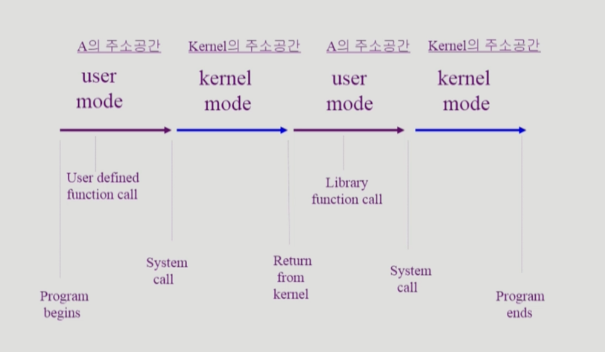

- 프로그램은 실행 후 종료될 때까지, user mode와 kernel mode를 왔다갔다하게 됨


# 3. Process

## 프로세스의 개념

- "Process is a program in execution"
- 프로세스의 문맥(context)
  - 프로세스의 정확한 상태를 규명하기 위해서 필요한 요소들
  - CPU 수행 상태를 나타내는 하드웨어 문맥
    - Program Counter
      - 프로세스 주소공간의 code를 가리킴
    - 각종 register에 들어있는 값
  - 프로세스의 주소 공간
    - code, data, stack
  - 프로세스 관련 커널 자료 구조
    - PCB (Process Control Block)
      - OS가 프로세스를 관리하기 위해 data 영역에 생성
    - Kernel stack
      - 프로세스의 시스템 콜에 의해 커널의 함수가 호출
  - multitasking을 할 때, 이전 프로세스의 문맥을 알고있어야 작업을 이어서 할 수 있음


## 프로세스의 상태 (Process State)

- 프로세스는 상태(state)가 변경되며 수행됨

  - Running

    - CPU를 잡고 instruction을 수행중인 상태

  - Ready

    - CPU를 기다리는 상태
      - 메모리 등 다른 조건을 모두 만족한 상태로 대기
    - Ready 상태에 있는 프로세스들이 번갈아가며 CPU를 잡게 됨

  - Blocked (wait, sleep)

    - CPU를 주어도 당장 instruction을 수행할 수 없는 상태
    - 프로세스 자신이 요청한 event(I/O 등)가 즉시 만족되지 않아 이를 기다리는 상태
      - 디스크에서 file을 읽어와야 하는 경우

  - New

    - 프로세스가 생성 중인 상태

  - Terminated

    - 수행(execution)이 끝난 상태
    - 정리할게 남아있는 상태

    

    

    - Ready queue에 줄 서있는 프로세스들이 CPU를 번갈아 가며 사용
    - 프로세스가 I/O를 필요로하면, 시스템 콜을 하고 blocked 상대가 되어 해당 장치의 I/O queue에 줄을 서게 됨
      - 해당 I/O 작업이 끝나면 device controller가 인터럽트를 걸어 I/O의 완료를 알리고, 프로세스는 다시 Ready queue에 들어감
    - queue는 커널의 주소 공간의 data 영역에 존재

- OS의 상태에 대해서는 이야기 하지 않음


## Process Control Block (PCB)

- OS가 각 프로세스를 관리하기 위해 프로세스 당 유지하는 정보
- 구성 요소
  - OS가 관리상 사용하는 정보
    - Process state, Process ID
    - scheduling information, priority
  - CPU 수행 관련 하드웨어 값
    - Program counter, registers
  - 메모리 관련
    - code, data, stack의 위치 정보
  - 파일 관련
    - open file descriptors ...
- queue에 프로세스를 줄 세울때, 사실은 PCB를 줄 세움


## 문맥 교환 (Context Switch)

- CPU를 한 프로세스에서 다른 프로세스로 넘겨주는 과정

  - CPU를 내어주는 프로세스의 상태를 그 프로세스의 PCB에 저장
    - register, program counter, memory map
  - CPU를 새롭게 얻는 프로레스의 상태를 PCB에서 읽어옴

- 시스템 콜이나 인터럽트 발생 시 반드시 문맥 교환이 일어나는 것이 아님

  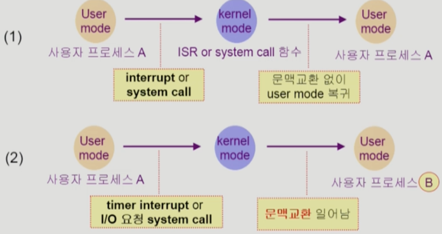

  - (1)의 경우에도 CPU 수행 정보 등 context의 일부를 PCB에 저장해야 하지만, 문맥 교환을 하는 (2)의 경우 그 부담이 훨씬 큼
    - (2)의 경우 cache memory flush가 필요하여 상당한 오버헤드 발생


## 프로세스를 스케줄링하기 위한 큐

- Job queue
  - 현재 시스템 내에 있는 모든 프로세스의 집합
  - 다른 queue에 있는 프로세스 포함
- Ready queue
  - 현재 메모리 내에 있으면서 CPU를 잡아서 실행되기를 기다리는 프로세스의 집합
- Device queue
  - I/O device의 처리를 기다리는 프로세스의 집합
- 프로세스들은 각 큐들을 오가며 수행됨


## 스케줄러 (Scheduler)

- Long-term scheduler (장기 스케줄러 or job scheduler)

  - 시작 프로세스 중 어떤 것들을 ready queue로 보낼지 결정
  - 프로세스에 메모리 및 각종 자원을 주는 문제
  - degree of Multiprogramming을 제어
    - 메모리에 프로그램을 몇개 올릴 것인지
  - time sharing system에는 보통 장기 스케줄러가 없음
    - 어떤 프로그램이 시작되면 곧바로 ready상태로 메모리에 올림

- Short-term scheduler (단기 스케줄러 or CPU scheduler)

  - 어떤 프로세스를 다음번에 running 시킬 지 결정
  - 프로세스에 CPU를 주는 문제
  - 충분히 빨라야 함
    - ms 단위

- Medium-Term scheduler (중기 스케줄러 or swapper)

  - 여유 공간 마련을 위해 프로세스를 통째로 메모리에서 디스크로 쫓아냄

  - 프로세스에서 메모리를 뺏는 문제

  - degree of Multiprogramming을 제어

  - 중기 스케줄러 덕분에 프로세스 상태에 suspended (stopped) 추가

    - 외부적인 이유로 프로세스의 수행이 정지된 상태

    - 프로세스는 통째로 디스크에 swap out 됨

      - 사용자가 프로그램을 일시 정지 시킨 경우
      - 메모리에 너무 많은 프로세스가 올라와 있을 때 시스템이 프로세스를 잠시 중단시킴

    - blocked의 경우 자신이 요청한 이벤트가 만족되면 ready로 돌아감

    - suspended의 경우 외부에서 resume해 주어야 active한 상태로 돌아갈 수 있음

      


## Thread

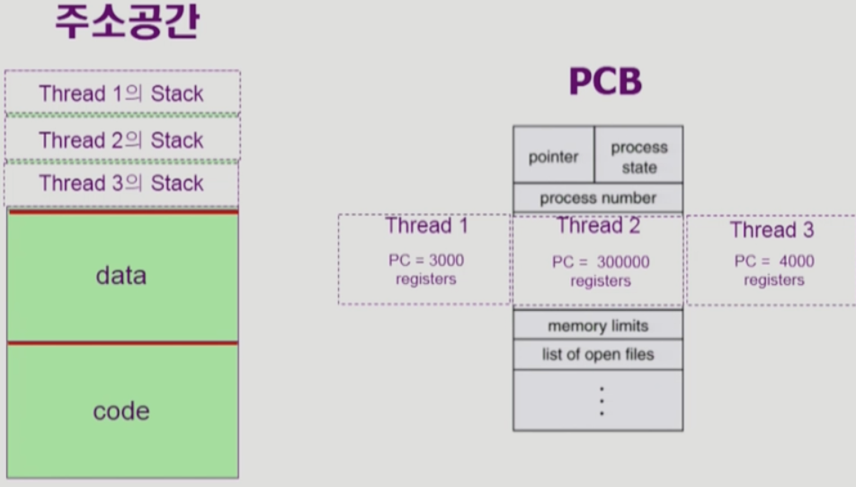


- 스레드는 프로세스 내부의 CPU 수행 단위 
  - 스레드를 lightweight process라고도 부름
    - 프로세스를 여러개 두는 것 보다, 한 프로세스에 스레드를 여러개 두는 것이 더 가볍기 때문
- 스레드의 구성 (CPU 수행과 관련있는 부분)
  - program counter
  - register set
  - stack space
- 프로세스 내부에서 스레드가 공유하는 부분 (task)
  - code section
  - data section
  - OS resources
- 다중 스레드로 구성된 태스크 구조에서는 하나의 서버 스레드가 blocked (waiting) 상태인 동안에도 동일한 태스크 내의 다른 스레드가 실행(running) 되어 빠른 처리를 할 수 있다.
  - 여러개의 스레드를 사용하는 웹 브라우저에서는 한 스레드에서 웹 페이지의 이미지를 읽어올 때, 다른 스레드가 이미 읽어온 텍스트를 화면에 띄울 수 있어서 사용자 입장에서 빠르게 느낌 -> 빠른 응답성
- 동일한 일을 수행하는 다중 스레드가 협력하여 높은 처리율 (throughput)과 성능 향상을 얻을 수 있음
  - 동일한 일을 수행하는 프로세스를 여러개 만들면, 각 프로세스 마다 독자적인 주소공간을 만들어야 해서 메모리가 낭비됨 -> 리소스 절약
- 스레드를 사용하면 병렬성을 높일 수 있음
  - CPU가 여러개 달린 컴퓨터에서 얻을 수 있는 이점


## Benefits of Threads

- Responsiveness
  - 웹브라우저에서 웹서버에 요청을하면 html을 받게 됨
  - 받은 html에서 다시 이미지들을 읽어와야됨(I/O)
  - 스레드가 여러개라면, 이미지를 읽어오는 스레드만 blocked되고, 다른 스레드가 html의 텍스트 등을 화면에 띄울 수 있음
    - I/O를 요청했음에도, 프로세스 자체가 blocked되지 않고 여전히 작동하므로 비동기식 입출력
- Resource Sharing
  - 동일한 일을 하는 경우, 프로세스를 여러개 만들면 메모리가 낭비되므로 스레드를 사용하여 리소스를 절약할 수 있음
- Economy
  - 프로세스를 생성하는 작업에 비해 스레드를 생성하는 작업은 오버헤드가 작음
  - 문맥 교환에서의 이점
- Utillization of MP Architectures
  - CPU가 여러개 있는 경우의 장점
  - 각각의 스레드가 서로다른 CPU에서 병렬적으로 작업 가능


## Implementation of Threads

- Kernel Threads
  - supported by kernel
  - OS 커널이 스레드의 존재를 아는 경우
  - 하나의 스레드에서 다른 스레드로 CPU가 넘어갈 때, 커널이 CPU 스케쥴링 하듯이 넘겨줌
- User Threads
  - supported by library
  - 프로세스 안에 여러 개의 스레드가 있다는 사실을 OS가 모름
  - 프로세스 자체적으로 내부에 CPU 수행 단위를 여러개 두면서 관리
    - 약간의 제약이 존재
- Real-time Threads


# 4. Process Management

## 프로세스 생성 (Process Creation)

- 부모 프로세스 (Parent process)가 자식 프로세스 (Children process) todtjd
- 프로세스의 트리 (계층 구조) 형성
- 프로세스는 자원을 필요로 함
  - OS로부터 받음
  - 부모 프로세스와 자원을 공유하는 경우도 있음
- 자원의 공유
  - 부모와 자식이 모든 자원을 공유하는 모델
  - 일부를 공유하는 모델
  - 전혀 공유하지 않는 모델
    - 일반적으로 부모와 자식은 서로 CPU와 메모리를 얻기 위해 경쟁
  - copy-on-write (COW)
    - 자식이 생성될 때 부모의 program counter register만 카피함
    - 자식의 data가 변화하면 그 부분은 부모와 더 이상 공유하지 않음
- 수행 (Execution)
  - 부모와 자식이 공존하며 수행되는 모델
  - 자식이 종료 (terminate)될 때 까지 부모가 기다리는(wait, blocked 상태) 모델
- 주소 공간 (Address space)
  - 프로세스의 생성은 두 단계를 거침
    - 자식은 부모의 주소 공간을 복사함
      - code, data, stack
      - binary and OS data (PCB)s
    - 자식은 그 공간에 새로운 프로그램을 올림(덮어 씌움)
  - 유닉스의 예
    - `fork()` 시스템 콜이 새로운 프로세스를 생성
      - 부모를 그대로 복사 (OS data except PID + binary)
      - 주소 공간 할당
    - `for()` 다음에 이어지는 `exec()` 시스템 콜을 통해 새로운 프로그램을 메모리에 올림


## 프로세스 종료 (Process Termination)

- 프로세스가 마지막 명령을 수행한 후 OS에게 이를 알려줌 (exit, 자발적)
  - 자식이 부모에게 output data를 보냄 (via wait 시스템 콜)
  - 프로세스의 각종 자원들이 OS에 반납됨
- 부모 프로세스가 자식의 수행을 종료시킴 (abort, 비자발적)
  - 자식이 할당 리소스의 한계치를 넘어설 때
  - 자식에게 할당된 태스크가 더 이상 필요하지 않을 때
  - 부모가 종료 (exit)하는 경우
    - OS는 부모 프로세스가 종료하는 경우 자식이 더 이상 수행되지 않도록 함
    - 손자->자식->부모 순의 단계적인 종료


## `fork()` 시스템 콜

```c
int main() {
  int pid;
  pid = fork();
  // A
  if (pid == 0) {
    	printf("\n Hello, I am child!\n");
  } else if {
    	printf("\n Hello, Iam parent!\n");
  }
}
```

- create a child (copy)
- `fork()`를 통해 자식을 만들면, 자식은 주석 A 밑의 코드부터 실행함
  - 부모 프로세스의 context를 복사했기 때문에 program counter가 가리키고 있는 부분 부터 실행됨
- 부모와 자식을 구분하기 위해 `fork()` 실행 후의 반환 값이 다름
  - 부모는 양수, 자식은 0을 가짐


## `exec()` 시스템 콜

```c
int main() {
  int pid;
  pid = fork();
  if (pid == 0) {
    	printf("\n Hello, I am child! Now I'll run data \n");
  		execlp("/bin/date", "/bin/date", (char *) 0);
  } else if (pid > 0) {
    	printf("\n Hello, I am parent!\n");
  }
}
```

- overlay new image

- 자식이 date라는 프로그램으로 덮어씌워짐

- 한 번 `exec()`을 하면 돌아올 수 없음

- 반드시 자식을 만들고 `exec()`할 필요는 없음

  ```c
  int main() {
      	printf("\n Hello, I am child! Now I'll run data \n");
    		execlp("/bin/date", "/bin/date", (char *) 0);
      	printf("\n Hello, I am parent!\n"); // 이 코드는 영원히 실행되지 않음
  }
  ```


## `wait()` 시스템 콜


- sleep until child is done
- 프로세스 A가 `wait()` 시스템 콜을 호출하면
  - 커널은 자식 프로세스가 종료될 때 까지 프로세스 A를 sleep 시킴 (block 상태)
  - 자식 프로세스가 종료되면, 커널은 프로세스 A를 깨움 (ready 상태)
- 리눅스의 쉘이 프로세스 A
  - 커맨드에 다른 프로그램의 이름을 치면 자식 프로세스가 생성되고 `wait()` 시스템 콜
  - 자식 프로세스가 끝나면 다시 커서가 깜빡거리며 새로운 커맨드를 입력받을 수 있게 됨


## `exit()` 시스템 콜

- frees all the resources, notify parent
- 프로세스의 종료
  - 자발적 종료
    - 마지막 statement 수행 후 `exit()` 시스템 콜을 통해 종료
    - 프로그램에 명시적으로 적어주지 않아도 `main` 함수가 리턴되는 위치에 컴파일러가 자동으로 넣어줌
  - 비자발적 종료
    - 부모 프로세스가 자식 프로세스를 강제 종료 시킴
      - 자식 프로세스가 한계치를 넘어서는 리소스 요청
      - 자식에게 할당된 태스크가 더 이상 필요하지 않음
    - 키보드로 `kill, break` 등을 입력한 경우
    - 부모 프로세스가 종료되는 경우
      - 부모 프로세스가 종료되기 전에 자식 프로세스들이 먼저 종료됨


## 프로세스 간의 협력

- 독립적 프로세스 (Independent process)

  - 프로세스는 각자의 주소 공간을 가지고 수행되므로 원칙적으로 하나의 프로세스는 다른 프로세스의 수행에 영향을 미치지 못함

- 협력 프로세스 (Cooperating process)

  - 프로세스 협력 메커니즘을 통해 하나의 프로세스가 다른 프로세스의 수행에 영향을 미칠 수 있음

- 프로세스 간 협력 메커니즘 (IPC: Interprocess Communication)

  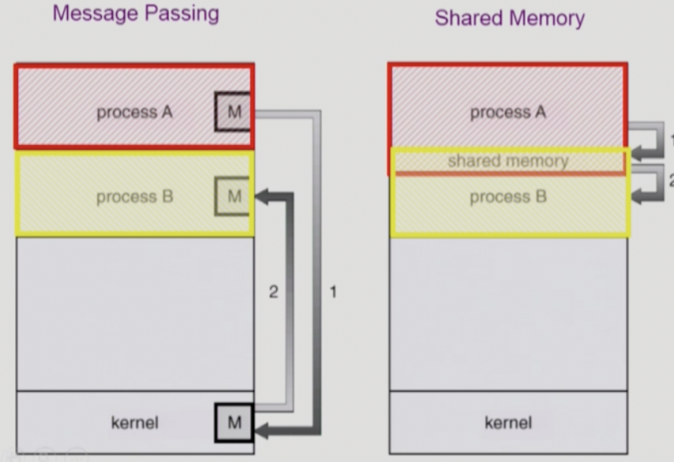

  - 메세지를 전달하는 방법 (message passing)
    - 커널을 통해 메세지 전달
  - 주소 공간을 공유하는 방법 (shared memory)
    - 서로 다른 프로세스 간에도 일부 주소 공간을 공유하게 하는 shared memory 메커니즘이 있음
    - thread의 경우 사실상 하나의 프로세스 내부에 존재하는 것이므로 프로세스 간 협력으로 보기는 어렵지만, 동일한 process를 구성하는 thread들 간에는 주소 공간을 공유하므로 협력이 가능


### Message Passing

- Message system
  - 프로세스 사이에 공유 변수 (shared variable)를 일체 사용하지 않고 통신하는 시스템
  - 메세지는 반드시 커널이 전달
- Direct Communication
  - 통신하려는 프로세스의 이름을 명시적으로 표시
- Indirect Communication
  - mailbox (또는 port)를 통해 메세지를 간접 전달


# 5. CPU scheduling

## CPU and I/O Bursts in Program Execution

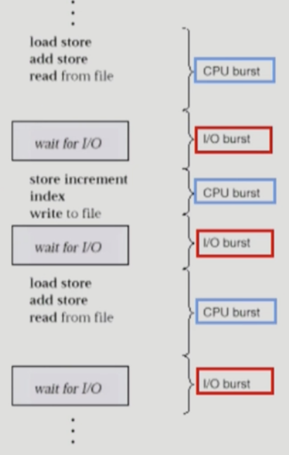

- 어떤 프로그램이든 실행되면, CPU burst와 I/O burst를 반복함
  - 빈도는 다름
    - 사람이 자주 개입하는 프로그램이면 I/O burst의 빈도가 높아짐


## CPU-burst Time의 분포

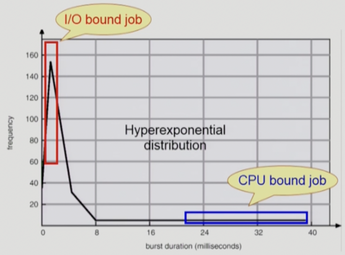

- I/O bound job
  - I/O burst가 많은 job
    - CPU를 잡고 계산하는 시간보다, I/O에 많은 시간이 필요한 job
  - many short CPU bursts
- CPU bound job
  - CPU만 길게 쓰는 프로그램
    - 계산 위주의 job
  - few very ong CPU bursts
- Interactive job에게 적절한 response 제공 요망
  - CPU bound job이 CPU를 너무 오래 사용하면, I/O가 많이 필요한 Interactive job의 대기 시간이 길어짐


## CPU Scheduler & Dispatcher

- CPU Scheduler
  - Ready 상태의 프로세스 중에서 이번에 CPU를 줄 프로세스를 고름
  - OS 내부의 CPU scheduling을 하는 코드
- Dispatcher
  - CPU의 제어권을 CPU scheduler에 의해 선택된 프로세스에게 넘기는 코드
  - 이 과정이 context switch (문맥 교환)

### CPU 스케줄링이 필요한 경우

1. Running -> Blocked
   - I/O를 요청하는 시스템 콜
2. Running -> Ready
   - 할당 시간 만료로 timer interrupt
3. Blocked -> Ready
   - I/O 완료 후 인터럽트
4. Terminate

- 1, 4에서의 스케줄링은 nonpreemptive (강제로 빼앗지 않고 자진 반납)
- 2, 3에서의 스케줄링은 preemptive (강제로 빼앗음)


## Scheduling Criteria

- CPU utilization (이용률)
  - keep the CPU as busy as possible
  - 전체 시간 중 CPU가 일한 시간의 비율
- Throughput (처리량)
  - number of processes that complete their execution per time unit
  - 몇 개의 일을 처리했는지
- Turnaround time (소요 시간)
  - amount of time to execute a particular process
  - CPU를 쓰러 들어와서 작업이 끝나고 나갈때까지 걸린 시간
- Waiting time (대기 시간)
  - amount of time a process has been waiting in the ready queue
  - ready queue에 줄 서서 기다리는 시간의 총합
- Response time (응답 시간)
  - amount of time it takes from when a request was submitted until the first response is produced, not ouput
  - 최초로 CPU를 얻기 까지 걸린 시간


## Scheduling Algorithm

### FCFS (First-Come First-Served)

- nonpreemtive
- 프로세스의 도착 순서대로 CPU 할당
- 긴 프로세스가 도착하면 짧은 프로세스들이 오래 기다려야 하므로 그리 효율적이지 않음
  - Convoy effect
- 24->3
  - average waiting time = 12
- 3->24
  - average waiting time = 1.5


### SJF (Shortest-Job-First)

- 각 프로세스와 다음번 CPU burst time을 가지고 스케쥴링에 활용
- CPU burst time이 가장 짧은 프로세스를 제일 먼저 스케쥴
- Nonpreemptive
  - 일단 CPU를 잡으면 이번 CPU burst가 완료될 때 까지 CPU를 선점 당하지 않음
- Preemptive
  - 현재 수행중인 프세스의 남은 burst time보다 더 짧은 CPU burst time을 가지는 새로운 프로세스가 도착하면 CPU를 빼앗김
  - 이 방법을 Shortest-Remainig-Time-First (SRTF)라고도 부름
    - SRTF는 주어진 프로세스들에 대해 minimum average waiting time을 보장
- Starvation
  - CPU 사용 시간이 긴 프로세스는 대기시간이 매우 길어질 수 있음
- 다음번 CPU burst time는 추정만이 가능함
  - 과거의 CPU burst time을 이용하여 추정
  - t': 추정값, t: 실제값
  - t'~n+1~ = αt~n~ + (1-α)t'~n~ (0<=α<=1)
  - -> t'~n+1~ = αt~n~ + (1-α)αt~n-1~ + ... + (1-α)^n+1^t'~0~
    - 최근 시간의 가중치가 더 큼


### Priority Scheduling

- 가장 높은 우선 순위(보통 정수값)를 가진 프로세스에게 CPU 할당
  - 우선 순위는 다양한 방법으로 정할 수 있음
- SJF도 Priority Scheduling의 일종
- Starvation
  - Solution
    - 대기 시간이 길어지면 우선 순위를 높여주는 Aging을 통해 Starvation을 방지
- Preemtive
- Nonpreemtive


### Round Robin (RR)

- 현대적인 CPU Scheduling
- 각 프로세스는 동일한 크기와 할당 시간 (time quantum)을 가짐
  - 일반적으로 10~100ms
- 할당 시간이 지나면 프로세스는 선점당하고 ready queue 제일 뒤에 가서 다시 줄을 섬
- n개의 프로세스가 ready queue에 있고, 할당 시간이 q time unit인 경우 각 프로세스는 최대 q time unit 단위로 CPU 시간의 1/n을 얻음
  - 어떤 프로세스도 (n-1) q time unit 이상 기다리지 않음
- 응답시간이 빠르다는 장점이 있음
- CPU 사용 시간이 길수록 대기 시간도 비례해서 커짐
- q가 커지면 FCFS와 유사해짐
- q가 작아지면 context switch 오버헤드가 커짐
- 프로세스의 CPU burst time이 비슷한 경우 average turnaround time이 길어짐


### Multilevel Queue

- Ready queue를 여러개로 분할

  

- 각 큐는 독립적인 스케줄링 알고리즘을 가짐
- 큐에 대한 스케줄링이 필요
  - Fixed priority scheduling
    - 무조건 우선순위가 높은 큐부터 처리
    - Starvation 문제 발생
  - Time slice
    - 각 큐에 CPU time을 적절한 비율로 할당
- 두 개의 queue로 분할하는 예시
  - foreground (interactive)
    - PR
  - background (batch - no human interaction)
    - FCFS


### Multilevel Feedback Queue

- 프로세스가 다른 큐로 이동 가능

  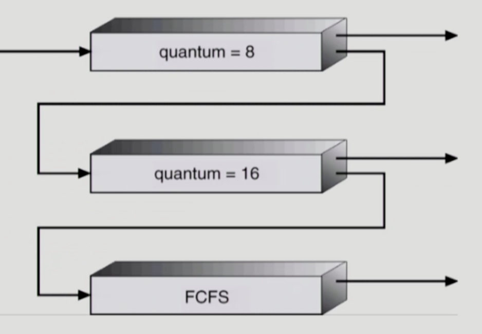

  - 프로세스는 처음에 맨 위의 큐에 들어감
  - 할당시간이 끝나면 아래 큐로 내려감
    - CPU 사용시간이 짧은 프로세스는 위쪽에서 빠져나감
    - CPU 사용시간이 긴 프로세스는 점점 아래로 내려감

- 정의해야하는 파라미터
  - Queue의 수
  - 각 큐의 scheduling algorithm
  - 프로세스를 상위/하위 큐로 보내는 기준
  - 프로세스가 CPU 서비스를 받으려 할 때 들어갈 큐를 결정하는 기준


### Multiple-Processor Scheduling

- CPU가 여러 개인 경우 스케줄링은 더 복잡해짐
- Homogeneous processor인 경우
  - Queue에 한 줄로 세워서 각 프로세서가 알아서 꺼내가도록 할 수 있음
  - 반드시 특정 프로세서에서 수행되어야 하는 프로세스가 있는 경우는 문제가 더 복잡해짐
- Load sharing
  - 일부 프로세서를 job이 몰리지 않도록 부하를 적절히 공유하는 메커니즘 필요
  - 별개의 큐를 두는 방법
  - 공동 큐를 사용하는 방법
- Symmetric Multiprocessing (SMP)
  - 각 프로세서가 각자 알아서 스케줄링 결정
- Asymmetric multiprocessing
  - 하나의 프로세서가 시스템 데이터의 접근과 공유를 책임지고 나머지 프로세서는 거기에 따름


### Real-Time Scheduling

- Hard real-time systems
  - 정해진 시간 안에 반드시 끝내도록 스케줄링해야 함
- Soft real-time computing
  - 일반 프로세스에 비해 높은 우선 순위를 갖도록 해야 함


### Thread Scheduling

- Local Scheduling
  - User level thread의 경우 OS가 thread의 존재를 모르므로 사용자 수준의 thread library에 의해 thread를 스케줄할지 결정
- Global Scheduling
  - Kernel level thread의 경우 일반 프로세스와 마찬가지로 커널의 단기 스케줄러가 어떤 thread를 스케줄할지 결정


## Algorithm Evaluation

- Queueing models
  - 확률 분포로 주어지는 arrival rate와 service rate 등을 통해 각종 performance index 값을 계산
- Implementation & Measurement
  - 실제 시스템에 알고리즘을 구현하여 실제 작업에 대하여 성능을 측정하고 비교
- Simulation
  - 알고리즘을 모의 프로그램으로 작성 후 실제 데이터인 trace를 입력으로 하여 결과 비교


# 6 . Process Synchronization

## 데이터의 접근

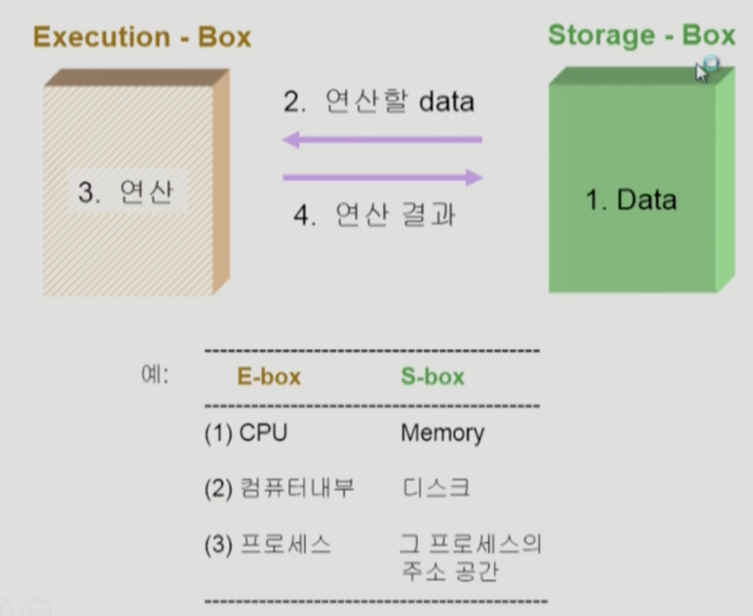


## Race Condition


- 여러 주체가 하나의 데이터에 접근하면 Race condition의 가능성이 있음
- Multiprocessor system
  - 공유메모리를 사용하는 프로세스들
  - 커널 내부 데이터를 접근하는 루틴들


## OS에서의 Race Condition

### interrupt handler vs kernel

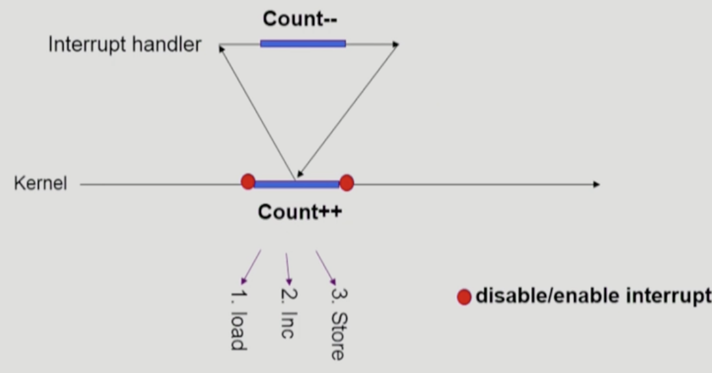

- 커널 모드 실행 중 인터럽트가 발생하여 인터럽트 처리 루틴이 수행
  - 양쪽 다 커널 코드이므로 kernel address space 공유
- 해결책
  - 커널 모드 실행 중 인터럽트 막기


### Preempt a process running in kernel

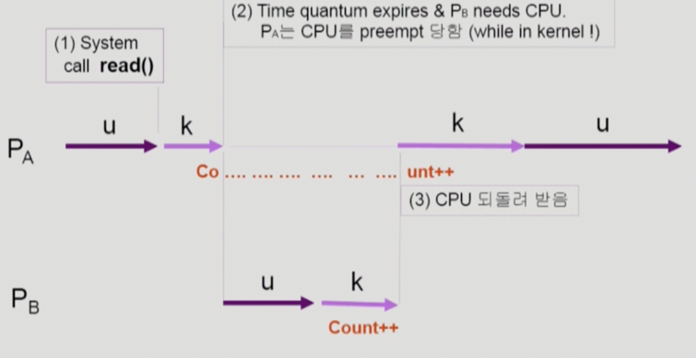

- 시스템 콜을 했는데, 해당 프로세스의 할당 시간이 끝남
- 해결책
  - 커널 모드에서 수행 중일 때는 CPU를 preempt하지 않음
  - 커널 모드에서 유저 모드로 돌아갈 때 preempt


### Multiprocessor

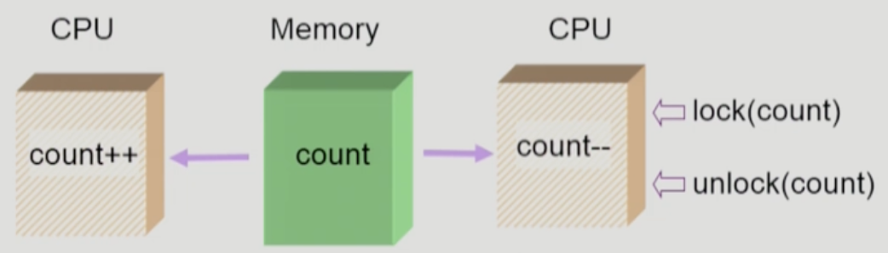

- 프로세서가 여러개인 경우, interrupt enable/disable로 race condition을 해결할 수 없음
- 해결책
  1. 한 번 하나의 CPU만이 커널에 접근할 수 있게 하는 방법
  2. 커널 내부에 있는 각 공유 데이터에 접근할 때 마다 그 데이터에 대해 lock/unlock하는 방법


## Process Synchronization 문제

- 공유 데이터의 동시 접근은 데이터의 불일치 문제를 발생시킬 수 있음
- 일관성 유지를 위해서는 협럭 프로세스 간의 실행 순서를 정해주는 매커니즘 필요
- Race condition
  - 여러 프로세스들이 동시에 공유 데이터를 접근하는 상황
  - 데이터의 최종 연산 결과는 마지막에 그 데이터를 다룬 프로세스에 따라 달라짐
  - Race condition을 막기 위해서는 concurrent process가 동기화되어야 함


## The Critical-Section Problem

- n개의 프로세스가 공유 데이터를 동시에 사용하기를 원하는 경우
- 각 프로세스의 code segment에는 공유 데이터를 접근하는 코드인 critical section이 존재
- 하나의 프로세스가 critical section에 있을  다른 모든 프로세스는 critical section에 들어갈 수 없어야 함


## 프로그램적 해결법의 충족 조건

- Mutual Exclusion (상호 배제)
  - 프로세스 P가 critical section 부분을 수행 중이면, 다른 모든 프로세스들은 그들의 critical section에 들어가면 안됨
- Progress (진행)
  - 아무도 critical section에 있지 않은 상태에서 들어가고자 하는 프로세스가 있으면 들어가게 해주어야 함
- Bounded Waiting (유한 대기)
  - 프로세스가 critical section에 들어가려고 요청한 후부터 그 요청이 허용될 때까지 다른 프로세스들이 critical section에 들어가는 횟수에 한계가 있어야 함


## 해결을 위한 알고리즘

### Algorithm 1

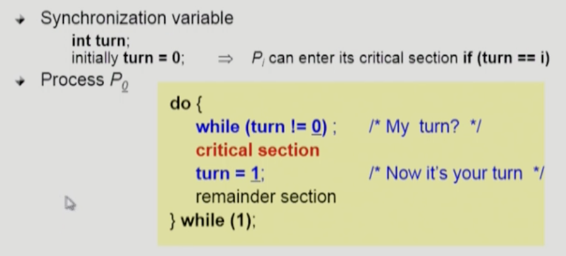

- ciritical section에 교대로 들어가도록 짜여져 있음
- Progress 조건을 만족하지 못함
  - 극단적으로 P1은 여러번, P2는 한 번만 ciritical section에 들어가는 경우 교대가 한 번 밖에 일어나지 않아서 P1이 여러번 들어갈 수 없음


### Algorithm 2

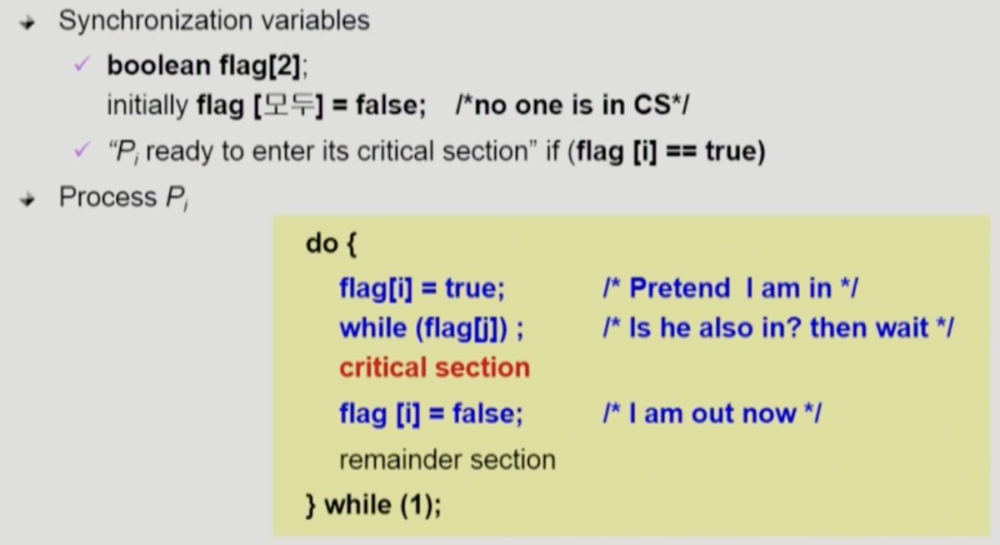

- 2행까지 수행 후 CPU를 뺏긴다면, 끊임 없이 양보하는 상황 발생 가능
- Progress 조건 위배


### Algorithm 3 (Peterson's Algorithm)

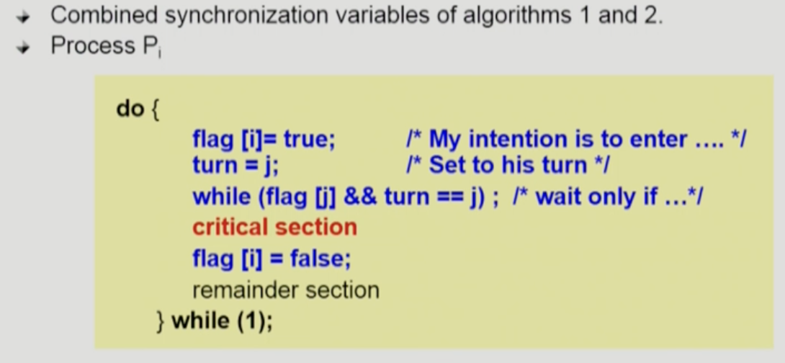

- 모든 조건을 만족
- Busy waiting(=spin lock)
  - 계속 CPU와 memory를 쓰면서 대기하므로 비효율적


## Synchronization Hardware

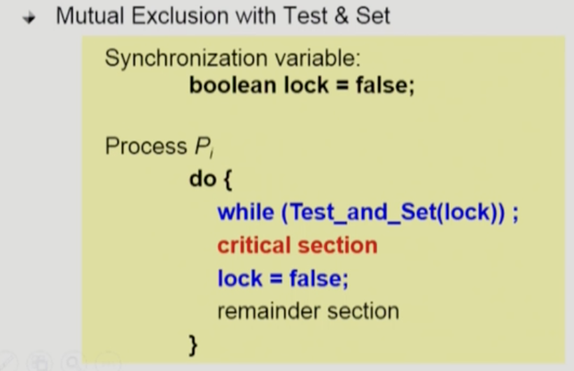

- 동기화 문제는 읽고 쓰는 작업을 한 번에 처리할 수 없기 때문에 발생
- 하드웨어적으로 Test & modify를 atomic하게 수행할 수 있도록 하면 해결 가능


## Semaphores

- 앞의 방식들을 추상화시켜 개발자에게 편의성 제공

- Semaphore S

  - integer variable

  - 두 가지 atomic 연산에 의해서만 접근 가능

    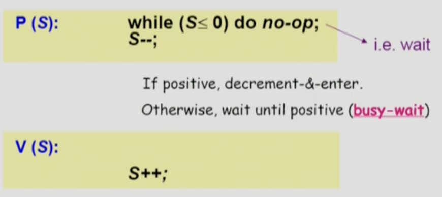

    - P 연산을 통해 자원을 가져감
    - V 연산을 통해 자원을 내놓음

### Block / Wakeup Implementation

- Semaphore를 다음과 같이 정의

  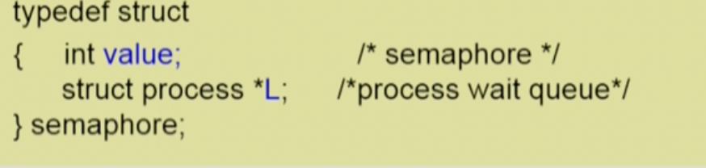

- block과 wakeup을 다음과 같이 가정

  - block

    - 커널은 block을 호출한 프로레스를 suspend 시킴
    - 이 프로세스의  PCB를 semaphore에 대한 wait queue에 넣음

  - wakeup(P)

    - block된 프로세스 P를 wakeup 시킴

    - 이 프로세스의 PCB를 ready queue로 옮김

      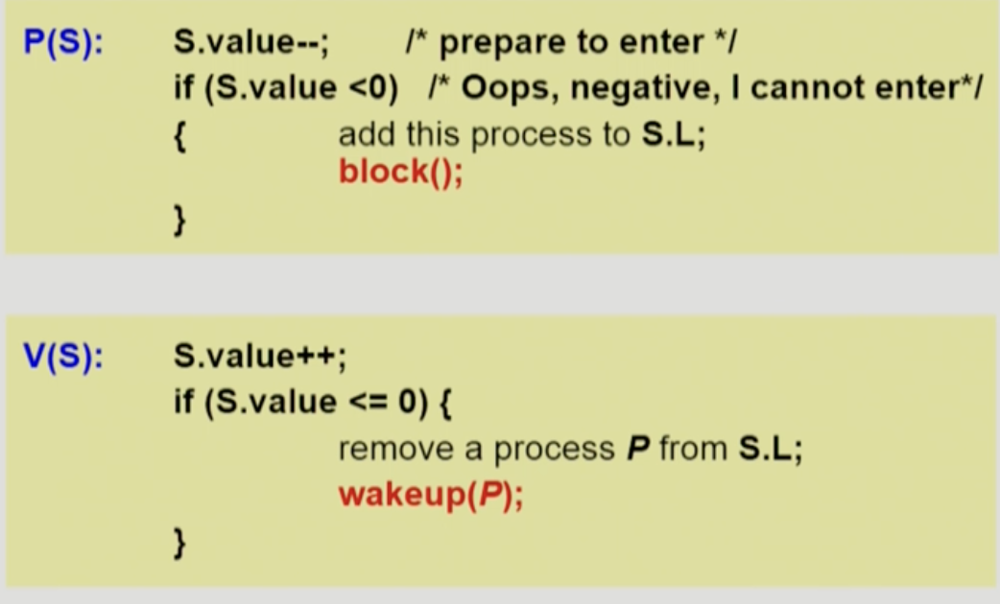


### Busy-wait vs Block/wakeup

- Critical section의 길이가 긴 경우 Block/wakeup이 좋음
- Critical section의 길이가 짧은 경우 Blcok/wakeup의 오버헤드가 busy-wait의 오버헤드보다 더 커질 수 있음
- 일반적으로는 Block/wakeup 방식이 더 좋음


### Two Types of Semaphores

- Counting semaphore
  - 도메인이 0 이상인 임의의 정수값
  - 주로 resource counting에 사용
- Binary semaphore (=mutex)
  - 0 또는 1 값만 가질 수 있는 semaphore
  - 주로 mutual exclusion (lock/unlock)에 사용


## Deadlock and Starvation

- Deadlock

  - 둘 이상의 프로세스가 서로 상대방에 의해 충족될 수 있는 event를 무한히 기다리는 현상

    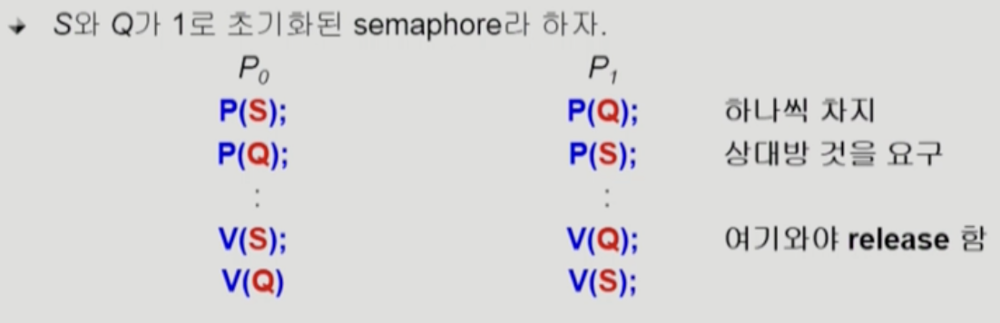

    - S와 Q의 획득 순서를 정해놓으면 해결 가능

- Starvation
  - indefinite blocking
    - 프로세스가 suspend된 이유에 해당하는 semaphore 큐에서 빠져나갈 수 없는 현상


## Classical Problems of Synchronization

### Bounded-Buffer Problem

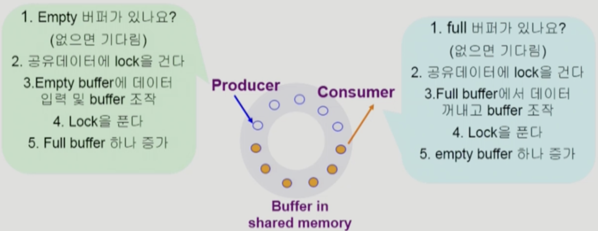

- Producer, Consumer는 여러개일 수 있음
- 여러개의 Producer가 같은 버퍼에 대해 작업하는 경우
  - Lock을 걸어서 동시 접근을 막아야 함
  - Consumer도 마찬가지
  - shared data의 mutual exclusion을 위해 binary semaphore 필요
- 버퍼가 가득 차거나 비었을 때 가용 자원의 개수를 세야 함
  - 남은 full/empty buffer의 수를 표시하기 위해 integer semaphore 필요

 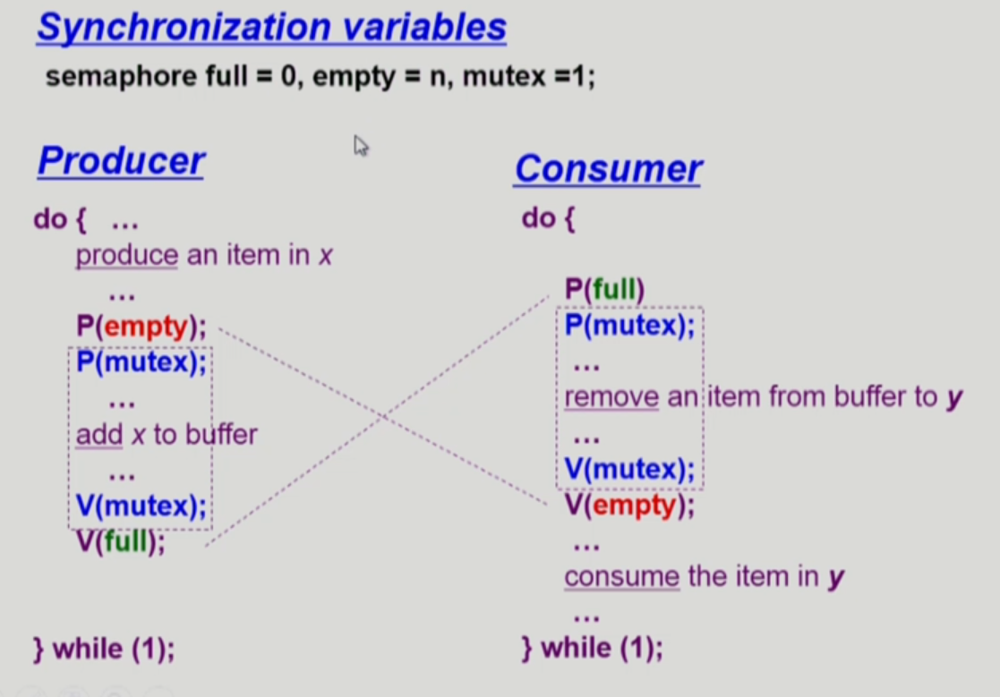


### Readers-Writers Problem

- 한 프로세스가 DB에 write 중일 때 다른 프로세스가 접근하면 안됨

- read는 동시에 해도 됨

- solution

  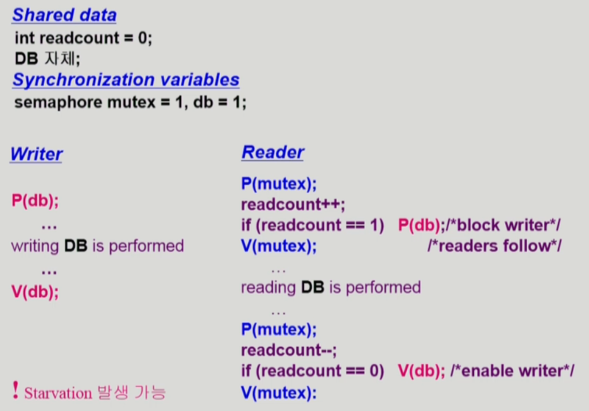

  - Writer가 DB에 접근 허가를 얻지 못한 상태에서는 대기중인 모든 Reader들을 다 DB에 접근하게 해줌
  - Wrtier는 대기 중인 Reader가 하나도 없을 때 DB 접근이 허용됨
  - 일단 Wrtier가 DB에 접근 중이면 Reader들은 접근이 금지됨
  - Writer가 DB에서 빠져나가야만 REader의 접근이 허용됨


### Dining-Philosophers Problem

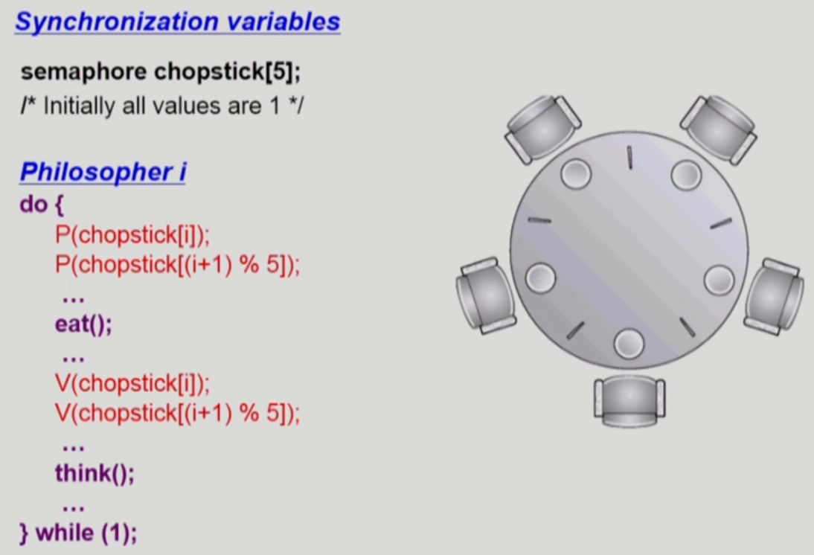

- Deadlock 가능성 존재

  - 모든 철학자가 동시에 왼쪽 젓가락을 집은 경우

- Solution

  - 4명의 철학자만이 테이블에 동시에 앉을 수 있도록 함

  - 젓가락을 두 개 모두 집을 수 있을 때에만 젓가락을 집을 수 있게 함

  - 비대칭적으로, 짝수번째 철학자는 왼쪽 젓가락부터, 홀수번째 철학자는 오른쪽 젓가락부터 잡도록 함

    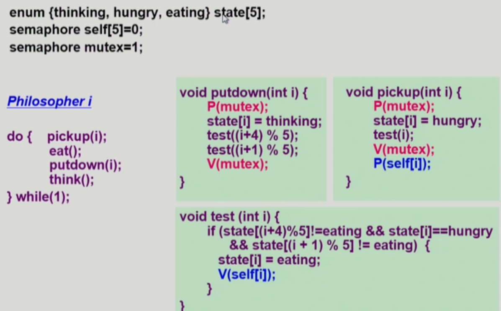


## Monitor

- Semaphore의 문제점
  - 코딩하기 힘듦
  - 정확성의 입증이 어려움
  - 자발적 협력이 필요
  - 한 번의 실수가 모든 시스템에 치명적 영향

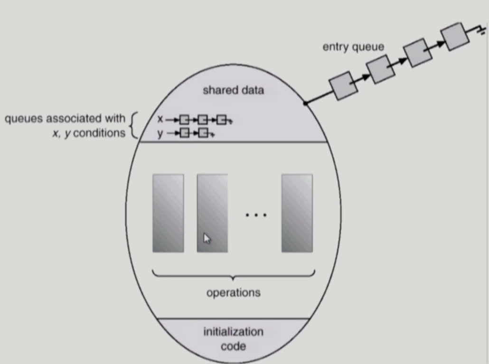

- Monitor는 동시 수행중인 프로세스 사이에서 abstract data type의 안전한 공유를 보장하기 위한 high-level synchronization construct
- Monitor 내에서는 한 번에 하나의 프로세스만이 활동 가능
- 프로그래머가 동기화 제약 조건을 명시적으로 코딩할 필요 없음
- 프로세스가 모니터 안에서 기다릴 수 있도록 하기 위해 condition variable 사용
  - condition variable은 `wait`와 `signal` 연산에 의해서만 접근 가능
  - `x.wait()`을 invoke한 프로세스는 다른 프로세스가 `x.signal()`을 invoke하기 전까지 suspend됨
  - `x.signal()`은 정확하게 하나의 suspend된 프로세스를 resume함
    - suspend된 프로세스가 없으면 아무일도 일어나지 않음


# 7. Deadlock

## Deadlock

- 일련의 프로세스들이 서로가 가진 자원을 기다리며 block된 상태

## Resource

- 하드웨어, 소프트웨어 등을 포함하는 개념
  - I/O device, CPU cycle, memory space, semaphore 등
- 프로세스가 자원을 사용하는 절차
  1. Request
  2. Allocate
  3. Use
  4. Release


## Deadlock 발생의 조건

- Mutual exclusion (상호 배제)
  - 매 순간 하나의 프로세스만이 자원을 사용할 수 있음
- No preemption (비선점)
  - 프로세스는 자원을 스스로 내어놓을 뿐 강제로 빼앗기지 않음
- Hold and wait (보유 대기)
  - 자원을 보유한 프로세스가 다른 자원을 기다릴 때 보유 자원을 놓지 않고 계속 가지고 있음
- Circular wait (순환 대기)
  - 자원을 기다리는 프로세스 간에 사이클이 형성되어야 함


## Resource-Allocation Graph (자원 할당그래프)

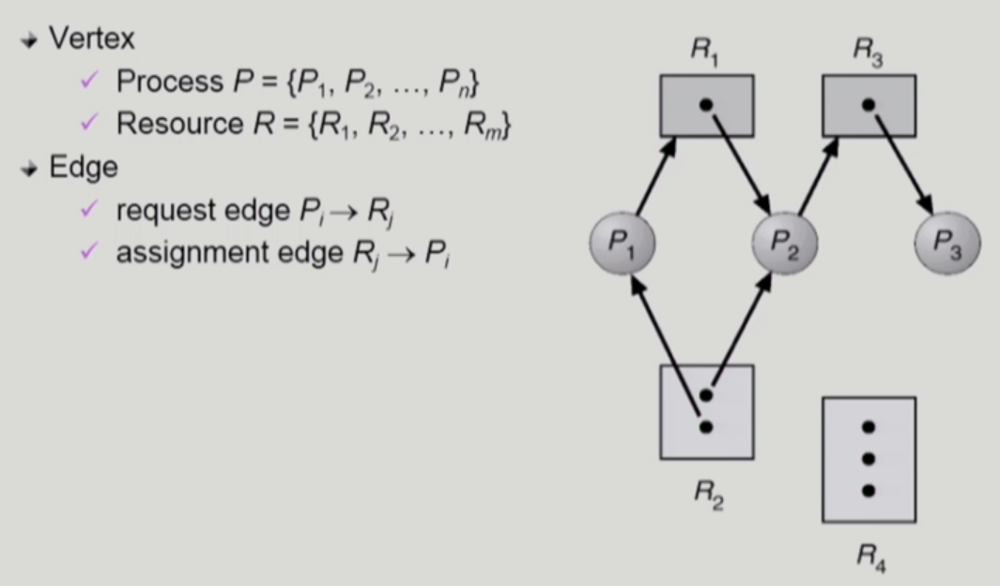

- P1은 R2를 점유하고 R1을 기다리는 상태
- P2는 R1, R2를 점유하고 R3를 기다리는 상태
- P3는 R3를 점유한 상태

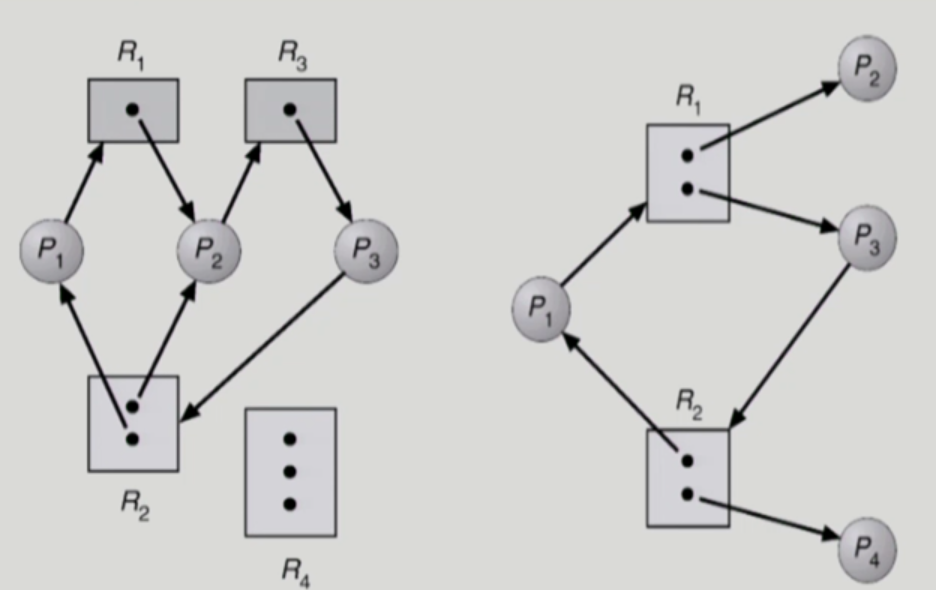

- 그래프에 cycle이 없으면 데드락이 아님
- 그래프에 cycle이 있을 때,
  - 리소스 당 인스턴스가 하나면 데드락
  - 여러개면 데드락의 가능성이 있음


## Deadlock의 처리 방법

- Deadlock Prevention

  - 자원 할당 시 데드락의 4가지 필요 조건 중  어느 하나가 만족되지 않도록 하는 것
  - 데드락을 원천적으로 막을 수 있지만, 자원을 비효율적으로 이용하게 됨
    - Mutual Exclusion
      - 공유해서는 안되는 자원의 경우 반드시 성립해야 함
    - Hold and Wait
      - 프로세스가 자원을 요청할 때 다른 어떤 자원도 가지고 있지 않아야 함
        - 프로세스 시작 시 모든 필요한 자원을 할당받게 하는 방법
          - 자원에 대한 비효율성
        - 자원이 필요할 경우 보유 자원을 모두 놓고 다시 요청
    - No preemption
      - 프로세스가 어떤 자원을 기다려야 하는 경우 이미 보유한 자원이 선점됨
      - 모든 필요한 자원을 얻을 수 있을 때 그 프로세스는 다시 시작됨
      - state를 쉽게 save하고 restore할 수 잇는 자원에서 주로 사용
    - Circular Wait
      - 모든 자원 유형에 할당 순서를 정하여 정해진 순서대로만 자원을 할당
        - 예를 들어, 순서가 3인 자원R3을 보유 중인 프로세스가 순서가 1인 자원 R1을 할당 받기 위해서는 우선 R3을 release해야 함

- Deadlock Avoidance

  - 자원 요청에 대한 부가적인 정보를 이용해서 데드락의 가능성이 없는 경우에만 자원을 할당

    - 가장 단순하고 일반적인 방법은 프로세스들이 필요로 하는 각 자원별 최대 사용량을 미리 선언하는 방법

  - 시스템 state가 원래 state로 돌아올 수 있는 경우에만 자원 할당

  - Resource Allocation Graph algorithm (리소스별 인스턴스가 하나일 때)

    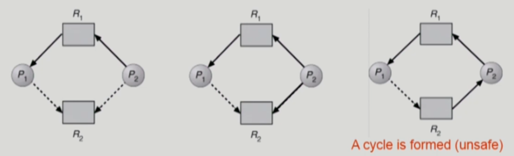

    - 점선은 들어올 수 있는 요청
    - cycle이 생기지 않는 경우에만 요청 자원을 할당하여 데드락을 미연에 방지
    - 프로세스 수가 n일 때 cycle 생성 여부 조사에 O(n^2^)의 시간 소요

  - Banker's Algorithm (리소스별 인스턴스가 여러개일 때)

    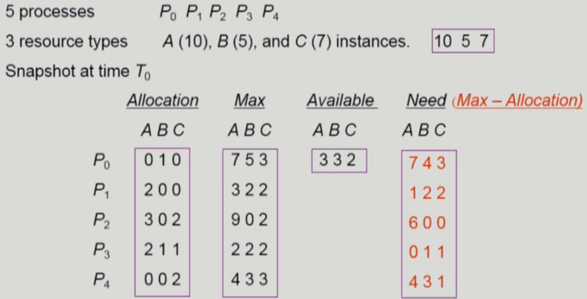

    - 프로세스의 보수적으로 최대 요청을 가정하고 가용자원으로 처리 가능할 경우에만 자원을 넘겨줌
    - P1의 경우 (1,0,2)를 요청하면, 필요한 자원 (1,2,2) 모두가 가용자원 (3,3,2)로 처리되므로 가능
    - 반면, P0의 경우 (0,2,0)을 요청하면 당장은 데드락이 아니지만, 필요한 자원 (7,4,3) 모두를 가용자원 (3,3,2)로 처리할 수 없으므로 불가능

  - Safe state

    - 시스탬 내의 프로세스들에 대한 safe sequence가 존재하는 상태

  - Safe sequence

    - 프로세스의 sequence <P1, ..., Pn>이 safe하려면 Pi의 자원 요청이 가용 자원 + 모든 Pj(j<i)의 보유 자원에 의해 충족되어야 함
    - 조건을 만족하면 다음 방법으로 모든 프로세스의 수행을 보장
      - Pi의 자원 요청이 즉시 충족될 수 없으면 모든 Pj(j<i)가 종료될 때까지 기다림
      - Pi-1이 종료되면 Pi의 자원 요청을 만족시켜 수행

- Deadlock Detection and recovery

  - 데드락의 발생은 허용하되, 그에 대한 detection 루틴을 두어 데드락 발견시 recover

  - 리소스별 인스턴스가 하나일 때

    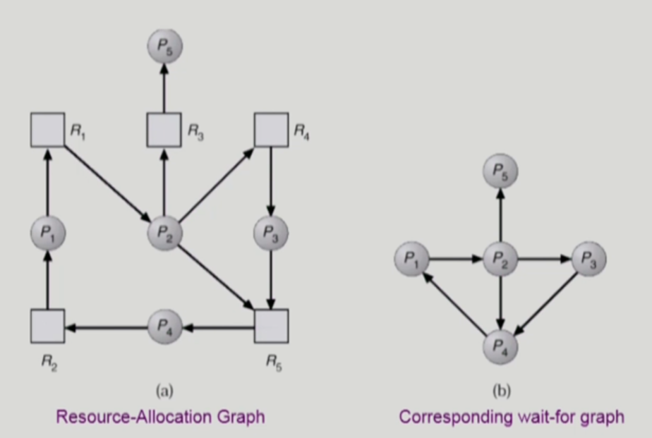

    - 프로세스 수가 n일 때 cycle 생성 여부 조사에 O(n^2^)의 시간 소요
      - n개의 프로세스에 대해 각각 최대 n-1개의 간선이 존재할 수 있음

  - 리소스별 인스턴스가 여러개일 때

    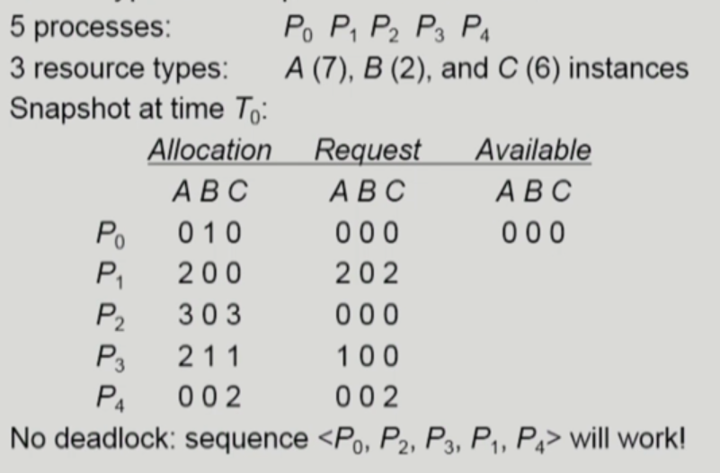

    - 최대한 낙관적으로 생각하여 데드락 detection
      - request가 없는 프로세스가 점유하고 있는 자원을 가용자원이라고 생각할 수 있음
        - request가 있는 프로세스는 점유하고 있는 자원을 내어놓지 않음
    - 만약 P2가 C를 하나 요청하면 데드락 발생

  - Recovery

    - 데드락이 발견되면 recover
    - Process termination
      - 데드락에 연루된 모든 프로세스 종료
    - Resource Preemption
      - 데드락에 연루된 프로세스르 하나씩 종료
      - 비용을 최소화할 victim을 선정
      - safe state로 rollback하여 프로세스를 재시작
      - Starvation 문제
        - 동일한 프로세스가 계속해서 victim으로 선정되는 경우
          - cost factor에 rollback 횟수도 같이 고려하여 이를 방지

- Deadlock Ignorance

  - 데드락이 거의 일어나지 않는다고 생각하고 아무런 조치도 취하지 않음
    - 데드락은 매우 드물게 발생하므로 이에 대한 조치 자체가 더 큰 오버헤드일 수 있음
    - 만약 시스템에 데드락이 발생한 경우 시스템이 비정상적으로 작동하는 것을 사람이 느낀 후 직접 프로세스를 죽이는 방법으로 대처

  - 대부분의 OS가 채택하는 방법


# 8. Memory Management

## Logical vs Physical Address

- Logical address (=virtual address)
  - 프로세스마다 독립적으로 가지는 주소 공간
  - 각 프로세스마다 0번지부터 시작
  - CPU가 보는 주소는 logical address임
    - 코드는 실제 메모리에 올라가더라도, 컴파일된 코드 내부에 정해진 주소는 logical address인 상태로 그대로 남아있기 때문
- Physical address
  - 메모리에 실제로 올라가는 위치
- 주소 바인딩
  - 주소를 결정하는 것
  - 실제 메모리의 어느 위치에 프로그램을 올릴지
  - Symbolic Address -> Logical Address -> Physical address


### 주소 바인딩 (Address Binding)

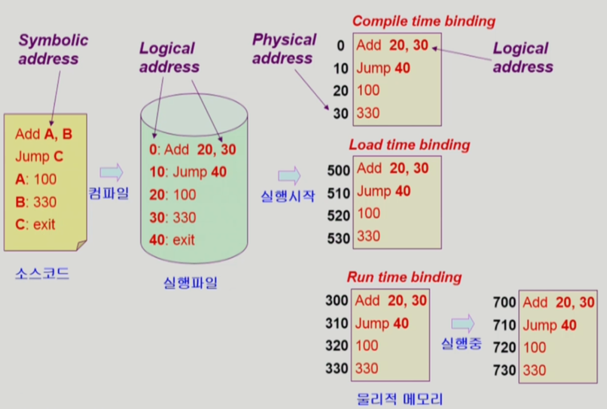

- Compile time binding

  - 물리적 메모리 주소가 컴파일 시 알려짐
  - 시작 위치 변경 시 재컴파일
  - 컴파일러는 절대 코드 생성
  - 메모리 주소가 미리 결정되기 때문에 실제 메모리의 빈 공간을 활용하지 못함
    - 논리적 주소 = 물리적 주소
    - 비효율적이어서 거의 사용하지 않음

- Load time binding

  - Loader의 책임하에 물리적 메모리 주소 부여
  - 컴파일러가 재배치가능코드를 생성한 경우 가능

- Execution time binding (=Run time binding)

  - 수행이 시작된 이후에도 프로세스의 메모리 상 위치를 옮길 수 있음

  - CPU가 주소를 참조할 때마다 binding을 점검

    - address mapping table

  - 하드웨어적인 지원이 필요

    - MMU (Memory Management Unit)

      - 논리 주소를 물리 주소로 mapping 해주는 하드웨어

      - relocation register (base register)

        - 실제 메모리 상에서 프로그램의 시작 위치 저장

      - limit register

        - 프로그램이 차지하는 메모리 크기 저장
        - 프로그램이 자신의 메모리 범위를 벗어나는 것을 막음
          - 넘어가면 Trap

        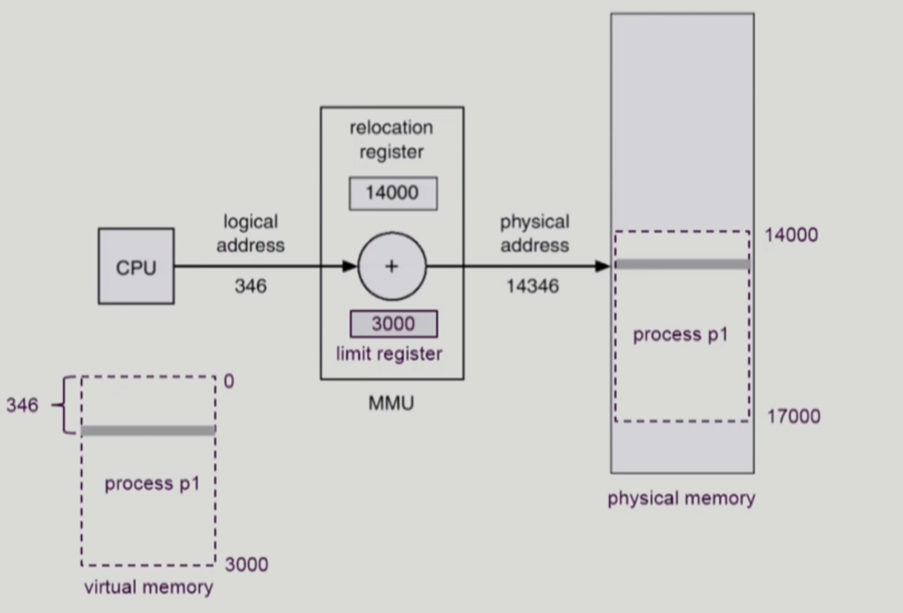

        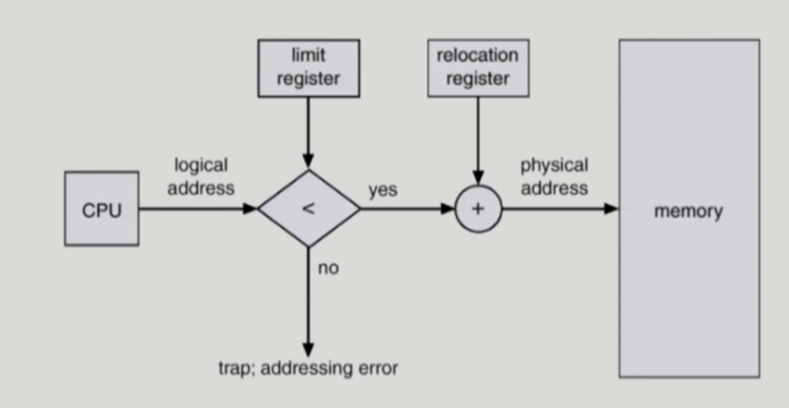


## Some Terminologies

- Dynamic Loading
  - 프로세스 전체를 메모리에 미리 다 올리는 것이 아니라 해당 루틴이 불려질 때 메모리에 load하는 것
  - memory utilization 향상
  - 가끔씩 사용 되는 많은 양의 코드의 경우에 유용
    - 예를 들어, 오류 처리 루틴
  - OS의 특별한 지원 없이 프로그램 자체에서 구현 가능
    - OS는 라이브러리를 통해 지원 가능

- Overlays
  - 메모리에 프로세스의 부분 중 실제 필요한 정보만을 올림
  - 프로세스의 크기가 메모리보다 클 때 유용
  - OS의 지원 없이 사용자에 의해 구현
  - 작은 공간의 메모리를 사용하던 초창기 시스템에서 수작업으로 개발자가 구현
    - 프로그래밍이 매우 복잡
    - Manual Overlay

- Swapping

  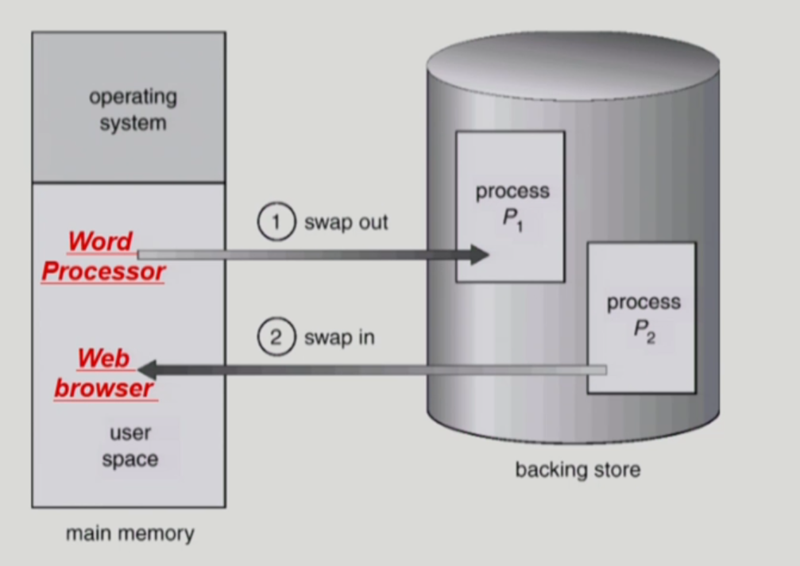

  - 프로세스를 일시적으로 메모리에서 backing store로 쫓아내는 것
  - backing store (=swap area)
    - 디스크
      - 많은 사용자의 프로세스 이미지를 담을 만큼 충분히 빠르고 큰 저장 공간
  - Swap in / out
    - 일반적으로 중기 스케줄러에 의해 swap out 시킬 프로세스 선정
    - priority-based CPU scheduling algorithm
      - 우선순위가 낮은 프로세스를 swapped out 시킴
      - 우선순위가 높은 프로세스를 메모리에 올림
    - Compile time binding 혹은 load time binding에서는 원래의 메모리 위치로 swap in 해야 하므로 불편
    - Execution time binding에서는 추후 빈 메모리 영역 아무 곳에나 올릴 수 있음
    - swap time은 대부분 transfer time (swap되는 양에 비례하는 시간)임

- Dynamic Linking
  - Linking을 실행 시간(execution time)까지 미루는 기법
  - Static linking
    - 라이브러리가 프로그램의 실행 파일 코드에 포함됨
    - 실행 파일의 크기가 커짐
    - 동일한 라이브러리를 각각의 프로세스가 메모리에 올리므로 메모리가 낭비됨
  - Dynamic linking
    - 라이브러리가 실행시 연결됨
    - 라이브러리 호출 부분에 라이브러리 루틴의 위치를 찾기 위한 stub이라는 작은 코드를 둠
    - 라이브러리가 이미 메모리에 있으면, 그 루틴의 주소로 가고, 없으면 디스크에서 읽어옴
    - OS의 도움이 필요


## Allocation of Physical Memory

- 메모리는 일반적으로 두 영역으로 나누어 사용

  - OS 상주 영역
    - interrupt vector와 함께 낮은 주소 영역 사용
  - 사용자 프로세스 영역
    - 높은 주소 영역 사용

- 사용자 프로세스 영역의 할당 방법

  - Contiguous allocation

    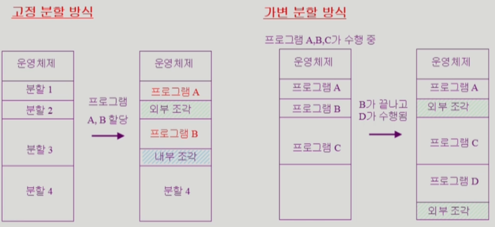

    - 각각의 프로세스가 메모리의 연속적인 공간에 적재되도록 하는 것

    - 고정 분할 방식

      - 사용자 프로그램이 들어갈 물리적인 메모리를 미리 나누어 놓음
      - 할당해놓은 공간보다 프로그램의 크기가 크면 할당되지 못하고 외부 조각이라 함
      - 할당해놓은 공간보다 프로그램의 크기가 작아서 남은 공간을 내부 조각이라 함

    - 가변 분할 방식

      - 사용자 프로그램이 들어갈 물리적인 메모리를 미리 나누어 놓지 않음

      - 가변 분할 방식에서도 외부 조각이 생길 수 있음

      - Dynamic Storage-Allocation Problem

        - 가변 분할 방식에서 크기가 n인 요청을 만족하는 가장 적절한 hole을 찾는 문제
        - First-fit
          - 크기가 n 이상인 것 중 최초로 찾아지는 hole에 할당
        - Best-fit
          - 크기가 n 이상인 가장 작은 hole을 찾아서 할당
          - hole들의 리스트가 크기순으로 정렬되지 않은 경우 모든 hole의 리스트를 탐색해야 함
          - 많은 수의 아주 작은 hole들이 생성됨
        - Worst-fit
          - 가장 큰 hole에 할당
          - Best-fit처럼 모든 리스트를 탐색해야 함
          - 상대적으로 아주 큰 hole들이 생성됨
        - First-fit, Best-fit이 Worst-fit보다 속도와 공간 측면에서 효과적임이 실험적으로 밝혀짐

      - Hole

        - 가용 메모리 공간

        - 다양한 크기의 hole들이 메모리 여러 곳에 흩어져 있음

        - 프로세스가 도착하면 수용가능한 hole을 할당

        - OS는 다음의 정보를 유지

        - 할당 공간

        - 가용 공간 (hole)

        - Compaction

          - 외부 조각 문제를 해결하는 한 가지 방법
          - 사용중인 메모리 영역을 한 군데로 몰고 hole들을 다른 한 곳으로 몰아 큰 block을 만드는 것
          - 매우 비용이 많이 듦
          - 최소한의 메모리 이동으로 compaction 하는 방법 (매우 복잡)
          - compaction은 프로세스의 주소가 실행 시간에 동적으로 재배치 가능한 경우에만 수행될 수 있음

          

  - Noncontiguous allocation

    - 하나의 프로세스가 메모리의 여러 영역에 분산되어 올라갈 수 있음

    - Paging

      - 프로세스의 가상 메모리를 동일한 사이즈의 page 단위로 나눔
      - 가상 메모리의 내용이 page 단위로 noncontiguous하게 저장됨
      - 일부는 backing storage에, 일부는 physical memory에 저장
      - physical memory를 동일한 크기의 frame으로 나눔
      - logical memory를 frame과 같은 크기의 page로 나눔
      - page table을 사용하여 logical address를 physical address로 변환
      - 외부 조각 발생 안함
      - 내부 조각 발생 가능
        - 프로그램의 가상 메모리가 page 단위로 깔끔하게 안나누어 떨어질 수 있음

      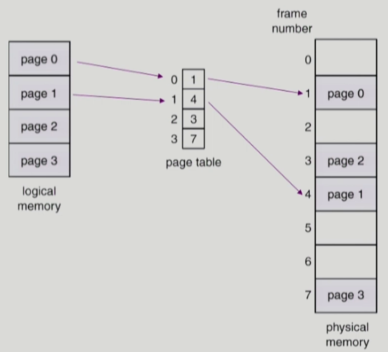

      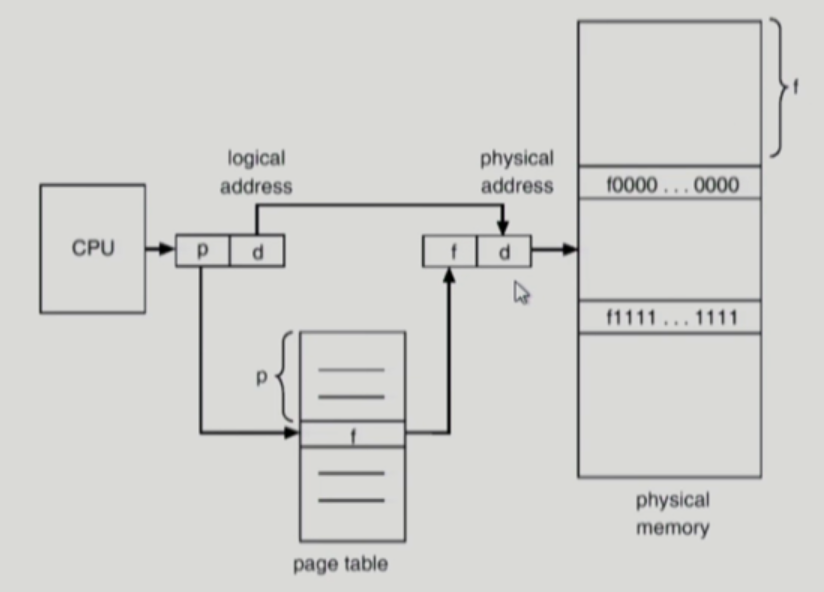

      - Page table은 메모리에 상주

      - Page-table base register (PTBR)가 page table을 가리킴

      - Page-table length register (PTLR)가 테이블 크기를 보관

      - Page table이 메모리에 있으므로 주소 바인딩을 위해 2번의 메모리 접근이 필요

        - page table 접근 1번, 실제 data/instruction 접근 1번

      - 속도 향상을 위해 Translation Look-Aside Buffer (TLB, Associative register)라는 고속의 lookup hardware cache 사용

        - parallel search 가능

        - TLB에는 page table의 일부만 존재

        - TLB는 순차적으로 검색

        - TLB는 프로세스마다 주소 바인딩 정보가 다르므로 context switch 때 flush

          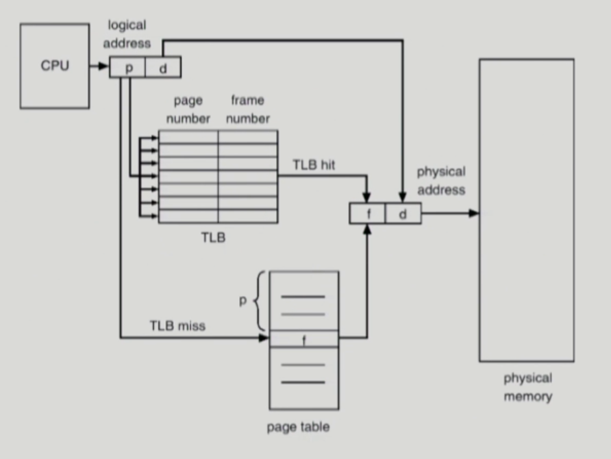

      - Two-Level Page Table

        - 현대의 컴퓨터는 address space가 매우 큰 프로그램 지원

          - 32bit 
            - 2^32^ B = 4GB의 주소 공간
            - page size가 4KB면 1M개의 page table entry 필요
            - 각 page entry가 4B면 프로세스당 4MB의 page table 필요
            - 대부분의 프로그램은 4GB의 주소 공간 중 극히 일부만 사용하므로 page table 공간이 낭비됨

        - page table 자체를 page로 구성

        - 시간은 더 걸리지만, 공간을 아낄 수 있음

          - 실제로는 테이블을 하나 더 만들기 때문에 공간을 더 쓸 것 같음
          - 그러나, 사용되지 않는 주소 공간에 대한 outer page table의 엔트리 값은 NULL이고 inner page table이 만들어지지 않으므로 공간을 아낄 수 있음

          

        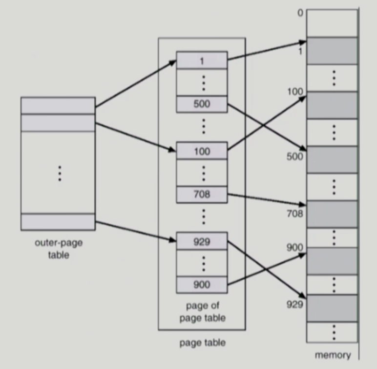

        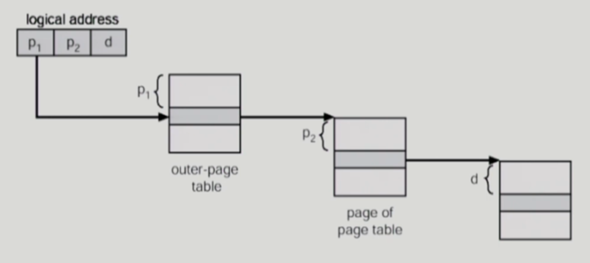

    - Multi-level Paging and Performance

      - Address space가 더 커지면, 다단계 페이지 테이블 필요
      - 각 단계의 페이지 테이블이 메모리에 존재하므로 logical address의 physical address 변환에 더 많은 메모리 접근 필요
      - TLB를 통해 메모리 접근 시간을 줄일 수 있음
      - 4단계 페이지 테이블을 사용하는 경우
        - 메모리 접근 시간이 100ns, TLB 접근 시간이 20ns이고 TLB hit ratio가 98%인 경우 effective memory access time = 0.98 * 120 + 0.02 * 520 = 128ns
        - 결과적으로 주소변환을 위해 28ns만 소요

    - Page Table에 존재하는 추가적인 비트

      - Protection bit

        - page에 대한 접근 권한 (read/write/read-only)

      - Valid (v) / Invalid (i) Bit in a Page Table

        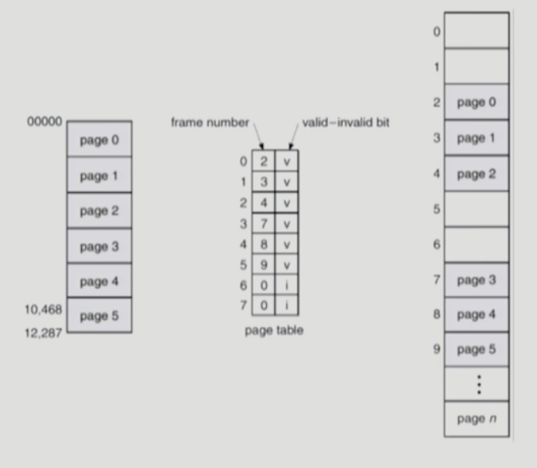

      - page table에 존재하는 추가적인 비트

      - Valid bit

        - 해당 주소의 frame에 그 프로세스를 구성하는 유효한 내용이 있음을 뜻함 (접근 허용)

      - Invalid

        - 해당 주소의 frame에 유효한 내용이 없음을 뜻함 (접근 불허)
          - 프로세스가 그 주소 부분을 사용하지 않는 경우
          - 해당 페이지가 메모리에 올라와 있지 않고 swap area에 있는 경우

    - Inverted Page Table

      - page table이 매우 큰 이유

        - 모든 프로세스 별로 그 logical address에 대응하는 모든 page에 대해 page table entry가 존재
        - 대응하는 page가 메모리에 있든 없든 간에 page table에는 entry로 존재

      - 시스템에 inverted page table이 딱 하나 존재

      - physical memory의 몇 번째 프레임에 어떤 페이지가 있는지 나타냄

      - inverted page table을 순차적으로 탐색해서 바꾸고자 하는 프로세스의 logical address에 대응하는 entry를 찾아야 함

        - page table의 크기를 줄이는 대신, 오버헤드가 커짐
        - associative register를 사용하여 병렬적으로 탐색하는 방식 사용

        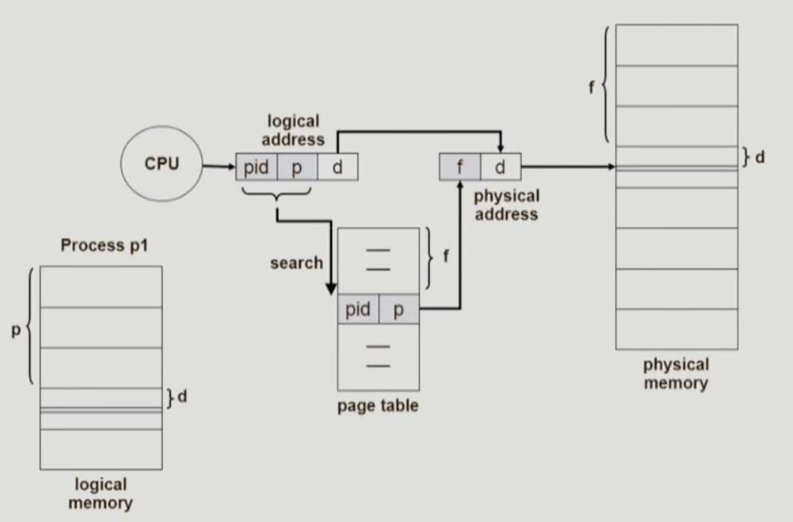

    - Shared Pages
      - Re-entrant code (Pure code)
      - 같은 code로 돌아가는 프로세스의 경우 code에 대한 page를 공유할 수 있음
      - read-only로 하여 프로세스 간에 하나의 code만 메모리에 올림
      - Shared code는 모든 프로세스의 Logical address space에서 동일한 위치에 있어야 함
    - Private code and data
      - 각 프로세스들은 독자적으로 메모리에 올림
      - Private data는 logical address space의 아무 곳에나 와도 무방

  - Segmentation

    - 프로그램은 의미 단위인 여러 개의 segment로 구성
      - 작게는 프로그램을 구성하는 함수 하나하나를 세그먼트로 정의
      - 크게는 프로그램 전체를 하나의 세그먼트로 정의
      - 일반적으로 code, data, stack 부분이 하나씩의 세그먼트로 정의됨
    - Segmentation Architecture
      - Logical address는 <segment-number, offset>으로 구성
      - Segment table
        - 세그먼트의 물리적 주소의 시작위치와 세그먼트 길이로 이루어짐
        - page와는 다르게 의미 단위인 세그먼트는 길이가 다를 수 있음
      - Segment-table base register (STBR)
        - 물리적 메모리에서의 segment table의 위치
      - Segment-table length register (STLR)
        - 프로그램이 사용하는 segment의 수

    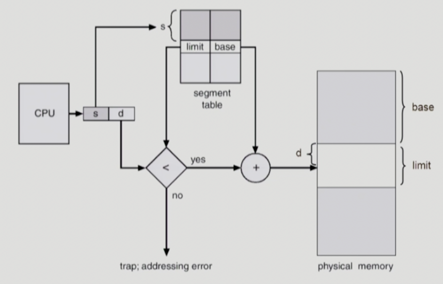

    - Protection
      - 각 세그먼트 별로 bit 부여
      - 페이지의 경우 일정한 크기로 잘랐기 때문에 특정 페이지에 code와 data가 같이 들어가는 상황이 발생할 수 있고, 이렇게 되면 bit를 부여하기 애매함
    - Sharing
      - 세그먼트는 의미 단위이기 때문에 공유(sharing)와 보안(protction)에 있어 페이징 보다 효과적
    - Allocation
      - 세그먼트의 길이가 동일하지 않으므로 가변분할 방식에서와 동일한 문제점들이 발생함
        - first fit/best fit 써야 함
        - 외부 조각 생김

  - Paged Segmentation

    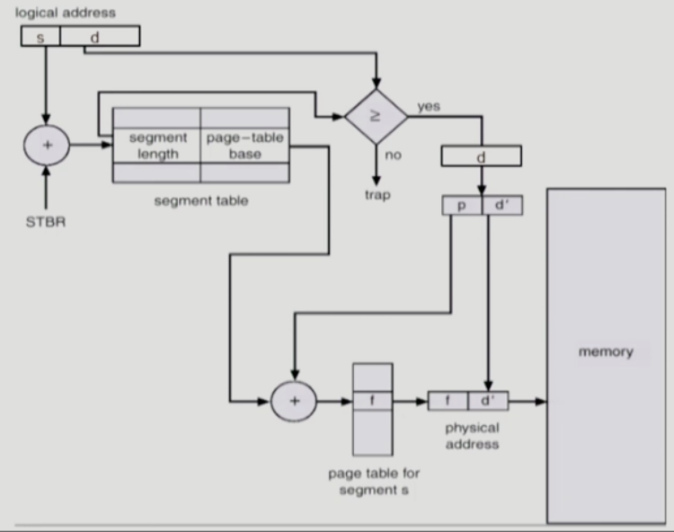

    - 세그먼트 하나가 여러개의 페이지로 구성됨
    - 실제로 메모리에는 페이지가 올라감


# 9. Virtual Memory

- DEMAND PAGING

  - 실제로 필요할 때 페이지를 메모리에 올림
    - I/O 양의 감소
    - 메모리 사용량 감소
    - 빠른 응답 시간
    - 더 많은 사용자 수용

  - Valid / Invalid bit의 사용
    - Invalid	
      - 사용되지 않는 주소 영역
      - 페이지가 물리적인 메모리에 없는 경우
    - 처음에는 모든 bit가 invalid
    - address translation을 할 때, invalid bit이면 page fault

- Page Fault

  - invalid page에 접근하면 MMU가 trap을 발생시킴

  - 커널 모드로 들어가서 page fault handler가 invoke됨

  - page fault 처리 순서

    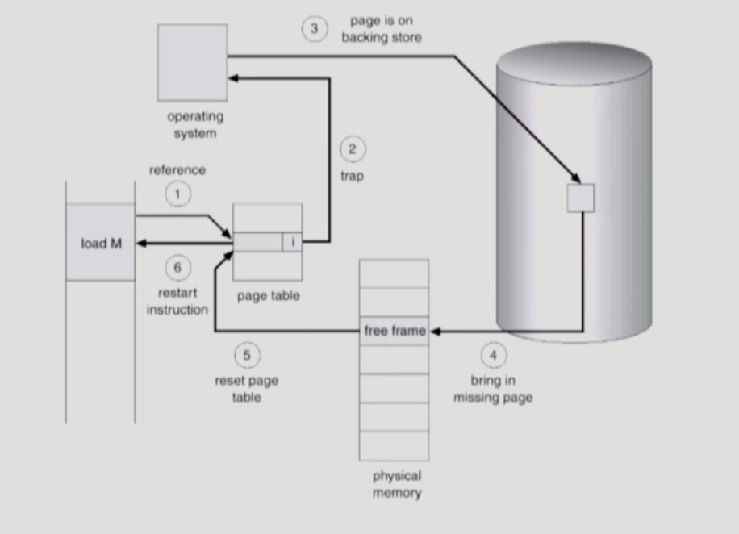

    1. Invalid reference (bad address, protection violation) 체크
    2. Get an empty page frame (빈 곳이 없으면 뺏음)
    3. 해당 페이지를 디스크에서 메모리로 읽어옴
       1. 디스크 I/O가 끝나기까지 이 프로세스는 CPU는 block 상태가 됨
       2. 디스크 I/O가 끝나면 page tables entry 기록, valid bit set
       3. ready queue에 이 프로세스 넣기
    4. 이 프로세스가 CPU를 잡고 다시 running
    5. 아까 중단되었던 instruction을 재개

- Performance of Demand Paging

  - Page Fault Rate 0<= p <= 1
    - if p = 0 -> no page fualts
    - if p = 1 -> every reference is a fault
  - Effective Access Time
    - (1-p) * memory access time + p * (OS & HW page fault overhead + swap page in + [swap page out if needed] + OS & HW restart overhead)

- Free frame이 없는 경우

  - Page replacement

    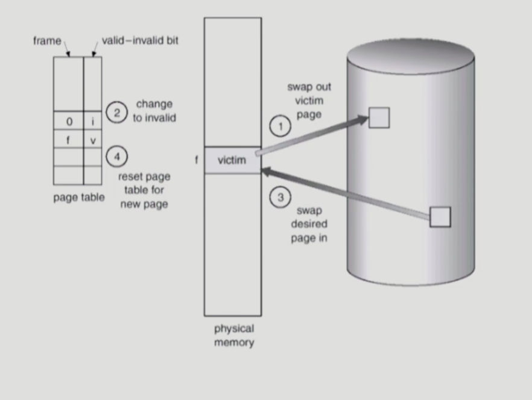

    - 어떤 프레임을 뺏을지 결정해야 함
    - 곧바로 사용되지 않을 페이지를 쫓아내는 것이 좋음
    - 동일한 페이지가 여러 번 메모리에서 쫓겨났다가 다시 들어올 수 있음

  - Replacement Algorithm

    - page-fault rate를 최소화하는 것이 목표
    - 알고리즘의 평가
      - 주어진 page reference string에 대해 page fault를 얼마나 내는지 조사
    - reference stirng의 예시
      - 1, 2, 3, 4, 1, 2, 5, 1, 3, 4, 5

    - Optimal Algorithm

      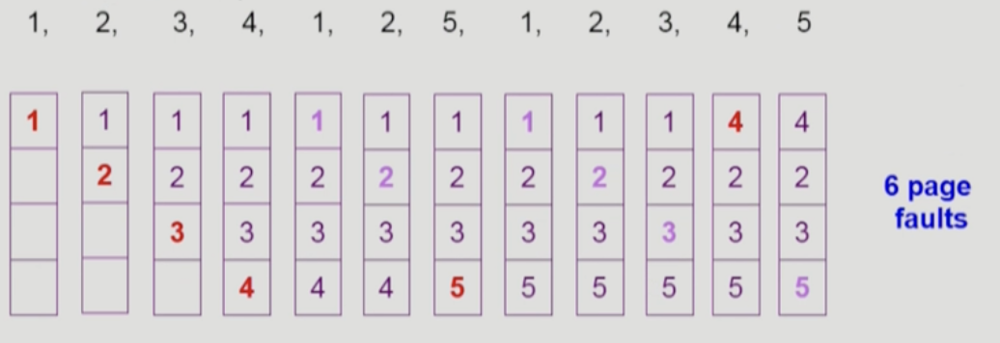

      - MIN (OPT)
        - 가장 먼 미래에 참조되는 페이지를 replace
      - 미래의 참조를 어떻게 아는가?
        - 미래를 안다고 가정하기 때문에 실제 시스템에서 사용 불가
        - Offline algorithm
      - 다른 알고리즘의 성능에 대한 upper bound 제공
        - 다른 알고리즘의 성능이 이보다 더 좋을 수 없음
        - Belady's optimal algorithm, MIN, OPT 등으로 불림

    - FIFO (First In First Out) Algorithm

      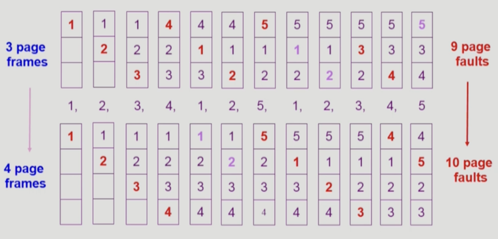

      - FIFO
        - 먼저 들어온 것을 먼저 내쫓음
      - FIFO Anomaly (Belady's Anomaly)
        - 메모리 크기를 늘리면 성능이 나빠짐

    - LRU (Least Recently Used) Algorithm

      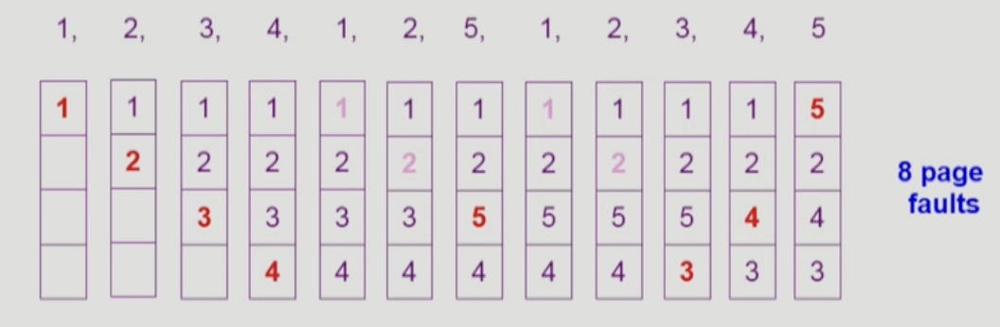

      - LRU

        - 가장 오래 전에 참조된 것을 지움

      - 더블 링크드 리스트 형태로 페이지의 순서를 관리

        

        - 시간 복잡도 O(1)

    - LFU (Least Frequently Used) Algorithm

      - LFU

        - 참조 횟수 (reference count)가 가장 적은 페이지를 지움

      - 최저 참조 횟수인 페이지가 여러개인 경우

        - LFU 알고리즘 자체에서는 여러 페이지 중 임의로 선정
        - 성능 향상을 위해 가장 오래 전에 참조된 페이지를 지우게 구현할 수 있음

      - 참조 횟수가 가장 적은 페이지가 루트에 오도록 최소힙 형태로 구현

        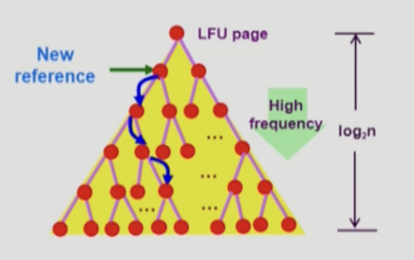

        - 시간 복잡도 O(logn)

    - LRU vs LFU

      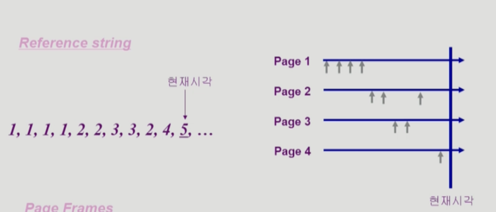

      - LRU는 1번 페이지 삭제
        - 마지막 참조 시점만 보기 때문에 그 이전에 참조 횟수가 많다는 것을 고려하지 않음
      - LFU는 4번 페이지 삭제
        - 최근 시점부터 참조횟수가 늘어나기 시작하려는 페이지를 지우게됨

- 다양한 캐싱 환경

  - 캐싱 기법

    - 한정된 빠른 공간(캐시)에 요청된 데이터를 저장해두었다가 후속 요청시 캐시로부터 직접 서비스하는 방식
    - Paging system 외에도 cache memory, buffer caching, web caching 등 다양한 분야에서 사용

  - 캐시 운영의 시간 제약

    - 교체 알고리즘에서 삭제할 항목을 결정하는 일에 지나치게 많은 시간이 걸리는 경우 실제 시스템에서 사용할 수 없음

    - Buffer caching이나 web caching의 경우 O(1)에서 O(logn)까지 허용

    - Paging system인 경우

      - 페이지가 이미 메모리에 존재하는 경우 주소를 변환하는 과정에 OS가 전혀 관여하지 않기 때문에 참조시각 등의 정보를 OS가 알 수 없음

      - page fault가 일어나야지만 OS가 디스크에서 페이지를 읽어오고, 관련된 정보를 알수 있음

      - 즉, paging system에서는 OS에 정보가 반쪽만 제공되어 리스트나 힙과 같은 자료구조를 유지하면서 LRU, LFU와 같은 알고리즘을 적용할 수 없음

      - 대신 Clock algorithm 사용

        - LRU의 근사 알고리즘

          - second chance algorithm
          - NUR (Not Used Recently) 또는 NRU (Not Recently Used)로 불림

        - Reference bit을 사용해서 교체 대상 페이지 선정

          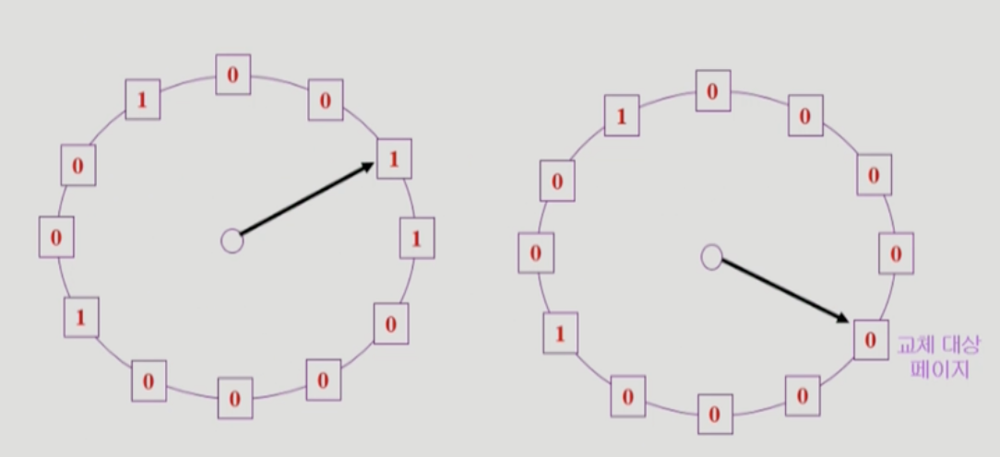

          - circular list
          - 참조된 페이지의 reference bit을 1로 바꿈
          - Reference bit이 0인 것을 찾을 때까지 포인터를 하나씩 앞으로 이동
          - 포인터를 이동하는 중에 reference bit이 1이면 모두 0으로 바꿈
          - 0을 찾으면 그 페이지를 교체
          - 한 바퀴 되돌아와서도 (=second chance) 0이면 그 때에는 replace 당함
          - 자주 사용되는 페이지라면 second chance가 올 때 1

        - Clock algorithm 개선

          - reference bit과 modified bit (dirty bit) 함께 사용
          - reference bit = 1
            - 최근에 참조된 페이지
          - modified bit = 1
            - 최근에 변경된 페이지 (I/O를 동반하는 페이지)
          - reference bit이 0인 페이지의 modified bit이 0이면 변경점이 없으므로 그냥 메모리에서 쫓아내면 됨
          - 반면 modified bit이 1이면 내용이 수정되었으므로 백킹 스토어에 수정 내용을 반영한 뒤 메모리에서 쫓아냄
          - modified bit이 0인 페이지를 우선적으로 쫓아내는 식으로 개선 가능

- Page Frame의 Allocation

  - Allocation problem
    - 각 프로세스에 얼마만큼의 page frame을 할당할 것인가?
  - Allocation의 필요성
    - 메모리 참조 명령어 수행시 명령어, 데이터 등 여러 페이지 동시 참조
    - Loop를 구성하는 page들은 한 번에 메모리에 올리는 것이 유리함
      - 최소한의 allocation이 없으면 매 loop 마다 page fault
  - Allocation Scheme
    - Equal allocation
      - 모든 프로세스에 똑같은 개수 할당
    - Proportional allocation
      - 프로세스 크기에 비례하여 할당
    - Priority allocation
      - 프로세스의 priority에 따라 다르게 할당

- Global vs Local Replacement

  - Global replacement
    - Replcae 시 다른 프로세스에 할당된 프레임을 빼앗아 올 수 있음
    - 프로세스별 할당량을 조절하는 또 다른 방법임
    - FIFO, LRU, LFU 등의 알고리즘을 global replacement로 사용시 해당
    - Working set, PFF 알고리즘 사용
  - Local Replacement
    - 자신에게 할당된 프레임 내에서만 replacement
    - FIFO, LRU, LFU등의 알고리즘을 프로세스 별로 운영 시

- Thrashing

  - Thrashing Diagram

    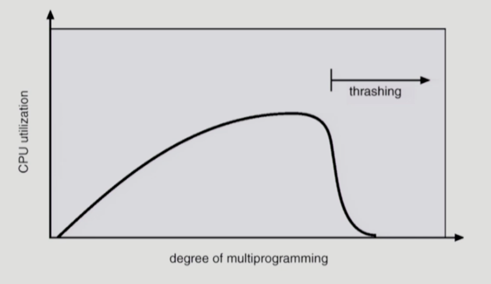

  - 프로세스의 원활한 수행에 필요한 최소한의 페이지 프레임 수를 할당받지 못한 경우

  - Page fault rate가 매우 높아짐

    - 디스크에서 페이지를 읽어오느라 I/O가 계속 발생
    - CPU utilization이 낮아짐
    - CPU utilization이 낮으면 OS는 multiprogramming degree를 높여야 한다고 판단
    - 또 다른 프로세스가 시스템에 추가됨
    - 프로세스 당 할당된 프레임 수가 더욱 감소
    - 프로세스는 페이지의 swap in / out으로 매우 바쁨
    - 대부분의 시간에 CPU는 한가함
    - low throughput

- Working-Set Model

  - Locality of reference

    - 프로세스는 특정 시간 동안 일정 장소만을 집중적으로 참조함
    - 집중적으로 참조되는 해당 페이지들의 집합을 locality set이라 함

  - Working-set Model

    - Locality에 기반하여 프로세스가 일정 시간 동안 원활하게 수행되기 위해 한꺼번에 메모리에 올라와 있어야 하는 페이지들의 집합을 working set이라 정의
    - Working set 모델에서는 프로세스의 working set 전체 메모리에 올라와 있어야 수행되고 그렇지 않을 경우 모든 프레임을 반납한 후 swap out (suspend)
    - Thrashing을 방지함
    - Multiprogramming degree를 결정함

  - Working set의 결정

    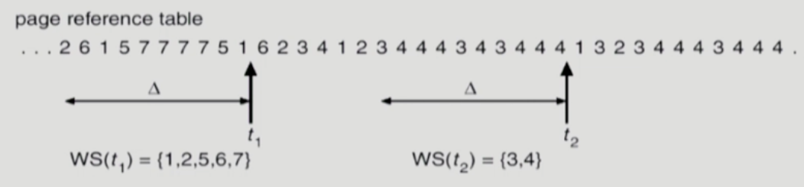

    - Working set window를 통해 알아냄
    - window size가 dt인 경우
      - 시각 t에서의 working set WS(t)
        - Time in terval [t-dt, t] 사이에 참조된 서로 다른 페이지들의 집합
      - Working set에 속한 페이지는 메모리에 유지, 속하지 않은 것은 버림
        - 즉, 참조된 후 dt 시간 동안 해당 페이지를 메모리에 유지한 후 버림

- PFF (Page-Fault Frequency) Scheme

  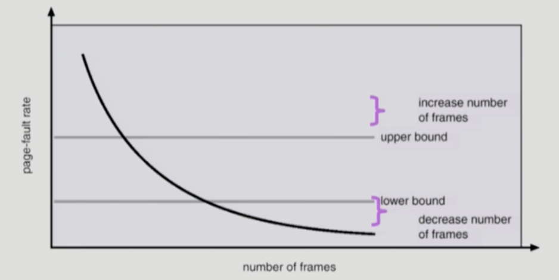

  - Page-fault rate의 상한값과 하한값을 둠
    - Page fault rate가 상한 값을 넘으면 프레임을 더 할당
    - Page fault rate가 하한 값 이하이면 할당 프레임 수를 줄임
  - 빈 프레임이 없으면 일부 프로세스를 swap out

- Page Size의 결정
  - Page Size를 감소시키면
    - 페이지 수 증가
    - 페이지 테이블 크기 증가
    - Internal fragmentation 감소
    - Disk transfer의 효율성 감소
      - Seek/rotation vs transfer
      - 디스크 헤드가 움직이는 Seek 시간이 오래걸림
    - 필요한 정보만 메모리에 올라와 메모리 이용이 효율적
      - Locality의 활용 측면에서는 좋지 않음
  - Trend
    - Larger page size
      - 64bit를 주로 사용하고, 메모리 크기가 커짐에 따라 페이지 사이즈가 작으면 페이지 테이블이 너무 커지게 됨

